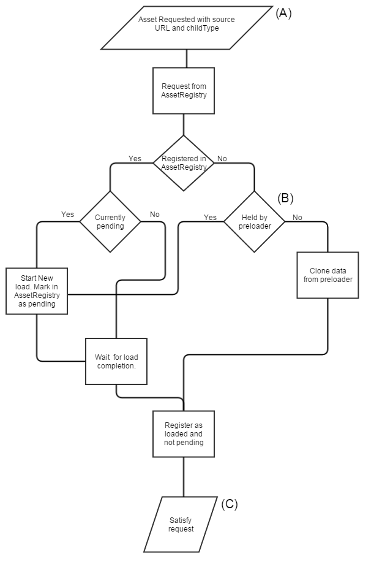

# Asset Pipeline

This discussion details the loading algorithm for 3D model and texture assets in the engine. It does not discuss delivery of raw HTML assets like GUI images, fonts, or sounds. Specifically, this deal with the loading pipline for VWF entities. Other 3D assets (like the previews in the EntityLibrary) may use a simpler system

## 3D Models

A) The THREE.js driver receives a request for a new node, which has a valid *source* and known *childType*. At this point, the VWF message queue is paused. A new *asset* subdriver is create to handle management of this object, and the constructor for *asset* begins the load process

B) It's possible that the preloaded already has loaded and parsed the necessary URL. If this is the case, the *assetRegistry* will copy the data from the preloader, and create an entry in the registry that states the URL is loaded and complete.

C) At this point, the asset data is presented to all registered callbacks, both from the original request, and for any additional requests for the same URL that occured while the URL was pending. In the typical case, this callback is *assetLoaded* from within the *asset* subdriver. This funciton will attach the new THREE.js asset to the root THREE.js node for the object. If the loader pause the VWF message queue, it will be resumed.

### Known *childType* values
1. subDriver/threejs/asset/vnd.raw-morphttarget
1. subDriver/threejs/asset/vnd.osgjs+json+compressed
1. subDriver/threejs/asset/vnd.osgjs+json+compressed+optimized
1. subDriver/threejs/asset/vnd.collada+xml
1. subDriver/threejs/asset/vnd.rmx+json
1. subDriver/threejs/asset/vnd.three.js+json
1. subDriver/threejs/asset/vnd.collada+xml+optimized
1. subDriver/threejs/asset/vnd.gltf+json
1. subDriver/threejs/asset/vnd.raw-animation

## Textures

Textures are loaded through the SceneManager, which caches and manages lifetimes for textures and their associated image data. Textures do not pause the VWF object queue, and thus a placeholder image is return synchronously from **_SceneManager.GetTexture**. This blank image data is swapped out for the requested image when the browser finished downloading and parsing the file.

A)  Both the **MaterialDef** system and the 3D asset type parsers will request a texture object from SceneManager. This is done in a synchronous way, so SceneManager immediatly returns a THREE.Texture object.

B) If the object is already loaded ( or loaded but pending), a new THREE.js texture is create by cloning the existing object. These clones are kept in an array on the first texture requests for a given URL. At this point, the texture may contain the solid blue placeholder data. 

C) Later, when the browser has finisied downloading and parsing the data, the texture and all clones will have their internal data updated to the new image. Users will see the blue textures replaced over time with the proper images.