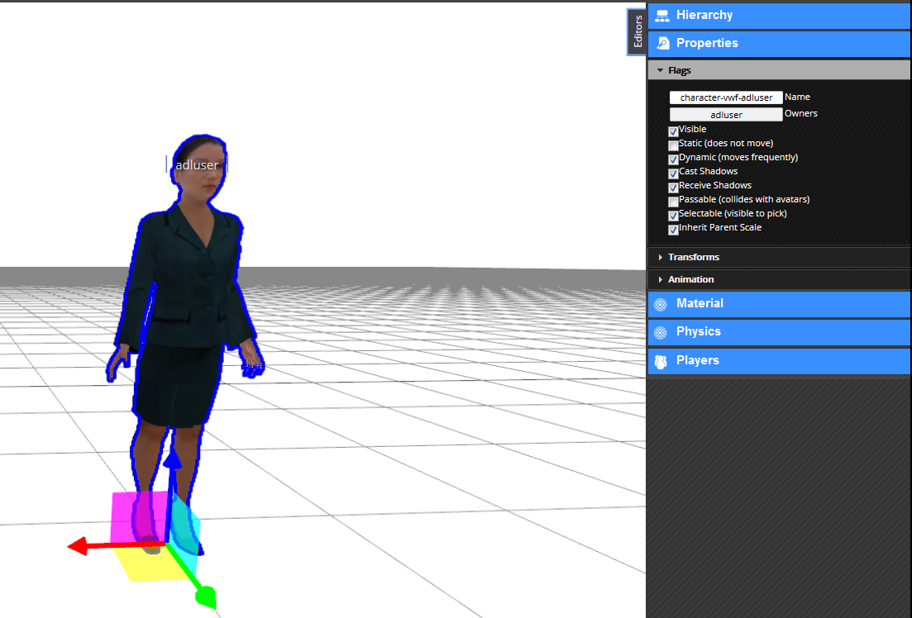
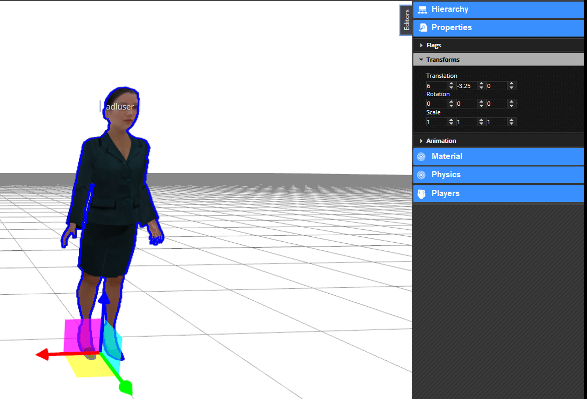

# Lights and Materials

## Introduction

Whether taking a photo in real life or rendering a virtual scene, lighting has a big part in the aesthetics of the final image. In this tutorial, I will show you the basics of lighting and materials in the Virtual World Sandbox.

This tutorial assumes that you know how to find, log into, and navigate the Sandbox website, and that you know the basic camera controls and navigation in-world. You do NOT need any knowledge of lighting techniques, that’s what this tutorial is for! 

First, a brief disclaimer. By default, new Sandbox scenes are very brightly illuminated. Since it is hard to be subtle at full brightness, I have turned all the scene lights way down for all the screenshots in this tutorial. See the [Scene lighting](#Scene-lighting) section for information on how to do this.

## Lights

Lights in the VW Sandbox behave close to what you’d expect from a light in the real world: they illuminate the scene in specific ways, depending on the type of light. The specifics will be covered in the following sections, but all lights are created in the same way. From the _Create_ menu, select _Lights_, and choose the type of light you are looking for. It will spawn at the center of your screen.

**Note:** Lighting nodes cannot be selected by the rubber band selector (drag-clicking). You must either click on the light bulb icon in the scene or select the light from the Hierarchy tab to select.

**Note:** Currently only the sun will cast shadows, though this may change in the future.

There are three types of lighting in the Sandbox: point lights, directional lights, and spot lights. There is also a special case: scene lights. I will cover this first.

### Scene lighting

Before you begin customizing the lighting in your world, I recommend you turn down the global lighting a bit. You can do this by selecting the scene:

And opening the Properties panel by either clicking the button on the top or the tab on the side:

Click on the “scene” section at the bottom of that tab. There are some nice cosmetic scene properties here. In particular, notice the Sun Color, Sun Intensity, and Sun Direction properties. Together they describe a directional light (more on this later). Feel free to play with these settings until you like the result. Note that these settings only affect the light as it falls on objects and creates shadows, and do not change the apparent position of the sun in the sky.

You cannot change the position of the sun in the sky _per se_, but you can change the way the sky looks. On that same scene properties tab, look for the Sky Texture property. You can change this to one of a variety of textures, from solid black/white to skies at different times of day. Again, experiment until you find something you like.

**Note:** As of this writing, there is no way to upload your own custom sky texture. However, this will likely be added in the future.

One final important property on this tab is the Ambient property. This sets the minimum amount of illumination an object can receive. Note that this is not really a color, but a magnitude. Keeping this greyscale is recommended for convenience and clarity. The below image shows a side-by-side of a low-ambient and high-ambient scene.

With all this in mind, you are now ready to actually begin lighting your scene.

### Point lights

This is a basic type of light that originates at a particular point in the scene and radiates out spherically from that point. You would use this type of light to model something like a light bulb or a torch. For example, the below scene uses point lights for the torches.

Notice that the parts closer to the torches are more brightly lit than the parts farther away.

Point lights have a couple key properties in the Sandbox that you can adjust: the position of the light, the color, the intensity, and the falloff distance. You will see another property called _type_ in the Properties tab, but this changes the point light to a spot or directional light, so don’t change this for now.

**Remember:** To access an object’s properties, select the object and click on the _Properties_ tab on the right side of the screen, or click on the appropriate toolbar button.

*   _Position_ is not a property unique to point lights, but is universal. It is set the same way you would set the position of any object: use the drag handles on the object when it is selected, or use the Transform property tab to set them manually.

*   The _color_ of a light causes any objects receiving the light’s light to be tinted this color. In the image above for example, the torches cast an orange light. Remember though that color is not additive, but multiplicative, meaning that if you shine a blue light on a red object it will appear black and not purple. This is the same way real light works; just think of how a black light looks on a white versus a green shirt.

*   The _intensity_ of a light determines how strongly the light influences the color of the relevant objects.

    

    The left light has an intensity of 1, and the right light has an intensity of 3\. You can see how the more intense light has more influence on its surroundings than the less intense light.

*   The _distance_ of the light affects how quickly the light’s intensity drops off.

    

    Both of these lights have the same intensity, but the light on the right has a distance of 3 versus the other light’s 1\. You can see how the light on the right extends farther out than the other as a result.

That’s all there is to point lights. Easy, right? Now on to directional lights!

### Directional lights

Directional lights are sort of the opposite of point lights. Instead of light hitting an object from a certain point, it hits an object from a certain direction. You can think of this as equivalent to a point light infinitely far away from the scene, so that its rays are parallel. This is usually used to model the sun, but since the Sandbox already has a sun you probably won’t use this light type very much.

It is important to note that directional lights are not scoped like point lights are. Directional lights will shine on the entire scene, regardless of its position.

An example of a directional light:

Directional lights have three properties: the direction, the intensity, and the color.

*   The _direction_ is set via the light’s Transform rotation property, either by editing it directly or by using the rotation handles as seen above.

*   The _intensity_ of a directional light is the same as with a point light.

*   The _color_ is the same as well.

### Spot lights

Spot lights in the Sandbox behave just as they do in real life: they originate at a point and radiate out in a cone shape in a particular direction. The rest is almost identical to the types of lights we’ve already discussed. An example scene that uses a spotlight:

Notice that the objects in and around the stage are more brightly lit than the objects near the sides. This is because the spotlight is aimed just above the stage.

The spot light has one new property and several old ones:

*   The _spot angle_ changes how focused or wide the beam from the spot light is. Lower numbers are less focused.

*   _Position_

*   _Direction_

*   _Color_

*   _Intensity_

Lights really are as simple as that. However, you can’t make a proper scene with just lights, you have to ritz up the objects the light falls on too. On to materials!

## Materials

What exactly distinguishes a snow globe from a trophy baseball? They’re roughly the same shape and weight, but they are made of very different materials. Adding many distinct materials to a 3d scene can add texture and credibility, and with enough attention to detail, can lend the scene that much-coveted touch of realism.

If you are familiar with node-based material systems such as those in Blender or Unreal, then you will find the Sandbox a little underwhelming. The Sandbox is not a platform for photorealistic renders, nor an advanced game engine. Rather, the graphics are merely another tool to enable the creativity, collaboration, and education of its users.

To access an object’s material properties, just select the object and click the _Material_ button () in the top toolbar. Alternatively, you can click on the _Material_ tab on the right. Either will bring up the object’s material editor:

**Note:** This image has all the material properties at default. The following screenshots however will have all but the demonstrated property zeroed out to produce a pure effect.

In the following sections we will be examining what each of the widgets here do, starting with the most basic: diffuse color.

### Diffuse color

A lot of different things go into the color of individual pixels of an object, such as light color, viewing angle, and shadowing. However, the base color of an object is not complicated. Clicking on the _Diffuse Color_ palette icon brings up a color chooser:

Moving this color around should produce obvious and immediate results. Below is a sphere with a pure red diffuse color:

Notice that changing the diffuse color does not make the ball solid red; it still has a light side towards the light and a dark side away from the light.

### Emission color

Emission color behaves very differently from diffuse color. Emission generates a pure color, unaffected by shadows or lights. You can see this in the image below:

This ball has only a pure red color with no light or dark sides like with diffuse color. One generally does not use emission by itself though, but rather in conjunction with other colors to provide a highlight effect, or to emulate ambient reflections:

This ball has a pure white diffuse color, but the slight blue emission color makes it look like the blue backdrop is reflecting onto it. Subtle use of this technique can make a scene look much more realistic.

So we’ve learned how to make a flat shaded object. But what if you wanted to model something shiny? Specular to the rescue!

### Specular reflections

This one is a little more complicated. Specular reflections are the dots of brightness that you see on objects, like a fuzzy reflection. For example, this sphere:

This sphere has a solid black diffuse color, but a white specular color. This causes the white spot, called a _frustrum_, in the direction of the light source. These frustra (plural of frustrum) are caused by several different material properties:

*   The _shininess_ of an object controls how focused the frustra are. The shinier the object is, the smaller and more focused and intense the frustra are. A shininess of 0 is the same as diffuse lighting. You can see this in the images below:

     

    The sphere on the left has a low shininess value, and as a result the frustrum is loosely focused, in direct contrast with the sphere on the right (high shininess, tight frustrum).

*   The _specular level_ indicates how strongly the object reflects the light. A value less than 1 will cause a reduction of incoming light, and a value greater than 1 will strengthen it.

      

    Seen here from left to right, low intensity (0.5), medium intensity (1.0), and high intensity (2.0) specular reflections.

*   The _specular color_ is fairly self-explanatory: it sets the color of the frustra. Though it’s probably more accurate to describe it as a mask; the light color is multiplied by the object’s specular color to produce the frustrum color. So a red light with a white specular will produce a red frustrum, but the same light with a blue specular will produce black. Feel free to fiddle with this until it looks right.

    

    A sphere with a cyan specular reflection color.

### Other material properties

We have already covered the most common material properties, but there are a couple others that may prove useful at some point.

*   An object’s _alpha_ value sets how transparent it is. Use this for anything that should be seen through, like glass or a hologram.

    

**Note:** By default, the back faces of an object will not be visible through the transparency, and there is no reliable way to make them appear. Unfortunately this is a limitation of the rendering engine, and there are no plans to implement it.

*   The _side_ value property affects what is called the _culling_ of the object. Normally, the rendering engine is optimized not to draw objects facing away from the camera, or are out of the frame. For example, a cube has six sides, but only three are ever visible at any one time. Knowing this, the renderer skips drawing the rear-facing faces to save time. This works for closed geometry like a cube, but for open geometry like a plane, it breaks down.

    Using the _side_ property, you can tell the renderer to draw only the front faces (default 0), only the back faces (1), or all faces (2). This is useful for the aforementioned open geometry, such as this half-pipe:

      

    From left to right, back-culled (front-facing only), front-culled (back-facing only), no culling (all faces).

    While fixing the culling would seem to be the obvious solution to the back-facing transparency issue mentioned previously, it does not work reliably and can produce some fairly bizarre effects. See the below image, and notice that some back faces are only partially drawn, and others are missing entirely:

    

*   The _reflect_ property is a bit of a misnomer. One would expect it to make the object like a mirror and reflect its surroundings. However, it is actually closer to an environmental factor. The higher the _reflect_ property is set, the more of the sky will appear in the surface of the object. This is a great effect for outdoor scenes, but for indoor scenes I recommend using the [emission](#Emission-color) trick I showed you earlier.

    

    A highly reflective cube.

We have covered all the major innate properties of an object’s material. However, there is another large topic that needs to be discussed before materials are fully covered: textures.

## Textures

At its core, texturing is how one maps a two-dimensional image onto a three-dimensional surface. This can be used for all the same effects that you can get with the materials in the previous section, but with infinitely greater detail and a little extra complexity. In the following sections, we will see how the addition of textures improves the blank model below:

Before we dive right into texturing though, it is important to talk about what makes texturing possible: UV coordinates.

### A word about UV coordinates

This is a complicated topic with a lot of room for nuance, but I shall attempt to cover the basics. Put simply, textures can be applied because during the creation of the model, all of the faces of the 3D geometry were flattened out (_unwrapped_) and mapped to some region on the texture. This 2D mapping is called “UV” because, since X, Y, and Z are already used for the 3D space, one needs a different way to specify texture coordinates, and the community settled on U for the horizontal and V for the vertical, thus UV coordinates. You can see this mapping in the following graphic:

 

In this example, the cube was unwrapped to this classic cross shape with the bottom of the cube at the intersection, though it could have been done any way the author chose. In fact, the Sandbox uses a simpler mapping: all the faces completely overlap, so the whole texture is displayed on every face. However, neither of these methods are valid for non-box geometries, like a cylinder or sphere, which is why this topic can get so complicated. This is not a UV mapping tutorial so I won’t get into this, but there are plenty of other good tutorials on the topic.

**Note:** If you do not like the way that the texture wraps to the Sandbox primitive geometries by default, you can add a modifier to generate configurable UV coordinates for the object. With your object selected, go to _Create > Modifier > UVMap_. This will add another panel to your object’s Properties page with various configuration settings to adjust the texture mapping.

With that said, let’s get started with textures!

### Basic texturing

There are several different types of textures that can be applied in the Sandbox which we will cover shortly, but they all have properties in common. To edit these properties, open the Materials panel for your object, and click on the section on the very bottom labeled “Texture Layer _x_” where _x_ is a number. If there is not a texture layer already on your object you can click the “Add Layer” button to create one. Clicking the texture layer will bring up a window similar to this one:

*   The _image_ property contains the URL to the texture. You can access this by clicking on the image at the top. This brings up a texture library browser from which you can choose a texture, or you can click the **+** to specify your own URL (for Dropbox- or Imgur-hosted textures)

*   The _alpha_ property controls the discard threshold for the texture. If a texture has an alpha channel, and the value of that channel for a particular pixel falls below the discard threshold, that pixel is not drawn and displays whatever is behind it.

*   The _scale_ properties allow you to change the apparent size of the texture, or inversely, how many times the texture appears on the object. Large values produce more copies of smaller textures, small positive values produce stretched textures, and negative values produce inverted textures.

*   The _offset_ properties shift the texture by a given amount in the _x_ and _y_ directions.

*   The _Map To_ property changes how the texture is interpreted: as a diffuse color, a normal map, a bump map, or a specular map. Light maps and environment maps currently do not work though they are on the list.

That last property, the _Map To_, is the most important property here, and the topic of the following sections. Each mode behaves differently, so we will cover each mode individually. First up is the diffuse mode.

### Diffuse textures

Diffuse textures are the basic type of texture. All it does is paint the image onto the object according to the UV coordinates. Here is the model above, with just a diffuse texture applied:

 

Much better, right? Just this is probably good enough for most applications, but it can be further improved by adding normal and specular maps.

### Normal maps

Mathematically speaking, a normal vector, usually just called a _normal_, is the vector perpendicular to a surface at a point. Normally these are built into the geometry, calculated from the angles of the vertices, but by using a normal map, you can manually specify the normal at every point rather than just at the vertices.

Just like a diffuse texture sets the color for every point, a normal map sets the normal for every point. The RGB channels of the texture map directly to the _xyz_ coordinates of the normal vector in the space tangent to the surface, which is why normal maps tend to look mostly blue (the _z_ coordinate, i.e. straight out from the surface). As a result, the lighting can be calculated at a higher granularity, causing apparent pits and bumps in the surface.

This is a very complicated description, but as they say, a picture is worth a thousand words. Compare the model from earlier with the same model with a normal map applied.

You see what a huge difference that makes? The normal affects the lighting, and the lighting affects our perception, creating apparent bumps and pits. This is a great way to add extra realism to a scene. The downside is that normal maps are much harder to author than its predecessor, the bump map.

### Bump maps

Bump maps also modify the normals of the surface, but instead of mapping _xyz_ vectors directly from the RGB image, bump maps store displacement. Lighter patches in the bump map indicate high points, and darker parts indicate low points. The system then uses the 3d model and this relief map to generate new normals which affect the lighting in the same way as above.

Since the bump mapping only uses intensity (light/dark), creating a bump map by hand is quite easy compared to a normal map which uses very specific calculated RGB values. The downside is that it produces somewhat fuzzier relief in the surface. This is visible in the image below:

The left half of this cube is bump mapped, and the right half is normal mapped. You can see at the edges how the bump map produces more rounded relief vs the normal map, which has sharper edges.

With bump maps described, the only texture type remaining to be covered is the specular map.

### Specular maps

Just like diffuse maps set the color and normal maps set the normal, specular maps set the shininess of each pixel. More specifically, it sets how intensely the specular color shows through in the object’s frustra. The map itself is simply a greyscale image that scales the frustrum intensity per pixel, so creating these by hand is not difficult if you have the diffuse texture to use as a template.

**Remember:** A frustrum is a non-diffuse reflection of a light source on a shiny object.

The best example to help visualize this type of map is a rusty metal object. You want the unrusted parts to be highly shiny but the rust to be dull. Or perhaps for a brick wall you want shiny bricks with dull mortar. Or a dirty glass window. These types of effects can be accomplished with a specular map. This effect is visible in the following image:

Notice how the mottled reflection gives our house a dirty or dilapidated appearance. This can be highly effective when combined with a normal map to produce a realistic-looking complicated surface.

So by combining all these techniques, our house now looks quite good! What a difference a couple textures make!

 

## Video Textures

The sandbox can support any video files that HTML5 naively supports. 

If you desire to load a video in a popup window or overlayed on the screen, you should look into standard HTML5 APIs for the 'Video' tag. Simply code up your video to play as you normally would in any web page, and attach that code to an object so that the sandbox will execute it. 

We've recently added support for using video files as textures. Currently, when a video is applied to a surface as a texture, it has no material settings. For instance, you cannot use a video in place of an image in a normal map. This may or may not become possible in the future. However, you can play still use a video texture to display a movie file on an object in the world, such as a monitor or projector screen.

Select the object you want to modify, and open the material editor. On the first tab, under 'Basic Material Settings' find the button that says 'Material Type: '. The default material type is the [Phong Material](Phong-Material), but we will need to change this. Click the button, and choose 'Video'. The GUI in the material editor will change, and a button labeled 'Choose Video URL' will appear. Click this button, and enter a URL to a video file. 

Your video file should appear on the object, mapped as per the object UV coordinates.

## Conclusion

Whew, what a journey! You have been introduced to a lot of material, but let’s review. You learned about the different types of lights: spot light, point light, and directional light. You learned a little bit about how the lights interact with objects in the Materials section. Finally you learned about the subtle art of the texture.

We did not go into a ton of detail on any of these topics, so if you’re looking for more information you are welcome to google anything mentioned in this article. However remember that that information will not be Sandbox-specific.

I hope you have found this article interesting and informative. If you have any questions or comments, feel free to post them in the comments section below, or email me at steve.vergenz.ctr (at) adlnet (dot) gov. Happy worldbuilding!

