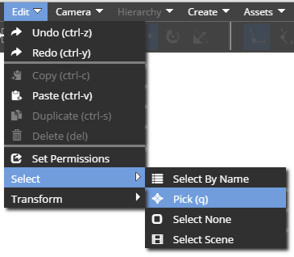
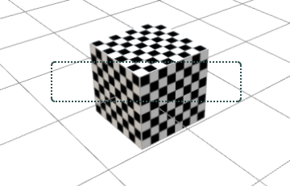
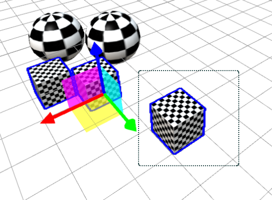
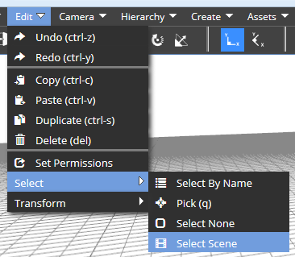
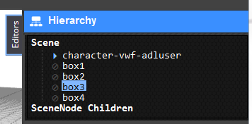

## Introduction

The Sandbox editor tools provide many different ways to select objects. Selections are the basis of editing and authoring a scene, so it’s important to understand all the different ways to select an object, select multiple objects, and add and subtract objects from the selection.

## Selecting objects with the mouse

The editing tools can be put into a mode called ‘Select by picking’. When the editor is in this mode, you can use the left mouse button to click on an object. When you click the object, it will become selected. In the most basic use, this new selection will overwrite the old selection, so that the object you clicked on it the only selected object.

To enter ‘Select by picking’ mode, click  on the toolbar.

You’ll know that you’ve entered the Select by Picking mode because the icon will light up blue.

You can also select the option off the drop down menu. Choose ‘Pick’ below.

You’ll know the object is selected because a white outline will appear around the selected object.

You can click and drag with the left mouse button to select a region. This will create a rectangle on the screen that will resize when you drag the mouse. The selection will be computed when you let go of the left mouse button. Any object that is within the rectangle on the screen will become selected. Like the normal click, this new selection will unselect all other objects

In the above example, the selection will become the selection shown below.

Notice how the objects that were either completely within the rectangle or which intersect the edge of the rectangle become selected, and the other objects which are completely outside of the rectangle are not selected.

**Note: **The algorithm for selecting objects checks the vertices of the bounding box, and the vertices of the object. Notice the selection rectangle above. None of the vertices intersect the rectangle, so the object is not selected. 

Even when you are not in select by picking mode, you can still select an object with the mouse. Right click on the object to open the context menu. This menu has a ‘Select’ option.

When you choose this Select option, the object will be selected, even if you are not in Select by Picking mode.

**Info: **The names of the selected objects are shown on the status bar at the bottom of the screen. When no object is selected, this will read ‘No Selection’ 

## Adding and subtracting from the selection

The ALT and CTRL keys on the keyboard allow you to either add or subtract from the current selection. When you hold CTRL, then do any of the mouse actions described above, the objects will be added to the current selection, rather than replacing the selection. Similarly, when holding the ALT key, the objects you click or the objects within the selection rectangle will be removed from the selection.

Here, I’m holding the ALT key. You will see the mouse cursor change to 

So, the objects in the rectangle are removed from the selection, and the new selection is shown below.

**Note: **Sometimes, you might leave the browser window while the ALT or CTRL key is depressed. In this case, the editor can become ‘stuck’ in the add or subtract mode. Just press and release the ALT and CTRL keys back in the browser window should this happen. 

## Other ways to select objects

Sometimes, you might need to select objects that you cannot directly click. This happens with objects do not have a 3D mesh that can be selected, such as a light or behavior. The Editor tools provide a lot of ways to access these objects.

Some objects create a tiny icon called a ‘Selection Glyph’. Clicking the Glyph will select the associated object. Glyphs are only visible when the camera is within 20 meters of the object, and when the editor is in Select by Picking mode. The normal ALT and CTRL modifier keys work as expected as well.

This is the Glyph for the Scene.

This is the Glyph for a Light object.

For the particle systems:

For a Group:

Often, you will want to select the Scene object. The drop down menu provides a shortcut to get to the scene object. Click on ‘Select Scene’ from the menu shown below.

**Info: **The Select By Name tool is currently in development. When finished, this tool will provide a powerful visual tool to see the scene and all the objects, and modify which objects are selected by clicking on their names. 

When you are working with a hierarchy of objects, you may wish to move to the parent of the current selection. For many objects, the parent will be the Scene, but some objects can be children of others.

Use this button  to select the parent of the current object.

To select the children of an object, or to explore the scene and find an object by name, you can open the Hierarchy View. This tool shows you all the objects that are children of the current object, the object’s parent.

Above, you can see that the currently selected object has 4 children, and its parent is ‘index-vwf’. When you click a child’s name, that child will be ‘previewed’, but not selected.

You’ll see a green box around the child to show you which object it is. At this point, it’s not really selected. Double click the child’s name (shown in blue above) to actually select that child. The GUI will update to show the children of this new selection. You can also double click “Parent” to select the current object’s parent.

**Remember: **The white bounding rectangle shows you the extents of the entire selected object, including its children. 

## Selections from other users

The Virtual World Sandbox will display to you the selection of other users. This is just for convenience – their selection set is separate from yours, and does not effect any of your tools. When a peer connected to the same world selects an object, you will see it surrounded by an orange box. In the example below, some other user of the system has selected my avatar.

## Clearing the selection and exiting Select by Picking mode

You can clear the current selection by clicking on nothing in the 3D view while in Pick mode, but this will not exit the Select by Picking mode, and the next click will select the next object. To exit the Select By Picking mode completely, use this toolbar button:

This will clear the selection and exit the picking mode. Or choose the ‘Select None’ option from the Edit Menu.

## Programmatically accessing the selection set

In some rare situations, you may wish to access the selection set from code. Perhaps you are writing a tool, or wish to automate some action from the JavaScript console. The information below will help you do that.

**Note: **Never call these methods from code that is bound to an object in the scene. Only use this from the console or when creating a tool. The selection set is not synchronized between clients and thus MUST NOT be used in any logic on an object. 

_Editor.GetSelectMode();
The above line of code will tell you what Selection mode the editor interface is in. The values are string, and will be either ‘Pick’ or ‘None’.

_Editor.GetSelectedVWFID()_Editor.GetSelectedVWFID(2)
Get the first, second or nth selected VWF ID. The ID identifies the VWF node that is selected. Supplying no parameter gets the 0th selection.

_Editor.getSelectionCount()
Get the number of nodes selected. Use this and the function above to iterate over the selection.

Robert.chadwick.ctr@adlnet.gov. This tutorial was built with VWS version 0.4.11 on Jan 8, 2014.

