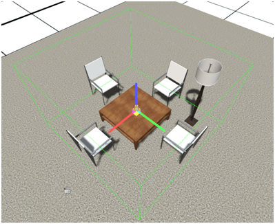

## Introduction

The Sandbox allows you to group objects together to make them easier to use and work with. Groups act much like other objects in the world. You can select them, copy or paste them, save them to the inventory or set their permissions. You can even assign code to group itself. Groups are really just a special kind of hierarchy, where all the group members children of a single parent.

## Making a Group

To make a group, select several objects. Here, I’ve selected 5 objects that I wish to group.

Next, choose **Hierarchy->Grouping->Group **from the drop down menu.

Once you have clicked this, you’ll see the selection rectangle will change to green, and a selection glyph will appear. The objects are now grouped.

**Note: **You cannot group objects that already have hierarchal relationships. For instance, you cannot group a child to its parent. 

## Breaking a Group

You can ungroup object by selecting the group root and choosing **Hierarchy->Grouping->Ungroup**

## Open and Closed groups

Groups can be either ‘Open’ or ‘Closed’. This setting only affects the selection logic, but is useful if you need to get inside a group and work with the objects within it. By default, new groups are closed. When a group is closed, you cannot select objects within the group, and when it is open, you can.

Closed groups have a bright green bounding box,

while open groups have a pale green bounding box.

You can open or close a group by using the dropdown menu. Hierarchy->Grouping->Open Group.

**Info: **To close a group, you must first select the group’s root. Do this by clicking the ‘**Select Parent’ **button after selecting a group member, or click directly on the selection glyph. 

## Adding to a group

Because groups are just a special kind if hierarchy, you can use the link tool to add an object to a group. Select the object you wish to add.

Next, select the Link button from the toolbar.

Now, select the group root of the group you wish to attach to. Because this group is closed, I can click anywhere on the table or a chair. If the group were open, I would have to click carefully on the selection glyph. Now, the lamp is attached to the group.

## Removing from a group

Again, since the group is just a special kind if hierarchy, you can just use the break link tool to remove an object from its group. Select a part of the group.

**Info: **it’s easier to do this if you open the group first 

Now, choose the break link button from the toolbar.

The objects will flash for a moment. When you select the group, you will now see it contains only the table and the lamp.

