# Build a Game

## Introduction

This document will walk you through the entire process of building a simple game in the VWS environment. It will cover the entire process from start to finish, including creating an account, setting up the scene, creating the objects, scripting the game and finally, publishing. This document assumes that you have some basic knowledge of web browsers and computers in general, but should not require any special prerequisites. By the end of this tutorial, you should have a functioning game you can play, and a good understanding of how to author content in the VWS application.

## Part 1: Getting started

First things first, we’ll need to get setup before we can start building. This section will walk you through the steps necessary to get a user account and create a world.

1.	First, browse to the [VW Sandbox website](https://sandbox.adlnet.gov/100/adl/sandbox/ "https://sandbox.adlnet.gov/100/adl/sandbox/"). You should see a website that looks something like the following.

	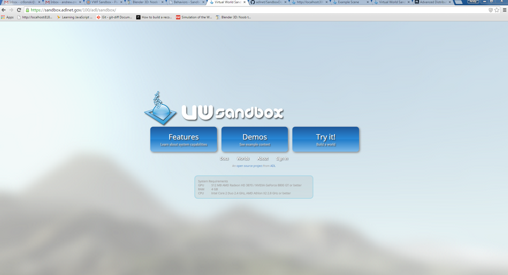

2.	Before we can create an application, we’ll need to sign in. If you have already signed up for an account, go ahead log in and meet at [Step 7: Create a New World](#newWorld "Step 7: Create a New World"). Otherwise, we'll walk through the steps to create an account. You’ll need to click the '**Try it!**' button.

	

3.	You will see a screen informing you that you are not signed in. It's okay, we were expecting that and we are going to sign up and fix that.

	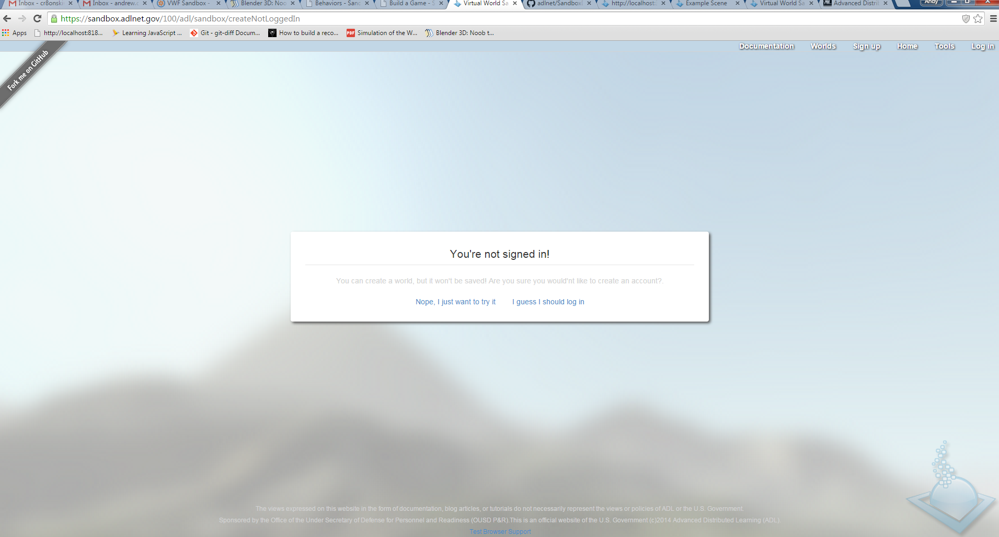

4.	Look up in the right hand corner. In the middle of the line of choices it says '**Sign up**'. Click that.

	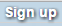

5.	You should now see a screen where you can choose a username, password, and email. You’re username can be anything, so long as it is not currently used by another user. Be sure the password is something you can remember! And provide a valid email address.

	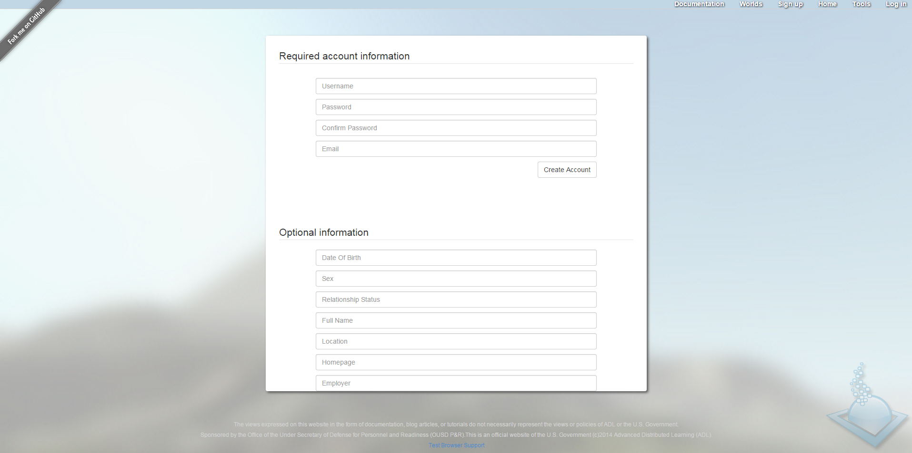

6.	Now that you have created a user account, you’ll be automatically logged into the website. You’ll know you’re logged in because you’ll see your user name on the right side underneath the buttons.

	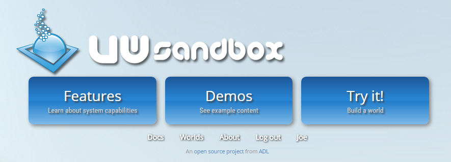


7.	<a id="newWorld"></a>Next, we’ll click the '**Try it!**' button again to create a new world to work in.	

	

8.	Enter a title and description of your world. And click the '**Create**' button.

	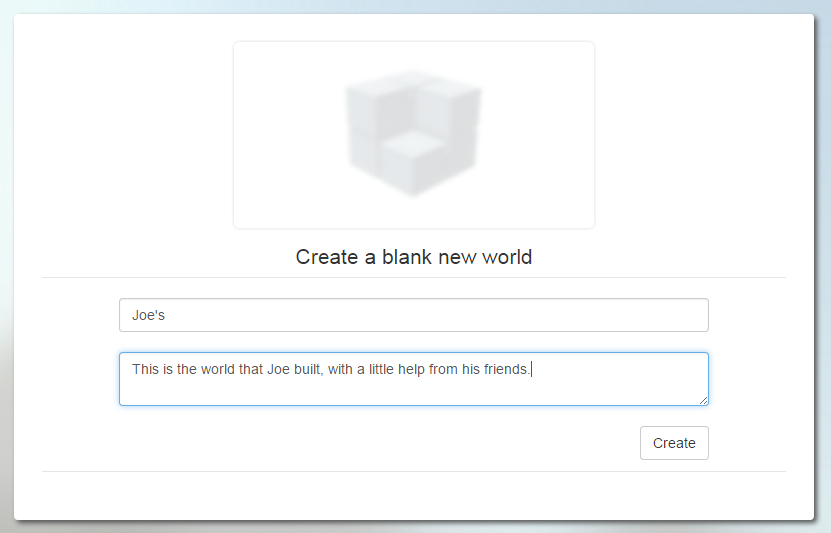

9.	You’ll see the following page. This page allows you many options to inspect or manipulate your world. In this case, we’re going to launch our blank world. Click on the word '**Launch**' at the bottom left.

	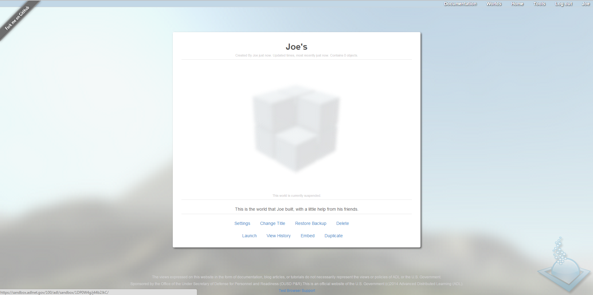

	**Note:** If you have not opened a world before in the VW Sandbox (if you have [skip these steps](#step10 "Step 10")), the program will automatically test your browser for compatibility.
	An alert will pop up to ask your permission to conduct the compatability test. Click '**OK**' to run the test.

	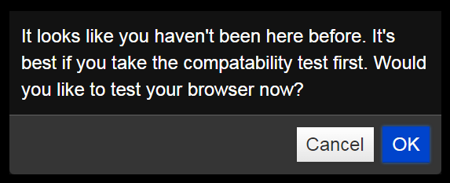

	If your browser is compatible with running the VW Sandbox, another alert will tell you. Click '**OK**' to continue to your world.
	If your browser does not pass the compatibility test, please check your computer's settings or contact someone for technical assistance. 

	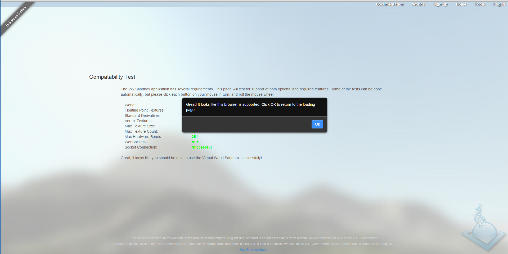

	**Note:** The VWS website uses a lot of cutting edge HTML5 features. If your browser window does not look like the image above, check that you are using the most recent version of Chrome, Firefox, Safari or Internet Explorer. Many mobile versions of these browsers may not be supported. 

10.	<a id='step10'></a>Great! If everything went according to plan, you should see the new world begin to load. Because this world is in editing mode, you’ll see a lot of buttons and graphics appear in bars on the top, bottom, and sides of your browser. These are the tools that we’ll be using in the next section. You’ll also see the default avatar and a gray grid in the center of the screen. This avatar is you! We won’t be going into any details about how the avatar works today, so just ignore it for now.

	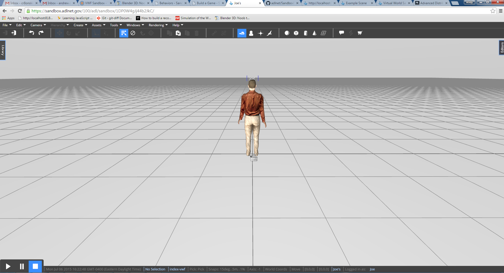

	**Note:** The VWS website uses a lot of cutting edge HTML5 features. If your browser window does not look like the image above, check that you are using the most recent version of Chrome, Firefox, Safari or Internet Explorer. Many mobile versions of these browsers may not be supported. 

11.	**Congratulations!** You’ve made it to the end of part one! Now is a good time to get used to moving around in this world. Click and hold with the right mouse button, and drag your mouse. Notice how the view rotates? This is the primary camera mode we’ll use when authoring, so it pays to practice a little bit. You can also roll the mouse wheel to zoom in and out, or press and drag with the center mouse button (sometimes the wheel itself is the button, can be pressed in addition to being rolled) to pan the view. Don’t worry too much about the left mouse button. It’s used for selection, which you’ll get plenty of practice within the next section.


	**Note:** Don’t be afraid to play around. At this point, the worst thing that can happen is that you create some junk in the world that will mess up our tutorial, however you know enough now to create another world to start the tutorial again. 

## Part 2: Setting up the scene

Now that we have a world to work in, we need to create all the objects that will be part of our game. We’re going to have to create, move, modify, select, copy and paste a lot of objects for this section. I’m going to show you the basic tools and how they work, but leave it up to you to setup all the pieces once you know how. To start, we need to build some walls to create the game board.

1.	First, rotate your camera so you are looking down at the grid. This will help you stay oriented, and makes selecting objects and moving them around easier. Zoom out a bit too.

	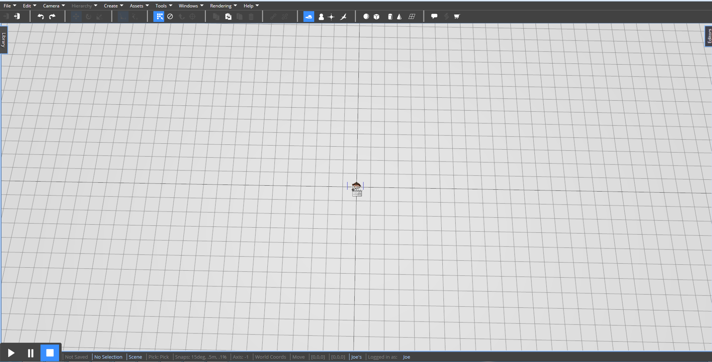

	**Remember:** Zoom by rolling the mouse wheel, rotate the camera by clicking and dragging with the right mouse button 

2.	Now, we need to activate a tool that will let us draw the level. Find the ‘**Tools**’ menu on the top menubar. Click the ‘**Block Painter**’ menu item.

	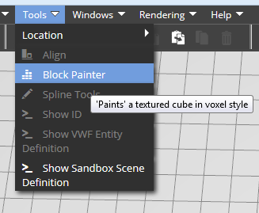

3.	When the Block Painter tool opens, you’ll see it slide out on the right, in an area we call the “side panel”. The block painter is a quick and easy way to create a lot of geometry quickly. There are other ways you could lay out the level, but this is fun! Let’s pick a different texture for our walls by clicking on the '**Pick Texture**' button.

	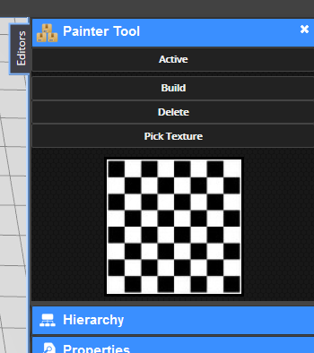

4.	The Map Browser will appear. This is the tool that is used in many parts of the software whenever you need to choose a texture map. Clicking on the folder icons will show the textures inside that folder, and clicking on an image will select that file as the texture. You can also use the plus icon to enter a texture via URL. For now, let’s keep it simple and choose the brick texture. Click on the small image of bricks.

	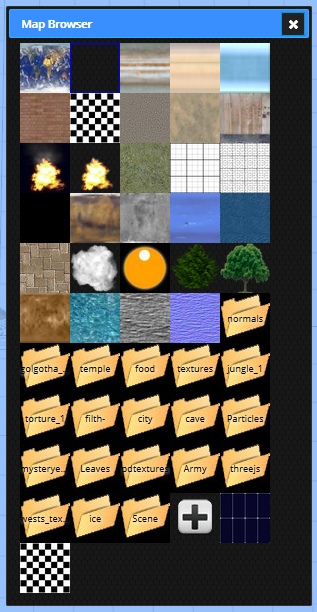

5.	The Painter tool will now show the selected texture, and the Map Browser window will disappear. We now need to activate the tool, and set it to "Build" mode. Click the '**Active**' button inside the tool’s panel, then click ‘**Build**’. The “Active” button should remain lit up.

	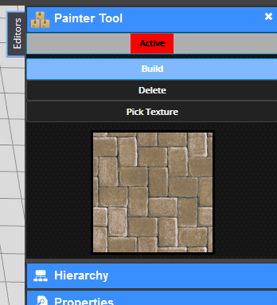

6.	When you hold your mouse within the 3D window, over the grid, you’ll see a faint transparent brick box. The tool is previewing where the next box will be placed.

	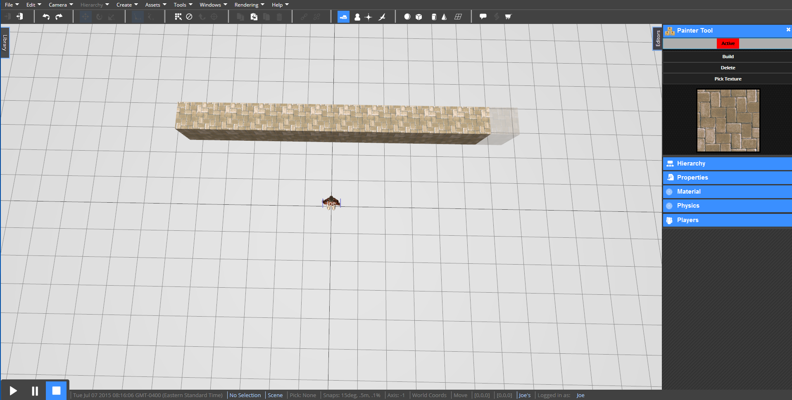

	**Info:** You can also delete blocks with the painter tool. Just click the ‘delete’ button to put the tool into delete mode. Now, when you click and drag, boxes will be destroyed instead of created. Click ‘Build’ to start building again. 
	
7.	Build a maze! Be sure that each path within the maze is just one block thick. This won’t be all that important, but it will make the game work better. Take some time to build something simple like the image below.

	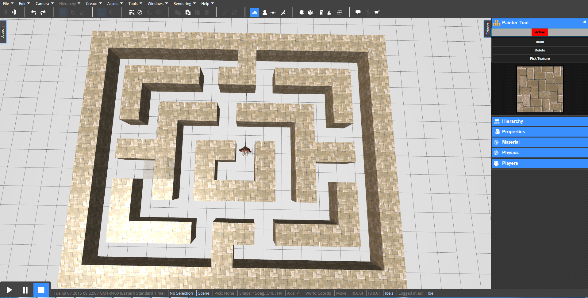

8.	Great! We now have our game board. Now that we’re done with the painter tool, we need to deactivate it so that we can go about the rest of our project. Click the ‘**Active**’ button in the tool again, so that it is no longer lit up. Now, click the ‘**X**’ button in the tool’s title bar to close the tool. It’s very important that you deactivate the tool before you close it – otherwise it can be active, just hidden!

9.	Now that we have our game board, we need to create our first actor! This actor will become the Player later, when we add scripts. We’ll use a sphere for the player. Click the '**Sphere**' icon on the main toolbar.

	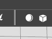

10.	You should see a sphere object appear right in the center of the viewport. By default, that sphere is checkered. We’ll change this in a moment. Also, we need to select the sphere so we can edit it. Our sphere is selected, since we just created it. 

	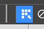

	**Info:** You can make sure the software is in selection mode by clicking the ‘Select by clicking’ button on the toolbar. You’ll know select mode is active because the button is blue.

11.	Since the sphere is already selected, you should see a blue outline appear around the sphere, as well as a brightly colored axis graphic. It should look something like this:

	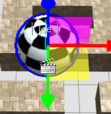

	**Remember:** It’s very important that the Painter Tool is deactivated. If you are still seeing a faint box following under your cursor, the tools it active but hidden. Open is as we did in step 2, deactivate it by clicking the Active button. Verify that the button is not lit, then close the tool. 

12.	Because we don’t know exactly where the sphere was created (it’s created at the center of your view) let’s go ahead and reset its position, rotation, and scale. Find the ‘**Edit**’ menu on the menu bar, then open the sub menu ‘**Transforms**’, and finally choose ‘**Reset Transforms**’. This will zero out the position, rotation and scale of the sphere.

	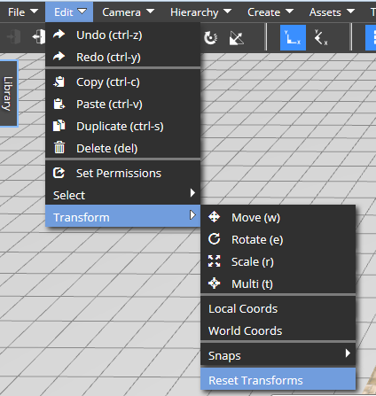

13.	Now, we need to go ahead and name the sphere so that we can find it later. All objects have a set of properties you can edit in a window called the Property Editor. We need to open the property editor, and change the Display Name property of the sphere to something nice, like ‘Player’. First, while the sphere is still selected, open the Editor side panel by finding the ‘**Editors**’ tab on the right side of the screen.

	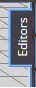

14.	Click to open the "Properties" panel. It will appear in the side panel just like the painter tool did. Find the "Display Name" property, which is the first textbox on the page, and change the value to '**Player**' by clicking in the box and typing.

	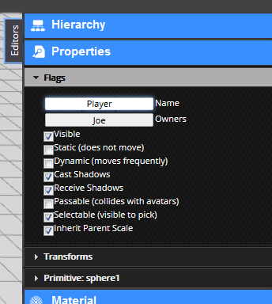

15.	We also need to make the sphere smaller. The properties that you can edit are divided into categories. The parameters for the generation of primitive objects like spheres and boxes will be under the "Primitive" category. Click the '**Primitive: Sphere1**' then find the '**Radius**' setting. Either type in the box, or use the slider to change the radius to '**.5**'.


	**Note:** Don’t be confused that the tab says 'Primitive: Sphere1' even though we just changed the object’s name to Player. The UI will update the next time it’s loaded. 

	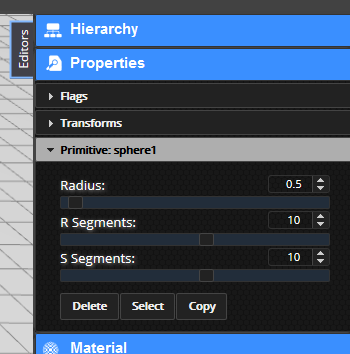

16.	Now, since the sphere was centered at (0, 0, 0). So that the object is not intersecting the ground, let’s move it up. We’ll do so precisely by typing in the Z value. Still in the Property Editor, Open the '**Transform**' panel, and find the 3rd text box from the left under the Translation label. This value is the Z coordinate of the spheres position. Enter '**.6**'. You’ll see the sphere move slightly.


	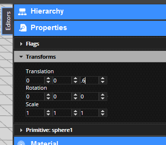

17.	Next, let’s go ahead and make the sphere yellow, just for kicks. Find the "Material Editor". Its right below the Properties Editor on the right of the screen. When you click the heading, the '**Material**' Editor will open in the side panel.


	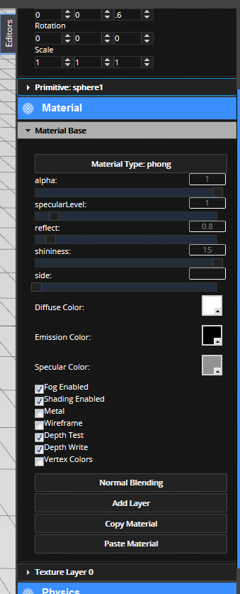

18.	So, we want to do two things. First, click the little white square next to '**Diffuse Color**'. This will let you change the color of the object. Click and drag in the color preview to set the diffuse color to **yellow**.


	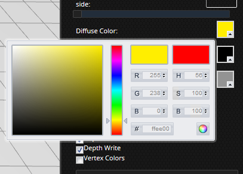

19.	Let’s also remove the default texture layer. The material editor allows you to link several different images to different properties of the surface, like a color map or a bump map. The default material has a checker texture for the diffuse map. Each texture gets a small tab at the bottom of the Material Editor. Click the '**Texture Layer 0**' tab to open the settings for the layer, then find the ‘**Delete Layer**’ button. The sphere should now be a solid yellow. You should still see the selection outline and the brightly colored axis graphic.


	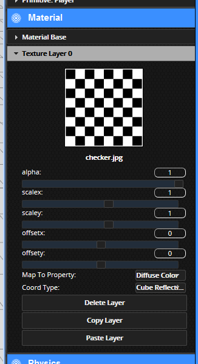


	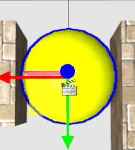

20.	Now, I’ve got a challenge for you. We need to create a cube with a **width length and height** of **.25**. I’d also like you to color it **blue**, and remove its default checker texture as well. Finally, I want you to position it so that it’s in the center of a path, with its Z coordinate at **.5**. Look over the instructions above, and I’m sure you can figure it out. Also, go ahead and name it '**Food1**'. When you’re done, you should have something that looks like this:


	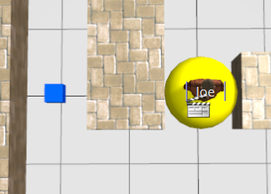

21.	The next steps are vital. We need to mark this object so that we can identify it from within the code later. Because there are going to be a lot of food objects, remembering all their names is going to be hard. Instead, we’ll assign a custom property to the object called ‘**gametype**’. We’ll make the value of this property ‘**food**’. While the first food object is selected, click the ‘**Scripts**’ button on the menu bar to open the Script Editor. 

	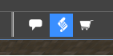

22.	When the Script Editor opens, find and click the '**Property**' tab.

	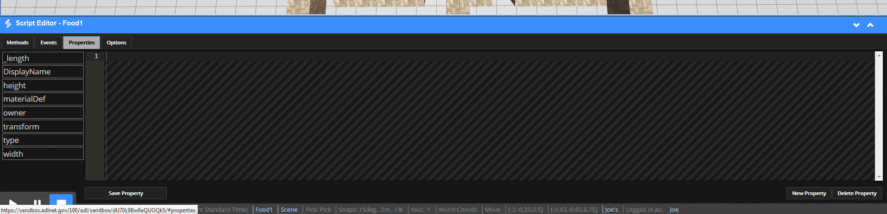

	**Note:** We’ll take much more about the Script Editor in part 3. For now, let’s just add the property and not worry about the rest. 

23.	Now, find the button in the bottom right that says ‘**New Property**’. Click it.


	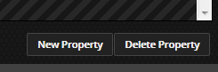

24.	When the prompt opens, type ‘**gametype**’. This will be the name of the new property. Click '**OK**'.


	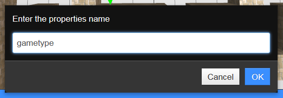

25.	On the next prompt, enter ‘**food**’. This will be the value of the new property. Click '**OK**'.


	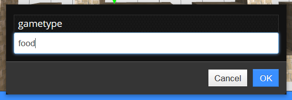

26.	You can now close the Script Editor. Use the '**down arrow**' on the right at the top of the panel.


	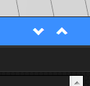

	**Note:** It’s very important that this step is successful. You can verify that the property was created by finding it in the list of properties on the left of the Properties Tab. If you see a button labeled ‘gametype’, we’re good to go.


	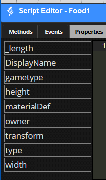

27.	We also need to mark the food object as ‘passable’. This will allow the player to move through the food without colliding with it later in part 3\. In the Properties Editor for the Food object, find and select the ‘**Passable**’ checkbox.


	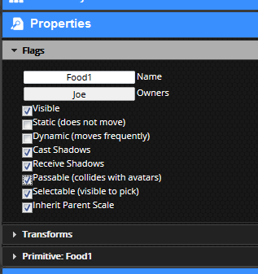

28.	We now have to copy the 'Food1' object to each point on the game along the paths. Using the '**Duplicate**' button, click the button to duplicate the selected food object. Duplicate the object, the click and drag along the RED or GREEN axis of the brightly colored axis graphic. You should see a new box move under the cursor.


	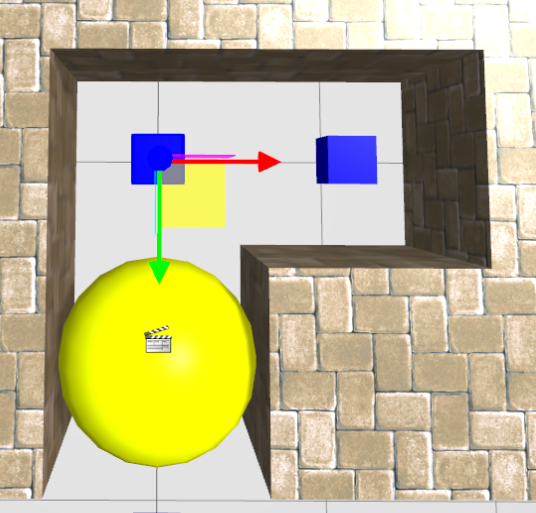

29.	Take some time and fill the game board with food objects as necessary. The editor tools have many options to make this faster. With some practice, you can do this in just a few minutes.


	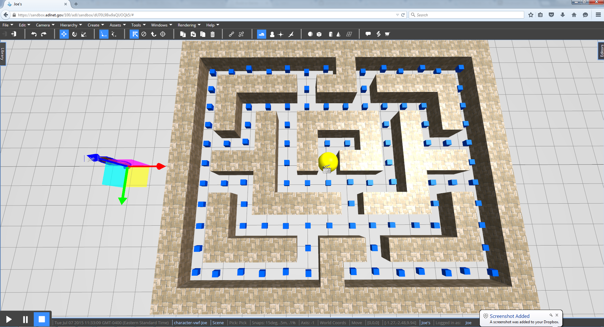

	**Info:** You can select more than one object at a time, and move or duplicate whole rows of food! Click and drag with the left mouse button to draw a rectangle on the screen. All objects in the rectangle will be selected. You can hold CTRL to add or ALT to subtract from the selection as well. 

	**Remember:** You must be in selection mode before you can click to select objects. 

30.	Using the same technique you’ve now mastered, duplicate the player object. Change its color to **red**, move it to the corner of the board, and name it '**Ghost**'.


	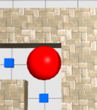

31.	Now, let’s just remove that gray grid. The texture of the default ground grid can be changed by editing the material of the Scene object. To select the scene, use the dropdown menu. Find **Edit->Select->Select Scene.**


	

32.	Not much will appear to change, but the material editor will now control the texture of the background grid. Use the material editor to create a solid white background. Click on the '**Material**' header, and uncheck the '**Wireframe**' checkbox. Now open the '**Texture Layer 0**' panel and click on the '**Delete Layer**' button.


	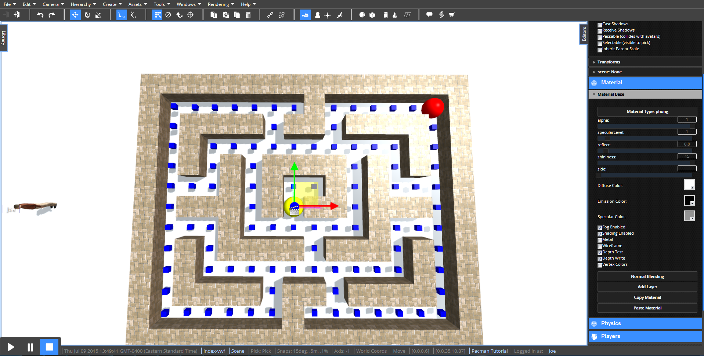

## Part 3: Scripting

Alright! Now we are cooking with fire. The whole scene is set up, and we just need to make the game work. To do so, we need to add some behaviors to the objects. This means we’ll have to write some code. This isn’t a programming course, and I’m not going to discuss every line of text here. Instead, I’ll give you the code, and you can apply it to the objects. For anyone familiar with JavaScript, you’ll immediately see hundreds of way to make this game more interesting, but let’s stick with the basics for now. (Apendix 1 on the sidebar for those that want a discussion of every line of code)

1.	First, let’s do the player code. Select the Player object, and open up the script editor. Make sure you’re on the Methods tab, and scroll down the list on the left until you see the word ‘**tick**’. Click it.

	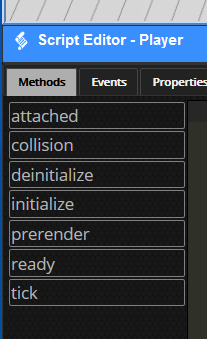

2.	The system will ask you if you want to create a new method called ‘tick’. Click '**OK**'. ‘Tick’ is the method that the engine will call at every frame of animation to update your objects.

	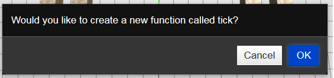

3.	Now, paste the below code in the script window between the opening and closing brackets { ... }.

```
	function tick()
	{
	
	    //This function was created for you by the system. 
	    //The tick function is called 20 times every second. 
	    // Write code here to animate over time
	 
	    "use strict";
	 
	     if (this.motionVec)
	    {
	        var oldpos = this.transformAPI.getPosition();
	        this.transformAPI.move(this.motionVec, 'parent');
	        var hit = _SceneManager.SphereCast(this.transformAPI.getPosition(), 0.35,
	        {
	            ignore: [_Editor.findviewnode(this.id).children[0].children[0], _Editor.GetMoveGizmo()],
	            filter: function(n)
	            {
	                if (n.passable) return false;
	                return true;
	            }
	        });
	        if (hit && hit.length)
	        {
	            this.transformAPI.setPosition(oldpos);
	        }
	    }
	
	}
```

4.	Click ‘**Save Method**’ to save this code on the object as the Tick method.

	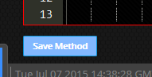

5.	<a id="newWorld"></a>Now, look above the tick method and click ‘**ready**’.

	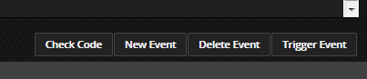

6.	A pop up will appear on the screen asking you if you want to create a new method called ‘ready’. Click '**OK**'.

	

9.	 Now the Script Editor stubs out the function for you. This process is very similar to the process to create the ‘Tick’ method. Enter the code below into the ‘**ready**’ method, copying over the what the editor has already provided (or skip the very first and very last line of code, since the editor has provided that for you.), and save it.

```
function ready()
{

    "use strict";

    //The scene is now completely loaded. This will fire on each client when the client
	//joins, so it`s not a great place to create objects

    //this is called when the object is setup, so event though the VWF state does not
	//contain this info, it's ok - this gets called on each client, even late joiners

    //here, we bind a function to the scenes keydown method.
    //since we might be calling the function several time during development,
	//let's unbind so we dont' get confused
    //by several copies of the function existing
    this.Scene.unbind("keyDown", this.keydown);
    this.Scene.unbind("keyUp", this.keyup);

    var self = this;
    console.log("this is ready");
    //we use a stack of keys so that the user gets the motion of the most recent key down
    //if we used just the last key, the motion would be strange when several were held
    this.keydown = function(eventData)
    {
        console.log("got keyDown");

        if (eventData.keysDown.uparrow)
        {
            self.motionVec = [0, -0.5, 0];
            self.movestate = 'up';
        }
        if (eventData.keysDown.downarrow)
        {
            self.motionVec = [0, 0.5, 0];
            self.movestate = 'down';
        }
        if (eventData.keysDown.leftarrow)
        {
            self.motionVec = [0.5, 0, 0];
            self.movestate = 'left';
        }
        if (eventData.keysDown.rightarrow)
        {
            self.motionVec = [-0.5, 0, 0];
            self.movestate = 'right';
        }
        console.log(self.movestate);
    }

    this.keyup = function(eventData)
    {
        //self.keyUp(event);

        console.log("got keyUp");

        if (eventData.keysUp.uparrow && this.movestate == 'up')
        {
            self.motionVec = null;
        }
        if (eventData.keysUp.downarrow && this.movestate == 'down')
        {
            self.motionVec = null;
        }
        if (eventData.keysUp.leftarrow && this.movestate == 'left')
        {
            self.motionVec = null;
        }
        if (eventData.keysUp.rightarrow && this.movestate == 'right')
        {
            self.motionVec = null;
        }

    }

    //ok, now we unbound any existing functions, and bound new ones.
    this.Scene.bind("keyDown", this.keydown);
    this.Scene.bind("keyUp", this.keyup);

}
```

11.	That’s it for the player. Deselect the player object, then click '**play**' in the main 3D window. Use the arrow keys on the keyboard. You should see the player move!

	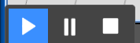

	**Note:** The movement directions may appear wrong, as if the keys are mapped the wrong way. Don’t worry about this – it depends on the camera orientation. In part 4, we’ll be sure to make a camera that looks in the right direction, so the keys seem to work properly. 

12.	Now, we need to create an object to hold some additional logic. This is the object that will check for the intersection of the player and the food, and make the food disappear. It will also monitor for when the game is complete. Use the skills you have learned above, and create a new **box**, which you can move outside of the maze area. Name it **GameManager**, and add the following code as its ‘**tick**’ method.

```
function tick(){
	if (!this.pacman) this.pacman = this.Scene.children_by_name.Player;
	if (!this.piplist)
	{
		this.piplist = [];
		for (var i = 0; i < this.Scene.children.length; i++)
		{
			if (this.Scene.children[i].gametype == 'food')
			{
				this.piplist.push(
				{
					pip: this.Scene.children[i],
					pos: this.Scene.children[i].transformAPI.getPosition()
				});
				this.Scene.children[i].visible = true;
			}
		}
		console.log(this.piplist);
	}
	var playerpos = this.pacman.transformAPI.getPosition();
	var activecount = this.piplist.length;
	for (var i = 0; i < this.piplist.length; i++)
	{
		var pip = this.piplist[i].pip;
		if (pip.visible == true)
		{
			var pos = this.piplist[i].pos;
			if (Vec3.distanceSquared(playerpos, pos) < 0.25)
			{
				pip.visible = false;
			}
		}
		else
		{
			activecount--;
		}
	}
	if (activecount == 30)
	{
		alertify.alert('You win!');
		this.reset();
	}
}
```

13.	Now, when you move across a food object, it will disappear. Move around and collect the food!

14.	We still need a way to reset the game. Go to the '**Events**' tab of the script editor, and find the '**New Event**' button in the bottom right corner. Click it, and when prompted, type '**reset**'.

	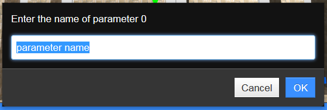

	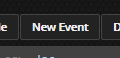

	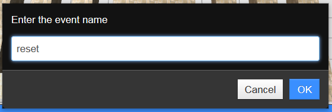

15.	When prompted for the number of parameters, leave the value at 0 and click '**OK.**' Paste the code below into the script window for the reset event.

	

```
function reset(){
    delete this.piplist;
    activecount = -10; //any value other than zero
    this.Scene.children_by_name.Ghost.transformAPI.setPosition(7, 5, 0.6);
    this.pacman.transformAPI.setPosition(0, 0, 0.6);
    console.log("reset Ghost and Player");
}
```

16.	Save the event code with the button labeled '**Save Event**'. **Note:** The exact values used depend on the exact setup of your level.

	

	**Remember: **You can find the proper values for your level by selecting the Ghost or the Player, and reading the translation out of the property editor. 

17.	Finally, we just need to add the code to make the Ghost work. Use the code below, but notice after the `alertify.log('Got you!');` line, the `...setPosition` arguments (the values in the parentheses) should be the same values you used above - the default position for the player. Select the **Ghost** object, open the **Script Editor**, create a **tick** method, and paste in the code below.

```
function tick(){
	if (window.paused) return;
	if (!this.pacman) this.pacman = this.Scene.children_by_name.Player;
	if (!this.pacman) return;
	var random = Math.random() * 2000;
	if (random > 0 && random < 10)
	{
		this.motionVec = [0, 0.5, 0];
	}
	if (random > 10 && random < 20)
	{
		this.motionVec = [0, -0.5, 0];
	}
	if (random > 20 && random < 30)
	{
		this.motionVec = [0.5, 0, 0];
	}
	if (random > 30 && random < 40)
	{
		this.motionVec = [-0.5, 0, 0];
	}
	var oldpos = this.transformAPI.getPosition();
	oldpos[0] = Math.floor(oldpos[0] * 2) / 2;
	oldpos[1] = Math.floor(oldpos[1] * 2) / 2;
	oldpos[2] = Math.floor(oldpos[2] * 2) / 2;
	this.transformAPI.setPosition(oldpos);
	if (Vec3.distance(oldpos, this.pacman.transformAPI.getPosition()) < 1.3)
	{
		alertify.log('Got you!');
		this.pacman.transformAPI.setPosition(0, 0, 0.6);
	}
	if (this.motionVec)
	{
		this.transformAPI.move(this.motionVec, 'parent');
		var hit = _SceneManager.SphereCast(this.transformAPI.getPosition(), 0.35,
		{
			ignore: [_Editor.findviewnode(this.id).children[0].children[0], _Editor.GetMoveGizmo()],
			filter: function(n)
			{
				if (n.passable) return false;
				return true;
			}
		});
		if (hit && hit.length)
		{
			this.transformAPI.setPosition(oldpos);
			var random = Math.random() * 40;
			if (random > 0 && random < 10)
			{
				this.motionVec = [0, 0.5, 0];
			}
			if (random > 10 && random < 20)
			{
				this.motionVec = [0, -0.5, 0];
			}
			if (random > 20 && random < 30)
			{
				this.motionVec = [0.5, 0, 0];
			}
			if (random > 30 && random < 40)
			{
				this.motionVec = [-0.5, 0, 0];
			}
		}
	}
}
```

18.	**Congratulations!** That's it! The game now works, and just needs a bit of polish to be completely finished!


## Part 4: Finishing touches

Great! At this point, our game basically works. The last thing we need to do is create a camera and publish the world. This is pretty easy stuff from here on out.

1.	First, let's create a camera object, so that the user of our game does not have to mess with positioning the camera. Use the drop down menu, and find **Create->Cameras->Perspective**


	

2.	When you click this, a camera object will be created at the center of your view. You should see a camera icon appear. If you don't, zoom closer, and make sure you are in selection mode. The icon should look like this:


	

3.	This icon helps you select and place the camera. Click on the camera to select it. You'll see a preview appear in the lower left of the main window that shows you what the camera sees. Move the camera so that it points down at the game board. You'll also see a helpful graphic that shows you in the main view where the camera is pointing. Aim for something like this:


	

	**Hint:** The way I moved the camera was with the Properties panel. I changed the Z transform value to 22, and the X rotation value to 90.

4.	Let's enter the camera to see exactly what it sees. Find the **Camera->Activate Camera **item on the dropdown list.


	

5.	When you click it, you'll see this prompt. Choose Camera1, and click ok.


	

6.	You are now looking exactly out of the camera. Use the arrow keys to move the player. Does it seem to go in the right direction? If not, you might need to go back to the Editor Camera, and reposition the camera object. If you're happy with the camera's view, then we're all done inside the editor, and we can move on to publish our game.

	

	**Note:** You will probably need to rotate your camera - it really depends on how your level is laid out. Look for the rotate tool on the toolbar. This will switch the axis graphic to a series of rings. Click and drag the rings to rotate the selected object. 

7.	Finally, before we leave the game, let's set the thumbnail that users will see on the main page. While looking out of your camera, use the dropdown menu item **File->Set World Thumbnail**. You should see a slight flicker in the main window. The exact image you see will now be the thumbnail for this world on the world's page.


	

8.	Since we're done editing the game, let's save this world. Click '**Save Now**' under the 'File' dropdown menu. (Sorry there's no ta-da!!)


	

9.	 Now use the Log out button in the upper left of the screen.


	

10.	An alert will ask you to confirm that you want to leave this page and remind you that you'll want to have already saved the world. We have, so click the '**Leave Page**' button.


	

11.	Now, we need to find your world so we update the settings. First double check whether your name is still in the upper right corner, or if you need to log in again. Next, go to the Worlds page. Use the search box to search for your world (i.e. Since I named the world Joe's, I'll search 'Joe') or click the '**My Worlds**' option.


	

12.	When you find your world, click the title or the thumbnail to get to the worlds landing page. since you are logged in, you should see an option to alter the settings for the world. Click on **Settings**.


	

	**Note: **You can change the publish settings in the future. If you need to keep editing, come back to the publish page, uncheck the publish button, then click publish. The world is now editable again. 

13.	Now, we want to double check a few settings. Since this is a single player game, check the '**Single Player**' checkbox. Be sure that "**Persist world state on close**", "**Create and Avatar for each user**", and "**Allow Editor Tools**" are unchecked. In the '**Choose Camera**' box choose the name of your camera. You should have an option called '**Camera1**'.


	

14.	Click the '**Save**' button! You're done! You now have a completely working game published on the VWS website. To play the game, just click '**Launch**' on the world's title from the Worlds page to load it.


## Conclusion

You can share this game with others by copying and emailing the direct link or your friends can search for it on the worlds page. By the end of this tutorial, you should have a firm foundation for building more complex games in the future. Hopefully, you'll also get comfortable with the user interface of the VWS software, and start thinking of other things to create! Here are a few challenges that build on this lesson. Make 3 Ghosts. Make a bigger level. Make the food come back after a certain time. If you're feeling really ambitious, make the Ghost behave with more intelligence. There is literally an infinite amount of ideas for expanding this simple tutorial. Check out the appendix below for more info on how the code works, if you're interested in making a more complex game. You can play the finished (with a few improvements) game here: [https://sandbox.adlnet.gov/100/adl/sandbox/world/hUnXSudIKvFmE82G](https://sandbox.adlnet.gov/100/adl/sandbox/world/hUnXSudIKvFmE82G "Pacman Tutorial - please enjoy.") Also view some other demos here: [https://sandbox.adlnet.gov/100/adl/sandbox/demos](https://sandbox.adlnet.gov/100/adl/sandbox/demos "VW Sandbox Demos").

## Appendix 1: Code explanation

It's not absolutely necessary for you to understand what the code is doing in order to make the game work. However, if you do know a bit of JavaScript, you might want to expand on this tutorial to build a more complex game. In that case, I'm providing here some explanation for the code you see above. I'll break it down by each object's methods and events, and each major portion of each of those scripts.

### Player Code

#### tick method

The code for the **tick** method on the player object.

```
function tick()
{

    "use strict";

    //This function was created for you by the system. 
    //The tick function is called 20 times every second. 
    // Write code here to animate over time
    if (this.motionVec)
    {
        var oldpos = this.transformAPI.getPosition();
        this.transformAPI.move(this.motionVec, 'parent');
        var hit = _SceneManager.SphereCast(this.transformAPI.getPosition(), 0.35,
        {
            ignore: [_Editor.findviewnode(this.id).children[0].children[0], _Editor.GetMoveGizmo()],
            filter: function(n)
            {
                if (n.passable) return false;
                return true;
            }
        });
        if (hit && hit.length)
        {
            this.transformAPI.setPosition(oldpos);
        }
    }

}
```

Below, we are just declaring the function. Its name, 'tick', is a special case name within the VWS system. Tick functions on objects are called 20 times a second. This is where you can change values over time to create motion or other animations.

```
function tick()
{...
}

```

If **this** object (the *Player*), has a **motionVec** variable, then get and store the current object position in a variable called **oldpos**. Then move the object (*Player*) by the motion vector. So, if the **Player** is at [1,0,0], and **motionVec** is [1,0,0], make the new position of the player [2,0,0]. You can see how, by calling **this** at every tick, the value of the X coordinate of the player's position increases over time. This is the basic mechanism for moving the player. The **KeyDown** and **KeyUp** events control what the value of **this**.**motionVec** is.

```
...if(this.motionVec)
	{
		var oldpos = this.transformAPI.getPosition();
		this.transformAPI.move(this.motionVec, 'parent');...
```

This is a much more interesting bit of code. It's what prevents the character from intersecting the walls. **_SceneManager.SphereCast** is a function that allows you to query the geometry of the world, to decide if any of the objects in the world intersect a sphere. The first parameter is the center of the sphere you would like to use to check for intersections. The second parameter, in this case **0.35**, is the radius of the sphere. Notice how we are basically saying "Now that we've moved the player, does a sphere at his new position with a radius of **0.35** intersect any of the world geometry?". **_SceneManager.SphereCast** also takes an options object as the final parameter. This object here contains a list of graphics objects to ignore - namely, the sphere itself, and the Axis control you've been using to move objects around. This is sort of a leaky abstraction - from game code, your objects should have no knowledge of the Axis "gizmo" that you use to move objects. We'll fix this in time. Also, eventually you'll be able to ignore objects by the names you give them, rather than the ugly **_Editor.findviewnode(this.id)...**. Because the **SphereCast** function operates over the graphic objects, it currently expects you to provide the actual 3D sphere object from the graphics engine. **_Editor.findviewnode(this.id)** is how you access this (for now).

```
...var hit = _SceneManager.SphereCast(this.transformAPI.getPosition(), 0.35,
	{
		ignore: [_Editor.findviewnode(this.id).children[0].children[0], _Editor.GetMoveGizmo()],
		filter: function(n)
		{
			if (n.passable) return false;
			return true;
		}
	});...
```

This last bit is much easier. It just says "Well, if we did hit something, put the **Player** back where he was!" That's all there is to preventing intersections for this simple game.

```
	if (hit && hit.length)
	{
		this.transformAPI.setPosition(oldpos);
	}
```

#### ready method

The code for **ready**

```
function ready()
{

    "use strict";

    //The scene is now completely loaded. This will fire on each client when the client 
	//joins, so it`s not a great place to create objects

    //this is called when the object is setup, so event though the VWF state does not 
	//contain this info, it's ok - this gets called on each client, even late joiners

    //here, we bind a function to the scenes keydown method.
    //since we might be calling the function several time during development, 
	//let's unbind so we dont' get confused
    //by several copies of the function existing
    this.Scene.unbind("keyDown", this.keydown);
    this.Scene.unbind("keyUp", this.keyup);

    var self = this;
    console.log("this is ready");
    //we use a stack of keys so that the user gets the motion of the most recent key down
    //if we used just the last key, the motion would be strange when several were held
    this.keydown = function(eventData)
    {
        console.log("got keyDown");

        if (eventData.keysDown.uparrow)
        {
            self.motionVec = [0, -0.5, 0];
            self.movestate = 'up';
        }
        if (eventData.keysDown.downarrow)
        {
            self.motionVec = [0, 0.5, 0];
            self.movestate = 'down';
        }
        if (eventData.keysDown.leftarrow)
        {
            self.motionVec = [0.5, 0, 0];
            self.movestate = 'left';
        }
        if (eventData.keysDown.rightarrow)
        {
            self.motionVec = [-0.5, 0, 0];
            self.movestate = 'right';
        }
        console.log(self.movestate);
    }

    this.keyup = function(eventData)
    {
        //self.keyUp(event);

        console.log("got keyUp");

        if (eventData.keysUp.uparrow && this.movestate == 'up')
        {
            self.motionVec = null;
        }
        if (eventData.keysUp.downarrow && this.movestate == 'down')
        {
            self.motionVec = null;
        }
        if (eventData.keysUp.leftarrow && this.movestate == 'left')
        {
            self.motionVec = null;
        }
        if (eventData.keysUp.rightarrow && this.movestate == 'right')
        {
            self.motionVec = null;
        }

    }

    //ok, now we unbound any existing functions, and bound new ones.
    this.Scene.bind("keyDown", this.keydown);
    this.Scene.bind("keyUp", this.keyup);

}
```

This one is much simpler, and I won't spend too much time on it. The engine notifies your objects about user input events by calling the Event code you inserted in the Script Editor panel. Because we had the **Player** selected when we created the code above, '**this**' means the player. So, think about the code above in the **tick** section. You can see how the value of the player motion depends on the **motionVec**, and the value of **motionVec** is controlled by the **keyDown** events. We also track **this.movestate** just to make it easier to figure out what key is currently pressed. This information is also contained in the **motionVec** variable, but I've done it this way just for readability. I won't go into any detail on the keyUp code. It should be self explanatory.

### Ghost Code

The Ghost object is a very simple example of AI. It just randomly moves around the scene, and detects when it gets close to the player. Here is the total code for the Ghost. It's all located inside the objects tick method.

```
function tick(){
	if (window.paused) return;
	if (!this.pacman) this.pacman = this.Scene.children_by_name.Player;
	if (!this.pacman) return;
	var random = Math.random() * 2000;
	if (random > 0 && random < 10)
	{
		this.motionVec = [0, 0.5, 0];
	}
	if (random > 10 && random < 20)
	{
		this.motionVec = [0, -0.5, 0];
	}
	if (random > 20 && random < 30)
	{
		this.motionVec = [0.5, 0, 0];
	}
	if (random > 30 && random < 40)
	{
		this.motionVec = [-0.5, 0, 0];
	}
	var oldpos = this.transformAPI.getPosition();
	oldpos[0] = Math.floor(oldpos[0] * 2) / 2;
	oldpos[1] = Math.floor(oldpos[1] * 2) / 2;
	oldpos[2] = Math.floor(oldpos[2] * 2) / 2;
	this.transformAPI.setPosition(oldpos);
	if (Vec3.distance(oldpos, this.pacman.transformAPI.getPosition()) < 1.3)
	{
		alertify.log('Got you!');
		this.pacman.transformAPI.setPosition(0, 0, 0.6);
	}
	if (this.motionVec)
	{
		this.transformAPI.move(this.motionVec, 'parent');
		var hit = _SceneManager.SphereCast(this.transformAPI.getPosition(), 0.35,
		{
			ignore: [_Editor.findviewnode(this.id).children[0].children[0], _Editor.GetMoveGizmo()],
			filter: function(n)
			{
				if (n.passable) return false;
				return true;
			}
		});
		if (hit && hit.length)
		{
			this.transformAPI.setPosition(oldpos);
			var random = Math.random() * 40;
			if (random > 0 && random < 10)
			{
				this.motionVec = [0, 0.5, 0];
			}
			if (random > 10 && random < 20)
			{
				this.motionVec = [0, -0.5, 0];
			}
			if (random > 20 && random < 30)
			{
				this.motionVec = [0.5, 0, 0];
			}
			if (random > 30 && random < 40)
			{
				this.motionVec = [-0.5, 0, 0];
			}
		}
	}
}
```

#### tick method

In this first section, we just try to get a reference to the **player** object. If can't get one for some reason, we just end the code by calling **return**. Notice how we save the reference to the **player** in the variable **this.pacman**? Looking up the object by its name is a somewhat expensive operation. It makes much more sense to find it once and hold onto it in a variable, then to look it up each time.

```
	if (window.paused) return;
	if (!this.pacman) this.pacman = this.Scene.children_by_name.Player;
	if (!this.pacman) return;...
```

The Ghost code will work a lot like the player code. Every frame, we move the object by some value. Because the Ghost does not accept keyboard inputs, it instead uses a random number. Here, we randomly choose a direction to move. Using 2000 possible random numbers, but only changing direction for 40 of them gives us less than 2% chance of changing directions while nothing hinders the Ghost.

```
	var random = Math.random() * 2000;
	if (random > 0 && random < 10)
	{
		this.motionVec = [0, 0.5, 0];
	}
	if (random > 10 && random < 20)
	{
		this.motionVec = [0, -0.5, 0];
	}
	if (random > 20 && random < 30)
	{
		this.motionVec = [0.5, 0, 0];
	}
	if (random > 30 && random < 40)
	{
		this.motionVec = [-0.5, 0, 0];
	}
```

This block of code is just some housekeeping. In this game, it's important that objects move in strait lines, and that they never end up with fractional positions, other than half steps between numbers. If the X position of the Ghost object is 1.34324343 or something like that, it can get stuck in walls. While the code normally does not allow the object to get into that sort of a state, this code just ensures it never happens. We read the position, clamp it to half steps with Math.floor, and write it back.

```
	var oldpos = this.transformAPI.getPosition();
	oldpos[0] = Math.floor(oldpos[0] * 2) / 2;
	oldpos[1] = Math.floor(oldpos[1] * 2) / 2;
	oldpos[2] = Math.floor(oldpos[2] * 2) / 2;
	this.transformAPI.setPosition(oldpos);
```

This simple block of code is the code that checks if the player got too near the Ghost. We could have used SphereCast like above, but this is simpler and works just as well. When the player gets too close, we send the player back to the start position, and make a little popup that says 'Got you!' Note that the value in the **setPosition** will depend on the layout of your level.

```
	if (Vec3.distance(oldpos, this.pacman.transformAPI.getPosition()) < 1.3)
	{
		alertify.log('Got you!');
		this.pacman.transformAPI.setPosition(0, 0, 0.6);
	}
```

This is the code that moves the ghost, just like the player. The ghost moves the amount of his **motionVec**. We use the exact same collision detection code, filtering out the ghosts own polygons, and any polygons of passable objects.

```
	if (this.motionVec)
	{
		this.transformAPI.move(this.motionVec, 'parent');
		var hit = _SceneManager.SphereCast(this.transformAPI.getPosition(), 0.35,
		{
			ignore: [_Editor.findviewnode(this.id).children[0].children[0], _Editor.GetMoveGizmo()],
			filter: function(n)
			{
				if (n.passable) return false;
				return true;
			}
		});
	}
```

This final bit of code is very similar to the first block that randomly changed the **motionVec**. The difference is that this code is in the block with if(hit). This means that the code will only execute when the object hits something. Notice how the random chance of changing the value is much higher. Since the ghost has hit an object, it must change direction!

```
		if (hit && hit.length)
		{
			var random = Math.random() * 40;
			if (random > 0 && random < 10)
			{
				this.motionVec = [0, 0.5, 0];
			}
			if (random > 10 && random < 20)
			{
				this.motionVec = [0, -0.5, 0];
			}
			if (random > 20 && random < 30)
			{
				this.motionVec = [0.5, 0, 0];
			}
			if (random > 30 && random < 40)
			{
				this.motionVec = [-0.5, 0, 0];
			}
```

### GameManager Code

Like the Ghost, the GameManager has only a tick method. However, unlike the Ghost, the GameManager is not all that interested in its own location or movement. Instead, we use the GameManager object to hold some global code that implements the game logic. The GameManager also has the necessary code to reset the game implemented in an event called 'reset'.

#### tick method

First, we just find and cache a reference to the player object. It's more efficient to cache this value then to find it at every tick.

```
	if (!this.pacman) this.pacman = this.Scene.children_by_name.Player;
```

This block of code is part of the setup of the game. Notice how it's surrounded by "**if(!this.piplist)**". So, if the object is not initialized with that value, we go ahead and set that value up. The **this.piplist** variable is an array that holds references to each food item in the scene, and the position of that object. We iterate over all the objects in the scene with "**for (var i = 0; i < this.Scene.children.length; i++)**". Notice how we next check each object to see if its '**gametype**' property is equal to '**food**'. You'll remember where we set this up in part 2. When you copied all the copies of the food object, this property copied as well. That's how we can check to see if each object is a food object, or something else like a wall. You'll also notice that this block of code caches the positions of each food inside of **this.piplist[i].pos**. Caching these values is efficient, because the objects never move! This block of code also sets each food object back to visible.

```
	if (!this.piplist)
	{
		this.piplist = [];
		for (var i = 0; i < this.Scene.children.length; i++)
		{
			if (this.Scene.children[i].gametype == 'food')
			{
				this.piplist.push(
				{
					pip: this.Scene.children[i],
					pos: this.Scene.children[i].transformAPI.getPosition()
				});
				this.Scene.children[i].visible = true;
			}
		}
	}
```

Here, we simply get the current position of the player, and the total number of food objects.

```
	var playerpos = this.pacman.transformAPI.getPosition();
	var activecount = this.piplist.length;
```

Here is the real meat of the goal of the game. Loop over every bit of food. If that food is visible, and if the distance from the food to the player is less than 0.25, make the food object invisible by calling **visible=false**; If the food is not visible, just subtract 1 from the total count. So, after this loop has run, **activecount** tells us how much food is still not eaten. What do we do with that?

```
	for (var i = 0; i < this.piplist.length; i++)
	{
		var pip = this.piplist[i].pip;
		if (pip.visible == true)
		{
			var pos = this.piplist[i].pos;
			if (Vec3.distanceSquared(playerpos, pos) < 0.25)
			{
				pip.visible = false;
			}
		}
		else
		{
			activecount--;
		}
	}
```

It's as simple as that. If there is not more active food (food which is visible, then we show a message, and **reset** the game. **This.reset()** triggers the **reset** event.

```
	if (activecount == 0)
	{
		alertify.alert('You win!');
		this.reset();
	}
```

#### reset event

In the **reset** function, we just place the ghost and player back at their staring positions, and delete the list of food. Remember that, at the next tick, if the GameManager does not have a list of food, it will create that list, and make all the food visible.

```
	function reset()
	{
		deletethis.piplist;
		this.Scene.children_by_name.Ghost.transformAPI.setPosition(4, -17, 0.5);
		this.Scene.children_by_name.Player.transformAPI.setPosition(-2, -10, 0.5);
	}
```

	**Note:** The positions that the ghost and player need to be set to will differ in your level from these values. 

## Appendix 2: About the VWS

The Virtual World Sandbox is a project from Advanced Distributed Learning to bring game based training and scenario design to more people by building a completely HTML5, web based, multiuser simulation engine. The VWS application is built on top of the Virtual World Framework, a next generation simulation foundation. The VWS website is a demonstration site, and should be used for exploration and entertainment only. To setup your own server, check out the installation documents on GitHub. You can learn more about the Virtual World Framework at [http://www.virtualworldframework.com.](http://www.virtualworldframework.com.) Contribute to the VWS project at [https://github.com/adlnet/Sandbox](https://github.com/adlnet/Sandbox "https://github.com/adlnet/Sandbox") Send questions and comments to: Robert.chadwick.ctr@adlnet.gov. This tutorial was built with VWS version 0.4.7.2 on November 18, 2013, and updated with ADL Sandbox 1.0 Beta on July 20, 2015.

