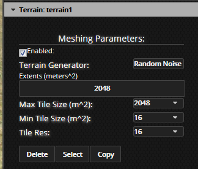
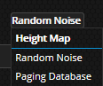

## Introduction

The Sandbox allows you to create a special entity type to render terrain. Like all Sandbox objects, the terrain object exposes properties that can be manipulated by the author. By setting these properties, you can control what landscape is rendered, how it looks, and its resolution. The terrain engine that underlies the terrain object is composed of several parts, each of which adds its own modifiable properties to the terrain object’s interface. Use the terrain object whenever you need a surface that would contain too many polygons to render with a standard 3D model file. For instance, the scene above is 13,000 by 8,000 meters. With a resolution of 1 polygon per square meter, this 3D asset file would need about 100 million vertices. The terrain engine dynamically allocates vertices around the camera, and removes vertices in the distance to create the image above, which uses only 100 thousand polygons.

## Overview of the terrain engine

The terrain rendering engine is composed of several major components: the quadtree, the algorithm, the generator and the shader. These parts work in concert to create a seamless surface that dynamically allocates polygons to details near the camera. The quadtree is responsible for laying out terrain ’tiles’ in such a way as to make the geometry denser near the camera. The generator manages a complex system to generate the proper height for each vertex – this is actually off loaded from the main Javascript thread into a pool of WebWorkers. This setup allows the system to do other things simultaneously while the terrain mesh is computed. The algorithm supplies the generator with the proper height of each vertex, and the shader presents that information to the renderer. The settings you manipulate generally will affect either the quadtree or the algorithm. While we currently do not expose aspects of the generator or shader to the GUI interface, we may do so in the future.

## Setting the terrain resolution.

Because the nature of the terrain engine is such that it is constantly reshuffling the exact positions of the vertices, there cannot be a simple ‘high’, ‘medium’, or ‘low’ resolution setting. Instead, you manage the effective resolution by setting the size of the quadtree tiles. A quadtree is just a structure that looks something like this.

The terrain system cuts space up into a grid organized something like the image above, with the densest portion around the camera. Each square above would be filled with one grid mesh, to generate a surface like this.

Here, each portion of the quadtree is covered by a 4×4 grid of points. This resolution (4×4) is the ‘**Tile Res’**. You can increase the total resolution of the terrain by setting the **Tile Res **property.

Here is the same quadtree covered by tiles with a resolution of 16×16

**Info: **You can change the resolution of the terrain by changing the Tile Res property. This property should be a power of 2 number, like 4,8,16 or 32. 

You can also control how deeply the world is divided. The quadtree will continue to be split until the size of each tile is equal to the Min Tile Size.

In this image, the Min Tile Size is 4 meters – meaning that the smallest tiles are 4×4 meters square. Note that the actual mesh is hidden here.

Here is the same terrain with a Min Tile Size of 16\. Note how the engine stops splitting the tiles after only a few divisions.

**Info: **You can change the smallest possible tile size with the ‘Min Tile Size’ 

You can also set a maximum size for tiles. When a tile is larger than this value, it will be hidden.

Here, the Max Tile Size is set to 32\. The largest blocks were 64 by 64 meters, so they were not shown. You can control the total number of tiles drawn at one time by making sure the Max Tile Size is set appropriately. This could be so big that the user never sees that tiles are missing, because they would be over the horizon. It’s usually not necessary to render the whole world at all – the user can see only a finite distance anyway.

Here is the same world with a Max Tile Size of 16\. The 32×32 meter tiles are hidden.

**Info: **You can change the largest possible tile size with the ‘Max Tile Size’ 

Finally, the total size of the world is the ‘Extents’. The total terrain system will not render anything beyond the extents.

**Info: **Extents means the total size of the terrain object. Nothing will be drawn further. 

Up to this point, I’ve been using simplified images to illustrate the idea. Let’s look at a real wireframe from the terrain engine. Note that I’ve done some tricks so we can actually get some top down views of the structure. When actually running, the tree is constantly changing.

Notice how the resolution of the mesh falls off in the distance?

This is the same terrain mesh when viewed from the top down. The densest region is focused around the camera.

If I zoom out far enough, you can see the effect of the Max Tile Size. At some point, the tiles stop rendering.

Likewise, if I zoom far enough, you’ll see that the quadtree structure stops splitting finer. This is the result of the Min Tile Size.

Finally, here is the result of the Extents – there is some boundary to the entire system.

For a first person view of terrain, we suggest a Min of 16, with a Tile Res of 16, and a Max of 2048\. Set the extents to whatever value you require. These settings will give you a maximum resolution of one polygon per meter.

For a flight game, something more like a Min of 256, a Res of 16 and a Max of 8192 might be better.

## Height Map Terrains

The terrain object allows you to specify what algorithm you wish to use to generate the terrain height values. You’ll note all the information above applies only to the x and y distribution of the points – we have not talked at all about where the Z comes from. Most readers will be interested in loading terrain from a height map source. In order to do this, you must first select the ‘heightmapTerrainAlgorithm’ as the terrain algorithm for the terrain. This terrain algorithm will read values from a file to set the Z position of the terrain points.

Click the field labeled ‘Terrain Generator’ on the properties panel for the terrain object.

Select ‘Height Map’ as shown above. You may have to reopen the properties panel, because selecting the terrain generator algorithm may add or remove properties from the object.

**Note: **HeightMap is the only option above that currently is usable. Unless you are a core developer, don’t worry about the other options. 

You should now have a button that allows you to select a height map as the data source. Click the button to launch the map browser.

Click the thumbnail of the image you wish to be the height map source. Here, I’ve selected the checker pattern.

Look at this! The white parts of the image are high, and the dark parts low. This is not a very realistic terrain, but you should be able to see how you could create more interesting terrains with a paint tool.

Here is a much better heightmap. Let’s see what it looks like when loaded into the engine.

Better! We can actually see some ridges and rivers in this image.

Still, this is not perfect, and not a good example of real world data. Because images must use a color to represent a height, the precision of the heightmap is limited. You can load a special format called a .BT file, which is a better way to represent height, but is harder to create. We’ll write a separate tutorial on how to generate a .BT file.

## Height Map Terrain Materials

The HeightMap terrain generator uses a technique called ‘Texture Splatting’ to mix together different images. This means that you provide one texture that tells the terrain where the other textures go. For instance, the material could be configured so that where the ‘MixMap’ is blue, a water texture appears. This will be described in detail below. The material also allows you to specify an overall image that will be used instead of the tiling textures in the distance.

Each of the buttons above will allow you to select a texture. Let’s look at an example Mix Map

./

This image is used to place other textures. Where this image is blue, the texture selected by the ‘Blue Channel Texture’ button will be used. Likewise for green and red. When there is no color for an area (where the MixMap is black) the Black Channel Texture is used. The MixMap will stretch exactly once over the heightmap.

The image above illustrates this principal. I’ve picked grass, water, and rock to illustrate the red, green and blue channel textures, and sand for the black channel.

As the terrain gets farther away from the camera, the image specified by the ‘Texture URL’ is faded in. You can see that effect here: notice up the valley, the grass, rock and sand fade away.

This is the image I’m using for the ‘Texture URL’. Like the MixMap, this will stretch exactly once over the heightmap. It’s possible to use real aerial photography for this image.

Here, you can see that in the distance, the ‘Texture URL’ completely replaces the MixMap.

