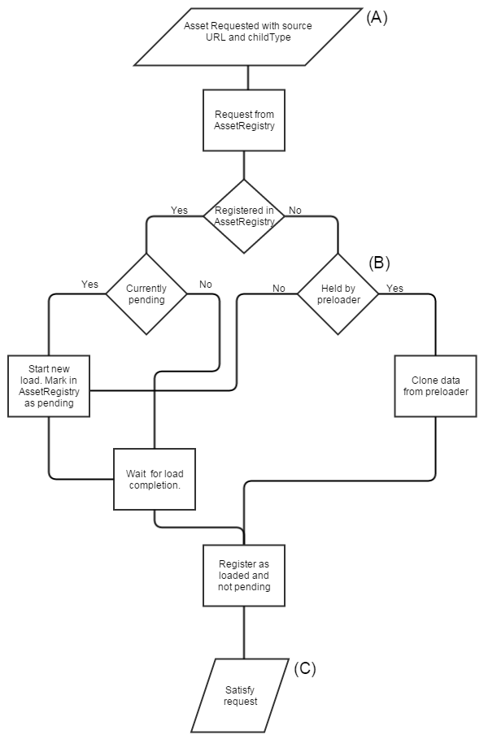

<h1>Architecture</h1>

A guide to understand the VW Sandbox architecture.

[TOC]

# Architecture Overview

The VW Sandbox is an [extendable](#extending-the-vw-sandbox) system providing collaborative authoring of cloud-based multiplayer and singleplayer simulations.  It is composed of a node.js [server-side JavaScript](#server-side-javascript) application and a [client-side JavaScript](#client-side-javascript) application.  The server-side JavaScript manages user and simulation data, exchanges messages between simulation clients, and provides a web server and a Web Service API.  The client-side JavaScript provides an editor and an engine for single and multiplayer simulations made up of drivers.  The engine provides drivers for Scripting, Transforms, Graphics, Physics, User Interfaces, and Audio.  The Scripting driver provides the Scripting API enabling simulation developers to use the engine's drivers. 

# Extending the VW Sandbox

The VW Sandbox architecture is extendable.  If you are interested in extending the VW Sandbox, there are some natural places to extend it listed below that do not require complete knowledge of the architecture or significant changes to the architecture.

### Add a Custom Graphic Type.

See [Custom Graphics](graphics.md#custom-graphics) in the Graphics section and the [Custom Graphic Tutorial](tutorials/custom-graphic-tutorial).

### Add a Menu Item

The menu items in the dropdown menus are defined in `support\client\lib\vwf\view\editorview\menus.html`. You can simply add new divs to this HTML file to create new dropdowns or submenus. Styles will be applied automatically. 

1. It should look something like this: ` <li><a  id="MenuSnapOff">Off</a></li>`
1. Hook up the click handler to do something.
  1. We generally use the `support\client\lib\vwf\view\editorview\Menubar.js` file for this.

```
 $('#MenuGlobalInventory').click(function(e) {
            if (_InventoryManager.isOpen())
                _InventoryManager.hide();
            else {
                _InventoryManager.show();
                $("#InventoryTypeChoiceGlobal").click()
            }

        });
```

Note that all editor actions are unsynchronized code. This means that you should not directly create or modify entities by calling `vwf.createChild` or `vwf.setProperty` or the other VWF API methods. The correct thing to do is bounce the message off the reflector server by calling `vwf_view.kernel.createChild` or `vwf_view.kernel.setProperty` or the other external VWF API methods.

It's also good pratice to check that the given user has permission to perform the action. While the reflector server will reject unauthroized messages, you should check permission beforehand so you can prompt the user with good feedback. The reflector will produce no output when rejecting your messages.


### Add an Editor to the Side Panel

In order to create a new editor in the side panel, there are a few steps. 

1. Create new editor panel JavaScript file
1. Load the new editor when the EditorView loads
1. Optionally create a global reference
1. Initialize the editorpanel

To create the file, add a new JS file in `support/client/lib/vwf/view/EditorView/`. This file should be a requireJS module, and have a GetSingleton function that creates and return the object. See this example below from `PhysicsEditor.js`

```
define([], function() {
    var PhysicsEditor = {};
    var isInitialized = false;
    return {
        getSingleton: function() {
            if (!isInitialized) {
               var baseclass = require("vwf/view/editorview/panelEditor");
              
                baseclass(PhysicsEditor,'PhysicsEditor','Physics','material',true,true,'#sidepanel')
                
                PhysicsEditor.init()
                initialize.call(PhysicsEditor);
                PhysicsEditor.bind()
                isInitialized = true;
            }
            return PhysicsEditor;
        }
    }
    function initialize()
    {
        ...
        //set up the object here
        this.BuildGUI = function()
        {

        }
    }
}
```
When calling the baseclass **panelEditor.js**, provide the parameters in this order:

1. The object itself, usually a new blank JS object
1. A name for the object
1. The title that will appear in the titlebar
1. The icon class from the icon sheet
1. Whether or not the editor will disable when there is no selection
1. Whether or not BuildGUI wll be called when the selection is changed
1. The div selector to attach to. Use `#sidepanel` for the normal SidePanel. 

Your object will inherit the functions 

1. show
1. hide
1. isOpen
1. enable
1. disable
1. isDisabled

You might also want to add a button to the toolbar or a menu item. Now that you have the class, you'll need to load it during the boot sequence. To do this, it first must be listed as a dependancy of the EditorView. Open `support/client/lib/vwf/view/EditorView.js` and find the string `define([...`. This is the list of modules that the EditorView depends on. These will be loaded by require.js when the system is started. Add your file to this list. 

You'll need to call the getSingleton function. Within the `if(needTools)` block, add
```
window._YourEditor = require("vwf/view/editorview/yourEditor").getSingleton();
```
If you don't need global or console access to the object, you may choose not to store the module in the global namespace.

You can also add a line
```
this.addManager(window._YourEditor)
```
The EditorView will route VWF API notification calls to your editor, similar to a VWF View Driver.


### Add an Editor Camera Mode

Camera modes used during editing are fundementally different than cameras used during gameplay. Camera modes are manipulations of the Editor Camera. The Editor Camera is a special case object that is not part of a multiplayer simulation.  You should not rely on the Editor Camera control code for your in game camera motions. 

The file `editorCameraController.js` loads and controls the camera controllers. Add your new controller here just as the existing ones are. Also, you might want to add an entry to the menubar to activate it.

There is only one `Editor Camera`. This camera is controlled with several different algorithms as defined in the various camera controller modules. Adding a new camera object is independant of the existing `Editor Camera`, and is described in [Create a Camera](graphics.md#creating-cameras) in the Graphics section.

You can add new `Editor Camera` modes by creating a new file in `support/client/lib/vwf/view/threejs/`. This file should be a require.js define call that returns an object. This object should implement
```
   this.initialize = function(camera){...}  //store the incoming camera
   this.activate = function(){...}          //this controller has been activated
   this.deactivate = function(){...}        //this controller has been deactivated
   this.setCameraMode = function(mode){...} //used for controllers that are registered to more than one mode string
   this.updateCamera = function(){...}      //here, you should set the position and orientation of the camera passed into initialize
```   
Next, add your module as a dependancy for the module in `support/client/lib/vew/view/threejs/editorCameraController.js`, and associate it with a mode string by adding
```
  yourModule.initialize(this.camera);
  this.addController('modeName',yourModule);
```
Your new mode will receive JQuery input events when the user takes mouse actions on the `index-vwf` div, and your mode is active. Take a quick look at `vwf/view/editorView/threejs/editorCameraController` to see what functions are available.

You can activate your new controller by calling 

```
   require('vwf/view/editorView/threejs/editorCameraController').setCameraMode('modeName')
```

### Show or Hide Editor Components

Each of the major Editor components can be hidden.
```
require("vwf/view/editorview/WindowResize").hideLibrary()
require("vwf/view/editorview/WindowResize").showLibrary()
require("vwf/view/editorview/WindowResize").hideSidePanel()
require("vwf/view/editorview/WindowResize").showSidepanel()
require("vwf/view/editorview/WindowResize").hideMenubar()
require("vwf/view/editorview/WindowResize").showMenubar()
require("vwf/view/editorview/WindowResize").hideToolbar()
require("vwf/view/editorview/WindowResize").showToolbar()
require("vwf/view/editorview/WindowResize").hideStatusbar()
require("vwf/view/editorview/WindowResize").showStatusbar()
```

[comment]: <> (Add a new Avatar)


### Add a New Entity Library

Entity libraries are JSON files that populate the EntityLibrary GUI element on the left hand side of the interface. The Editor can load multiple libraries, and each library can contain multiple entities. Default libraries are configured in `public\adl\sandbox\contentLibraries\libraries.json`. This is a simple JSON object that contains an map of library names and URLS in the form
```
{
    "Demo Entities": {
        "url": "./contentlibraries/entities.json"
    },
}
```

Each referenced url for an entity library file should resolve to a JSON object. This URL need not be on the same server as the VW Sandbox. A library file is a map of titles and data in the form
```
"Grassy Plain":{
        "url":"./contentlibraries/environments/vwf/grassyplain.vwf.json",
        "preview":"./contentlibraries/environments/thumbs/grassyplain.png",
        "type":"environment"
    }, ...
``` 
These objects have several available keys, at minimum you should provide the `url`, `preview`, and `type`. `url` is the location of the resource JSON data. This data need not be on the same server as the library file itself. `preview` is simply an image that will be displayed. `type` effects the behavior of the EntityLibrary, and also the interpretation of the data in `url`. `type` can be

1. asset         - use this for any 3D entity. The data at the url should be a VWF node definition
1. child         - use this for behaviors. The library will only allow this object to be dropped onto another object. url should be a VWF node 
1. environment   - this is a package of scene settings. 
1. material      - this is a MaterialDef value

There are a few other properties that can be added to the library object definition that control the drag and drop 3D preview

```
       "dropPreview":
        {
            "url": "./contentlibraries/entities/assets/defaulttree.json",
            "type": "subDriver/threejs/asset/vnd.osgjs+json+compressed",
            "transform": [
                1,
                0,
                0,
                0,
                0, -2.2112923048211997E-8,
                1,
                0,
                0, -1, -2.2112923048211997E-8,
                0,
                0,
                0,
                0,
                1
            ]
        },
```
DropPreview should contain a known asset type string (see the [Known ChildType Values](#known-childtype-values) of the [Engine's Asset Pipeline](#engine-asset-pipeline)), a URL to a 3D asset file, and a transform. This transform can be used to offset the raw three.js object from it's origin to reflect what the asset might look like in the VWF node definition. 

`dropOffset` can specify an offset transform that will be applied to the object after the library identifies the drop position in 3D space. 

`snap` will cause the drag and drop behavior to restrict the creation point to multiples of the value. Should be a number, in meters.

# Server-Side JavaScript

The Server-Side JavaScript manages user and simulation data, exchanges messages between simulation clients, provides a web server and a Web Service API, and delivers the client-side JavaScript.  The Node.js application makes heavy use of [Express](http://expressjs.com/), a minimalist web framework. It's composed of several sub systems:

1. [Reflector](#reflector)
1. [File Server](#file-server)
1. [Web Service API](#web-service-api)
1. [Data Access Layer](#data-access-layer)
1. [Views](#views)

Session is currently handled with Express middleware, although this was not always the case. We are currently using [Cookie-Session](https://github.com/expressjs/cookie-session).

### Reflector

The reflector is a portion of the system that synchronizes worlds. It's job is to accept messages from clients and send them to all participants in the world. This allows the simulation to only move forward when all clients receive the message. This system also keeps track of all the running worlds, and detects when all uses have left so a world can be shut down.  This the system is implemented in `reflector.js`. See [File Organization](#file-organization) for more info.

### File Server

The file server is a simple tool that responds to request for files by the client. Each file is GZipped and loaded into memory before being served. The File Server component is implemented in `filecache.js`. See [File Organization](#file-organization) for more info.

### Web Service API

The web front end uses many services on the server to manipulate worlds and users. This system includes the endpoints for CRUD operations on worlds and users, as well as upload of files, thumbnails, and a few other odds and ends. The Express routes send any request that includes `/vwfdatamanager.svc/` to this system. It's implemented in `sandboxAPI.js`. See [File Organization](#file-organization) for more info.

!!! note:

    All API commands require login unless otherwise specified.

#### GET Operations

##### 3drdownload
**GET {serverRoot}/vwfdatamanager.svc/3drdownload**

not sure yet

Returns:
```javascript
```

##### 3drmetadata
**GET {serverRoot}/vwfdatamanager.svc/3drmetadata**

not sure yet

Returns:
```javascript
```

##### 3drpermission
**GET {serverRoot}/vwfdatamanager.svc/3drpermission**

not sure yet

Returns:
```javascript
401 ""
```

##### 3drsearch
**GET {serverRoot}/vwfdatamanager.svc/3drsearch**

not sure yet

Returns:
```javascript
200 []
```

##### 3drtexture
**GET {serverRoot}/vwfdatamanager.svc/3drtexture**

not sure yet

Returns:
```javascript
```

##### 3drthumbnail
**GET {serverRoot}/vwfdatamanager.svc/3drthumbnail**

not sure yet

Returns:
```javascript
```

##### apppath
**GET {serverRoot}/vwfdatamanager.svc/apppath**

Accepts:
*(None)*

**Note:** *Login not required*

Returns:
```javascript
The path to the application. (default: /adl/sandbox)
```

##### cameras
**GET {serverRoot}/vwfdatamanager.svc/cameras**

Accepts:

`SID` (`String`)
State identifier.

Returns:
```javascript
200 + Array of camera objects added to Sandbox world.
```

##### copyinstance
**GET {serverRoot}/vwfdatamanager.svc/copyinstance**

`SID` (`String`)
State identifier.

Returns:
```javascript
200 + new state identifier
```

##### datafile
**GET {serverRoot}/vwfdatamanager.svc/datafile**

Accepts:

Something I haven't figured out yet.

Returns:
```javascript
Not sure how this one works.
```

##### docdir
**GET {serverRoot}/vwfdatamanager.svc/docdir**

Accepts:

*(None)*

Returns:
```javascript
The directory structure of the documention in the VW Sandbox repository on github.
```

##### forgotpassword
**GET {serverRoot}/vwfdatamanager.svc/forgotpassword**

Accepts:

Must either be logged in or have a valid `UID`.

Returns:
```javascript
200

Emails user with temporary password.

(See additional messages in log.)
```

##### getanalytics.js
**GET {serverRoot}/vwfdatamanager.svc/getanalytics.js**

I don't get this one

Accepts:

*(None)*

Returns:
```javascript
200 //Analytics not found
```

##### getassets
**GET {serverRoot}/vwfdatamanager.svc/getassets**

Accepts:

`SID` (`String`)
Sandbox world identifier.

Returns:
```javascript
200 + Array of asset objects.
```

##### geteditorcss
**GET {serverRoot}/vwfdatamanager.svc/geteditorcss**

Accepts:

*(None)*

Returns:
```javascript
CSS for Sandbox editors.
```

##### globalassetassetdata
**GET {serverRoot}/vwfdatamanager.svc/globalassetassetdata**

Accepts:

`AID` (`String`)
Asset identifier.

Returns:
```javascript
200 + {} Asset object.
```

##### globalassetmetadata
**GET {serverRoot}/vwfdatamanager.svc/globalassetmetadata**

Accepts:

`AID` (`String`)
Asset identifier.

**Note:** *Login not required.*

Returns:
```javascript
200 + Asset meta data object.
Includes:
uploader - UID
title - String
type - String
uploaded - date time stamp
description - string
type - type of asset (Primitive, ...)
```

##### globalassets
**GET {serverRoot}/vwfdatamanager.svc/globalassets**

Accepts:

(*None*)

**Note:** *Login not required.*

Returns:
```javascript
200 + Array of asset objects.
Includes:
description - String
key - AID Asset Identifier
```

##### inventory
**GET {serverRoot}/vwfdatamanager.svc/inventory**

Accepts:

*(None)*

Returns:
```javascript
200 + [Array of inventory objects]
```

##### inventoryitemassetdata
**GET {serverRoot}/vwfdatamanager.svc/inventoryitemassetdata**

Accepts:

`AID` (`String`)
Asset identifier.

Returns:
```javascript
200 + {asset data of inventory item}
```

##### inventoryitemmetadata
**GET {serverRoot}/vwfdatamanager.svc/inventoryitemmetadata**

Accepts:

`AID` (`String`)
inventory identifier

Returns:
```javascript
200 + {asset item meta data}
```

##### login
**GET {serverRoot}/vwfdatamanager.svc/login**

Returns:
```javascript
200 No longer supported. Login now travels over the socket handshake.
```

##### logindata
**GET {serverRoot}/vwfdatamanager.svc/logindata**

Returns:
```javascript
200 + {Login data object}
Includes:
user_uid - UID
username - String
instances - [Array of instances]
clients - [Array of clients]
```

##### logout
**GET {serverRoot}/vwfdatamanager.svc/logout**

Accepts:

`S` (`String`)
valid state identifier

`CID` (`String`)
client identifier

Returns:
```javascript
200 Client Logged out `instance`
```

##### profile
**GET {serverRoot}/vwfdatamanager.svc/profile**

Accepts:

*(None)*

Returns:
```javascript
200 + User profile object.
May include fields:
Username
Email
Avatar
Salt
inventoryKey
id
```

##### profiles
**GET {serverRoot}/vwfdatamanager.svc/profiles**

Accepts:

*(None)*

Returns:
```javascript
Array of current UIDs.
```

##### restorebackup
**GET {serverRoot}/vwfdatamanager.svc/restorebackup**

Accepts:

`SID` (`String`)
identifier of the current state

`statename` (`String`)
identifier of the current state??

`backup` (`String`)
identifier of the backup to restore to

Returns:
```javascript
200 Success
```

##### salt
**GET {serverRoot}/vwfdatamanager.svc/salt**

Accepts:

`UID` (`String`)
User identification

Returns:
```javascript
Salt for a given UID.
```

##### saspath
**GET {serverRoot}/vwfdatamanager.svc/saspath**

Accepts:

(*None*)

Returns:
```javascript
The path to the asset directory. (default: /sas)
```

##### sitelogin
**GET {serverRoot}/vwfdatamanager.svc/sitelogin**

Accepts:

`UID` (`String`)
User identifier.

`P` (`String`)
User password. 

**Note:** *Must be logged out.*

Returns:
```javascript
Hangs up on check password.
```

##### sitelogout
**GET {serverRoot}/vwfdatamanager.svc/sitelogout**

Accepts:

Not sure.

Returns:

```javascript
(*Nothing*)
```

##### state
**GET {serverRoot}/vwfdatamanager.svc/state**

Accepts:

SID (`String`)
State identification.

Returns:
```javascript
200 + {State object}.
```

##### statedata
**GET {serverRoot}/vwfdatamanager.svc/statedata**

SID (`String`)
State identifier.

**Note:** *Login not required.*

Returns:
```javascript
Brief information of state object.
```

##### statehistory
**GET {serverRoot}/vwfdatamanager.svc/statehistory**

SID (`String`)
State identifier.

**Note:** *Login not required.*

Returns:
```javascript
History object containing two arrays: children and parents.
```

##### states
**GET {serverRoot}/vwfdatamanager.svc/states**

Accepts:

*(None)*

Returns:
```javascript
200 State data of every available world on server.
```

##### stateslist
**GET {serverRoot}/vwfdatamanager.svc/stateslist**

SID (`String`)
State identifier.

**Note:** *Login not required.*

Returns:
```javascript
200 Array of backup objects.
```

##### texture
**GET {serverRoot}/vwfdatamanager.svc/texture**

Accepts:

`UID` (`String`)
Path and texture filename.

**Note:** *Login not required.*

Returns:
```javascript
200 + Image.
```

##### textures
**GET {serverRoot}/vwfdatamanager.svc/textures**

Accepts:

*(None)*

**Note:** *Login not required.*

Returns:
```javascript
200 + Object of directory objects with arrays of filenames.
```

##### texturethumbnail
**GET {serverRoot}/vwfdatamanager.svc/texturethumbnail**

Accepts:

`UID` (`String`)
Path and texture filename.

**Note:** *Login not required.*

Returns:
```javascript
200 + Image.
```

##### thumbnail
**GET {serverRoot}/vwfdatamanager.svc/thumbnail**

Accepts:

`SID` (`String`)
State identifier.

Returns:
```javascript
Thumbnail image of world.
```

##### updatepassword
**GET {serverRoot}/vwfdatamanager.svc/updatepassword**

Accepts:

`P` (`String`)
Encrypted password.

Returns:
```javascript
```


----------

#### POST Operations

##### 3drupload
**POST {serverRoot}/vwfdatamanager.svc/3drupload**

Returns:
```javascript
```

##### createprofile
**POST {serverRoot}/vwfdatamanager.svc/createprofile**

Accepts:

`UID` (`String`)
User identification.

`data` (`formData`)
Form of profile information. Username, Password and Email are required.

**Note:** *Must be logged out.*

Returns:
```javascript
200 
```

##### createstate
**POST {serverRoot}/vwfdatamanager.svc/createstate**

Accepts:

*(None)*

Returns:
```javascript
200 Created state 'state identifier'.
```

##### error
**POST {serverRoot}/vwfdatamanager.svc/error**

Accepts:

[comment]: <> (what is really wanted here?)

Returns:
```javascript
200
```

##### globalasset
**POST {serverRoot}/vwfdatamanager.svc/globalasset**

the POST URL must contain valid name/pass and that UID must match the Asset Author

Accepts:

`title` (`String`)(optional)
name of item on query string

`type` (`String`)(optional)
type of item on query string

`form` (`formdata`)(optional)

Returns:
```javascript
200 + String of Asset Identifier
```

##### inventoryitem
**POST {serverRoot}/vwfdatamanager.svc/inventoryitem**

the POST URL must contain valid name/pass and that UID must match the Asset Author

Accepts:

`title` (`String`)
name for item on query string

`type` (`String`)
type of item on query string

`data` (`formData`)
the item

Returns:
```javascript
200 + Asset Identifier
```

##### inventoryitemmetadata
**POST {serverRoot}/vwfdatamanager.svc/inventoryitemmetadata**

Accepts:

`AID` (`String`)
inventory identifier

`data` (`formData`)
the meta data for the item

Returns:
```javascript
200 + ok
```

##### profile
**POST {serverRoot}/vwfdatamanager.svc/profile**

Accepts:

`logindata` (`String`)
valid session cookie

`data` (`formData`)
profile information **Note:** password cannot be updated by this method

Returns:
```javascript
200 
```

##### publish
**POST {serverRoot}/vwfdatamanager.svc/publish**
Publish the world to a new world. This is just a copy with some special settings.

Accepts:

`SID` (`String`)
state identifier

`publishdata` (`formdata`)
information about the state to publish

Returns:
```javascript
200 + SID
```

##### statedata
**POST {serverRoot}/vwfdatamanager.svc/statedata**

Accepts:

`SID` (`String`)
State identifier.

`statedata` (`JSON object`)
World state definition.

Returns:
```javascript
200 + Created state `SID`
```

##### thumbnail
**POST {serverRoot}/vwfdatamanager.svc/thumbnail**

Accepts:

`SID` (`String`)
State identifier.

`body` (`formdata`)
Image.

Returns:
```javascript
200 
```

##### uploadtemp
**POST {serverRoot}/vwfdatamanager.svc/uploadtemp**

Accepts:

`body` (`formdata`)
image or something

Returns:
```javascript
404 Not Found 
```


------
#### DELETE Operations

##### globalasset
**DELETE {serverRoot}/vwfdatamanager.svc/globalasset**

Accepts:

`AID` (`String` or `Number`)
Asset Identifier.

Returns:
```javascript
200 Ok
```

##### inventoryitem
**DELETE {serverRoot}/vwfdatamanager.svc/inventoryitem**

Accepts:

`AID` (`String` or is it a `number`)
inventory identifier

Returns:
```javascript
200 ok
```

##### profile
**DELETE {serverRoot}/vwfdatamanager.svc/profile**

Accepts:

*(None)*

Returns:
```javascript
200  - does not currently delete anything
```

##### state
**DELETE {serverRoot}/vwfdatamanager.svc/state**

Accepts:

`SID` (`String`)
state identifier

Returns:
```javascript
200 deleted instance
```


### Data Access Layer

The DAL interacts with the database to perform CRUD operation as requested by the Services API. It does not do any validation or verification, as it assumes that the front end has handled this. It does wrap several asyncronous steps into simple calls. It handles all storage. Currently, we write blobs to the filesystem and store metadata about worlds, users, and inventory in [NeDB](https://github.com/louischatriot/nedb).  The actual database interaction is implemented in `DB_nedb.js`. You can replace this to access a different DB.  Below is the current layout of data written to the file system.

```
  /data
     /DataFiles
        /Models
        /Textures
        /Sounds
     /Logs
     /Profiles
     /States
     /Textures
     /Thumbnails
```

#### /data/Datafiles
All files and sub-folders from here are simply served by the file server as `vwfdatamanager.svc/datafile/...` where `...` is the path to the file. You can place anything here you need for your own servers scenes, like models or textures

#### /data/Logs
This folder will fill over time with log traces from the server and from each running world.

#### /data/Profiles
Each user will have a folder here, and inventory asset blobs will be saved in it. Actual user profiles are stored in the DB, not as filesystem blobs.

#### /data/States
Each world will have a folder here, named with the UUID of the world. The `state` file in this folder is the current JSON for the world. You can manually edit the world data in this file, if you choose. Each backup is stored here as well. Note that if you move the database or create or delete these files manually, you may have references in the DB to binary data that is not on the disk.

#### /data/Textures
This subdirectory will be served to the client as part of the 'Map Browser' component. All files and directories will be indexed and downloadable. Files in this directory are assumed to be images.

#### /data/Thumbnails
This directory should mirror the Textures directory, with the same files and the same folders. However, each file in this directory should be a thumbnail of its pair in the /textures/ directory.


### Views
We use [Hogan](http://twitter.github.io/hogan.js/) and [Mustache](https://mustache.github.io/) to template the view files. Hogan and Mustache render all the front end GUI like the login page, the home page, and all the create/delete world logic.


# Client-Side JavaScript

The client-side JavaScript application provides an editor and an engine for single and multiplayer simulations made up of drivers.  The engine provides drivers for Scripting, Transforms, Graphics, Physics, User Interfaces, and Audio.  The Scripting driver provides the Scripting API enabling simulation developers to use the engine's drivers. 

!!! note:
    The Engine is the web application that the system sends to users web browsers.

### Engine Overview

The engine tracks the changing values of object properties and methods during the simulation.  These values are what gets persisted when you save the simulation to the file server.  The engine needs to be told which values in your objects should be tracked to ensure multiplayer synchronization.  When you define properties in the script editor, these values are automatically registered with the engine.  Additionally, all of the editor tools already properly register their values.  When you write a custom object (see [Custom Graphics](graphics.md#custom-graphics)), it is up to you to inform the engine about what information needs to be tracked.  The engine contains methods to register your custom values.

### Engine Methods

* createProperty
* createChild
* deleteChild
* setProperty
* getProperty
* createMethod
* deleteMethod
* callMethod
* createEvent
* deleteEvent
* fireEvent
* getState
* setState
* tick

### Engine Protocol

Commands to the engine are sent as JSON through the engine.  

!!! note:
    When debugging, engine commands can be sent using engine methods and JSON values to the engine through the JavaScript debug console of the web browser.  

### Engine Asset Pipeline

This discussion details the loading algorithm for 3D model and texture assets in the engine. It does not discuss delivery of raw HTML assets like GUI images, fonts, or sounds. Specifically, this deals with the loading pipline for VWF entities. Other 3D assets (like the previews in the EntityLibrary) may use a simpler system

#### 3D Models



A) The THREE.js driver receives a request for a new node, which has a valid *source* and known *childType*. At this point, the VWF message queue is paused. A new *asset* subdriver is create to handle management of this object, and the constructor for *asset* begins the load process

B) It's possible that the preloaded already has loaded and parsed the necessary URL. If this is the case, the *assetRegistry* will copy the data from the preloader, and create an entry in the registry that states the URL is loaded and complete.

C) At this point, the asset data is presented to all registered callbacks, both from the original request, and for any additional requests for the same URL that occured while the URL was pending. In the typical case, this callback is *assetLoaded* from within the *asset* subdriver. This funciton will attach the new THREE.js asset to the root THREE.js node for the object. If the loader pause the VWF message queue, it will be resumed.

##### Known *childType* Values

1. subDriver/threejs/asset/vnd.raw-morphttarget
1. subDriver/threejs/asset/vnd.osgjs+json+compressed
1. subDriver/threejs/asset/vnd.osgjs+json+compressed+optimized
1. subDriver/threejs/asset/vnd.collada+xml
1. subDriver/threejs/asset/vnd.rmx+json
1. subDriver/threejs/asset/vnd.three.js+json
1. subDriver/threejs/asset/vnd.collada+xml+optimized
1. subDriver/threejs/asset/vnd.gltf+json
1. subDriver/threejs/asset/vnd.raw-animation


#### Textures

Textures are loaded through the SceneManager, which caches and manages lifetimes for textures and their associated image data. Textures do not pause the VWF object queue, and thus a placeholder image is return synchronously from **_SceneManager.GetTexture**. This blank image data is swapped out for the requested image when the browser finished downloading and parsing the file.


A)  Both the **MaterialDef** system and the 3D asset type parsers will request a texture object from SceneManager. This is done in a synchronous way, so SceneManager immediatly returns a THREE.Texture object.

B) If the object is already loaded ( or loaded but pending), a new THREE.js texture is created by cloning the existing object. These clones are kept in an array on the first texture requested for a given URL. At this point, the texture may contain the solid blue placeholder data. 

C) Later, when the browser has finished downloading and parsing the data, the texture and all clones will have their internal data updated to the new image. Users will see the blue textures replaced over time with the proper images.


### Engine Drivers

The majority of the engine is implemented through a set of drivers.  The drivers are classified into model drivers and view drivers based on whether or not the driver provides services that can be accessed by the runtime reasoning of the world.  Model drivers can be accessed by the runtime reasoning of the world; view drivers can not be accessed by the runtime reasoning of the world.  Drivers are the part of the system that provide capabilities to simulation objects.  Model drivers participate in the simulation, and can actually change the state of the world synchronously.  View drivers can only change the state of the world by sending messages to the reflector.

#### Model Drivers
These modules actually affect the state of the running simulation. Together, they completely define the state of the world, and storing all their data represents a snapshot of the environment. 

##### Physics Driver
This is the physics driver. It is responsible for reading simulation state data and applying collision detection and Newtonian motion.

##### Scripting Driver
This driver does the actual execution of the code attached to nodes through scripts.

##### GUI Driver
The actual driver does very little. Most GUI code is in the views.

##### Object
Last chance data storage for object property data.

##### Graphics Model Driver
The ThreeJS model driver loads all asset files, and is one of the more complex parts of the system. Its responsible for interpreting information from nodes and creating the graphic representation.  

In order to make our code more modular, graphics engine functions are divided into sub-components we call subdrivers. Most of the real workload of the THREE.js driver is creating the sub drivers and sending messages into them. Subdrivers can inherit other subdrivers, and can also be specified by a user node definition. This last option allows a node to load custom graphics code into the simulation at runtime, even from another domain.  Below are a list of VW Sandbox SubDrivers:

###### Asset SubDriver
An entity in the simulation that loads a resource file, like a 3D model

###### MaterialDef SubDriver
Manages materials

1. Diffuse Color
1. Emission Color
1. Specular Reflections

###### Modifier SubDriver
Allow for transformation of parent geometry

1. Bend
1. Twist
1. Taper

###### ParticleSystem SubDriver
Implements particle systems

1. Smoke
1. Fire
1. Dust

###### Prim SubDriver
Master class for all primitive objects. Implements the modifier stack.

1. Sphere
1. Box
1. Cylinder

######  Spline SubDriver
Implements a 2D shape as a list of points

###### Terrain SubDriver
Implements the [Terrain](tutorials/working-with-terrain.md "Terrain") system

###### Transformable SubDriver
Manages setting and getting the position / orientation / scale of objects


**Other Subdrivers**

1. *Visible* - hides or shows objects
1. All modifiers and prims have their own, like `sphere.js` or `bend.js`
1. *Selectable* - enables/disables raycast functionality for an object. 
[comment]: <> (See [Scene Manager]())
1. *Static* - set objects as static or dynamic. 
[comment]: <> (See [Scene Manager]())

**Custom Subdrivers**

Nodes may request that they be associated with a subdriver via the `source` field of their node definition. 

```
    extends: "node3.vwf.yaml",
    type: "subDriver/threejs"
    source: "url to driver code"
```

A subdriver should implement the model driver interface, and additionally expose a `getRoot` method that returns a three.js object. A subdriver may inherit the properties of other subdrivers by specifying an `inherit` property.

The format of a subdriver file should be a function that returns a new function, which when called returns an object that implements the above described interface. The function returned by the `SubDriver` file is the `SubDriverFactory` for the given subdriver type. `setProperty` and `callMethod` are examples of engine methods passed to this driver, and all the associated functions in the drivers it inherits. The inheritance is accomplished by merging together the JavaScript objects of the entire inheritance tree of subdriver. 

```
(function(){ //boilerplate
		function text(childID, childSource, childName)  //the actual driver code
		{
			this.text = "hi";
			this.inherits = ['vwf/model/threejs/prim.js']; // other subdrivers to be merged into this
			this.setProperty ...
                        this.calledMethod ...
			this.getRoot = function()
			{
				return this.rootnode;
			}
			this.rootnode = new THREE.Object3D(); //all subdrivers must have a GetRoot function
		}
		//default factory code
        return function(childID, childSource, childName) {  //the factory function
			//name of the node constructor
            return new text(childID, childSource, childName); //returns a new subdriver
        }
})();
```


#### View Drivers
View drivers do all the work in the system that is not available to applications. These modules may only interact with the application state by sending messages to the reflector. The internal state of these modules is not considered part of the replicated application data.

##### Audio Driver
This driver wraps up the [Buzz audio library](http://buzz.jaysalvat.com/). It responds to method calls on nodes and creates sounds.

##### Editor Driver
This is the main entrypoint for the entire suite of editing tools.

The entire editing interface is implemented as a single large [View driver](#view-drivers). This driver is located in `/support/client/lib/vwf/views/Editorview/`.  See [File Organization](#file-organization).

The EditorView is mostly a shell that loads up several modules as required. This depends on the metadata about the state which is retrieved from the Service API at world load. 

The modules loaded by the EditorView to provide functionality are either Managers or Editors (though there is currently little difference between these). Generally, Editors expose more of a UI, and Managers are used by other modules for services. Most editors and managers are loaded into global variables with the file name prefixed with an underscore. For instance, the Editor component is implemented in `Editor.js` and is available at runtime as `window._Editor`. 

###### UndoManager

The UndoManager is loaded with the EditorView, and provides undo/redo services. Most of the other editors depend on this because their commands up to the reflector pass through it. 

The Undo Manager keeps a record of messages sent up to the reflector, and stores the information necessary to undo those operations. For instance, if you delete a node, the Undomanager keeps a copy of the node definition. When you undo, the UndoManager sends a command up to the reflector with a 'createNode' command and the old object definition.

Note that the UndoManager cannot undo changes to the application state that happen within the VWF model. For instance, you cannot undo the effects of a mouse click on an inworld script. This should not be an issue, as the publisher should reset world state after you test an application.

###### MaterialEditor
###### PrimitiveEditor

The name of this class is somewhat out of date - it now handles editing all objects which expose an `EditorData` property. 

The class builds a GUI for a given `EditorData`. If more than one object is selected, it will use the `EditorData` from the first. When setting properties, if multiple objects are selected, *it will set the same property name and value for all selected objects*. 

In addition to setting up a GUI for the EditorData, it contains two tabs for properties of all objects. These tabs are the `Transform` and `Flags` tabs.


###### ScriptEditor

See the ScriptEditor documentation in the [Scripting](scripting.md#script-editor) section.

###### SelectionEditor

A simple tool to display the scene as a tree view, with checkboxes to set the selection.

###### InventoryManager

This class manages the user's interface to their personal inventory. It communicates with the server over AJAX, and does not interface with the socket or the VWF directly. Instead, it will download an object definition from the server and then inject it over the client connection as a VWF node. 

1. _3DRIntegration
1. Mapbrowser

###### Publisher

This class manages the play/pause state of the world. It is responsible for creating a local world state backup, and restoring it when the stop button is hit. 

It also contains some logic for testing the world. It may interface with the server to create a temporary copy of the world and launch that world in a child window. When that child window is closed, the world is deleted. 

###### UserManager

###### DataManager

###### PhysicsEditor


##### JQueryUI
This driver created JQueryUI objects to track the changing state of UI nodes, and hooks up all the UI functionality so the nodes properly represent the UI state.

##### ThreeJS
This is the graphics engine view component. It does the actual render, and is responsible for non-stateful UI bits like selection rectangles, highlights, and camera previews.

The THREE.js View Driver manages all the rendering of the scene. It also includes the code for dealing with user input events and sending them over the VWF socket. 

This component is also responsible for displaying the inset selected camera view, and for rendering the object selection lines.

This driver is responsible for manipulating the graphics engine objects. Much of the actual functionality has been moved into the subdrivers, but some remains for historical reasons. 

##### xAPI
This module creates the interaction with the [ExperienceAPI](http://www.adlnet.gov/tla/experience-api/) to provide performance tracking capabilities.

##### webRTC
Provides the hookups for the Video chat function.


# File Organization

This page details how files are organized in the repo.

```
  /Sandbox
     /data
     /support
        /client
           /lib
              /vwf
                 /views
                   /Editorview
                 /models
                   /threejs
        /server
        /proxy
          /vwf.example.com
     /public
        /ADL
          /Sandbox
            /views
            /examples
            /skys
            /textures
            /terrain
``` 

## Data

### /data
This is where all the data that is specific to a given install lives (by default. Can be overridden by the config file) See [Data Organization](Data-Organization)

## Support

### /support/client/lib
This is where libraries required by the client side application live. Most of the system lives under /vwf/

### /support/client/lib/vwf/
The VWF system, and the associated boot files. The application is bootstrapped from here, and most of the client side app is in these subfolders

### /support/client/lib/vwf/views
This is where all the vwf view code lives. Many of the Sandbox features are implemented as vwf views. 

### /support/client/lib/vwf/views/EditorView
This is location of all the editor interface elements, as well as a few other bits of logic. The Editorview is responsible for creating all the widgets you normally see on the screen.

### /support/client/lib/vwf/models
The VWF model drivers. All the services that are provided to a running application are implemented as model drivers.

### /support/client/lib/vwf/models/threejs
The threejs model driver contains a lot of functionality, and is modularized into subdrivers. Files in this directory are loaded as required to provide threejs related services.

### /Support/Server/
The server files for the NodeJS application

### /support/proxy/
The VWF uses this location to store object definition files for the common object types. Here you'll find many of the YAML files for root object types like node3.vwf.yaml and scene.vwf.yaml. A few of these have been extended in Sandbox.

## Public 

### /public/adl/Sandbox
This is the root directory of the client side application. Here is the index.vwf.yaml that defines the scene, and object definitions that are specific to the Sandbox, like Prim.vwf.yaml and Asset.vwf.yaml. There are also some default textures and assets that are part of the system, like the texture for the home grid. Resources that are used in the examples live here as well. 

### /public/adl/Sandbox/examples
This directory holds all the example scenes you find when you access the /examples/ page. Each example directory must start with 'example_'. 

### /public/adl/Sandbox/skys
The skyboxes. Notice how each is names with the BK,UP,DN,FR,RT or FL suffix. 

### /public/adl/Sandbox/textures
Not to be confused with the textures that are available through the API and are stored with the data

### /public/adl/Sandbox/terrain
Just some example assets


