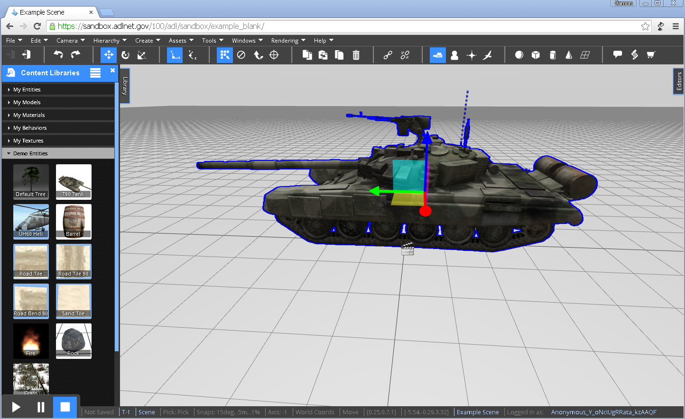
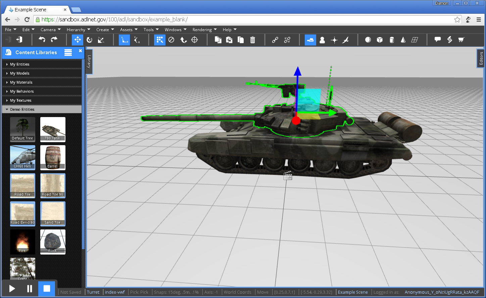
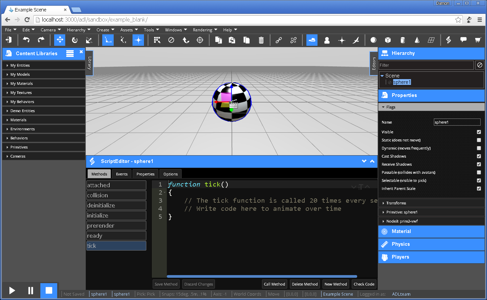

<h1>Creating Simulations</h1>

A guide to create simulations using the VW Sandbox.

[TOC]

# Learning the Interface

## Using the Editor

### Navigation, Selecting, and Moving Objects

By default, simulations are launched for editing in the Editor Camera.  The Editor Camera allows you to see and navigate the whole scene.  To navigate and manipulate objects using the Editor Camera, please review the keyboard and mouse commands below.

**Navigation**

* Hold the right mouse button and move your mouse to look around the scene.  
* Scroll the mouse wheel forward to zoom in and backward to zoom out.
* Hold the mouse wheel down to pan the view around.

!!! note

	To learn more about navigating using using different modes of the Editor Camera, take a look at [Camera Modes](camera-modes.md).

**Selection**

Click the left mouse button to select an object.  Go ahead and create an object to try it out.  Expand the `Library` tab on the left side of the screen.  Open the `Demo Entities` tab and drag the T90 Tank into the scene.  Select the tank by moving the cursor over the tank and clicking your left mouse button.  The tank should highlight in blue.

Click the left mouse button again on a specific part of an already selected object to select that part.  To continue the example, with the tank already selected, click the mouse button over the turret of the tank.  The turret should highlight in green.

To learn more about selecting objects in more advanced ways, check out the [Selecting Objects](../tutorials/Selecting-Objects.md) tutorial.

**Moving Objects**

#### Toolbar and Hotkeys

The VW Sandbox Editor provides a collaborative authoring experience in a web browser.  

At the bottom left of the screen is a play-pause-stop control panel that controls the state of the simulation.  By default, simulations load in the Editor in the stopped state.

Along the top of the interface is the toolbar and toolbar icons that enable a wide range of commands to be issued.

On the left side of the screen is a `Library` tab providing access to drag and drop re-usable content objects into the scene.

The scene itself is in the center of the screen.  A grid provides perspective within the scene.

On the right side of the screen is an `Editors` tab providing access to multiple editors that provide information about objects in the scene and commands to manipulate the objects and the scene itself.

When an object is selected, the Script Editor can be loaded at the bottom of the screen from the toolbar menu (Windows > Script Editor) or from the toolbar icons () located three icons in from the right.

These are some hotkeys that are helpful to remember when using the VW Sandbox Editor.  While in the editing mode the following hotkeys are available:

* `q` - select object
* `w` - move
* `e` - rotate
* `r` - scale
* `[shift] d` - duplicate
* `[delete]` - delete

### Organizing, Accessing, and Relating Objects

## Editing and Playing

### View Performance (FPS)

`Rendering` > `Toggle Stats` will place an overlay window in the top left corner showing the Frames per Second (FPS) of the simulation.  

### Change Simulation Settings

## Importing Assets

### FBX Import and Entity Library

## Simulation Authoring

### Script Editor

### The Tick Heartbeat

### Moving Objects using the Transfrom API

### Lights, Camera, Action!

### Working with a Team

## Searching for Objects

### Asset Server Filtering

### Finding Nodes through Script

## User Input

### Key Up, Key Down, and Mouse Movement

