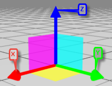
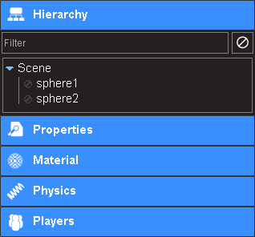
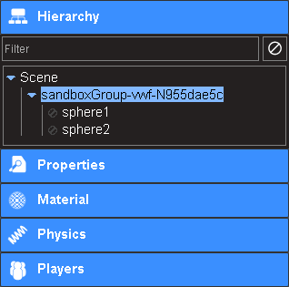
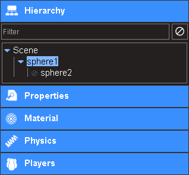
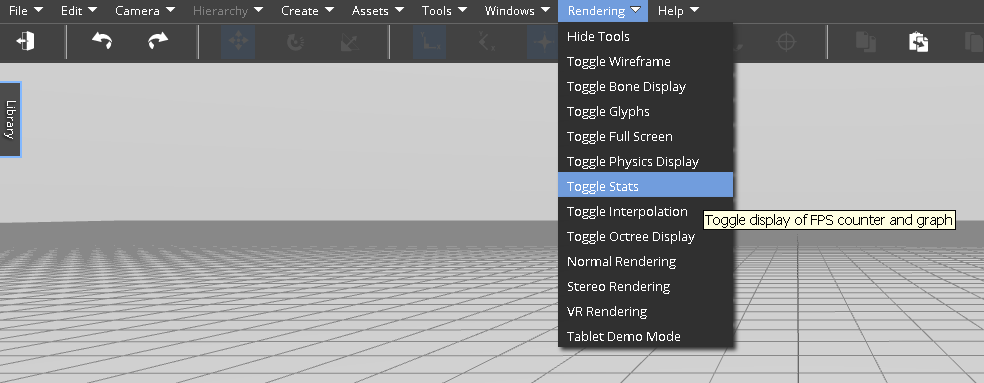
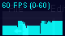
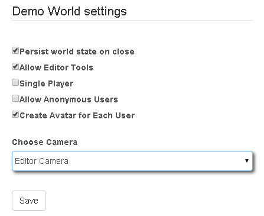
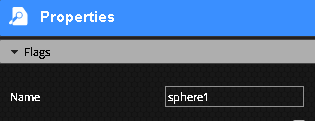
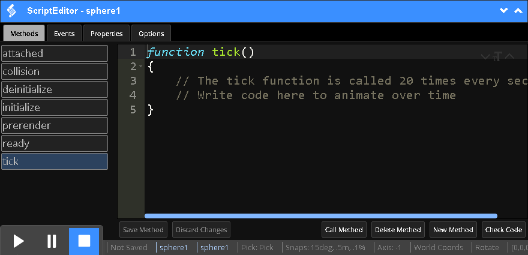
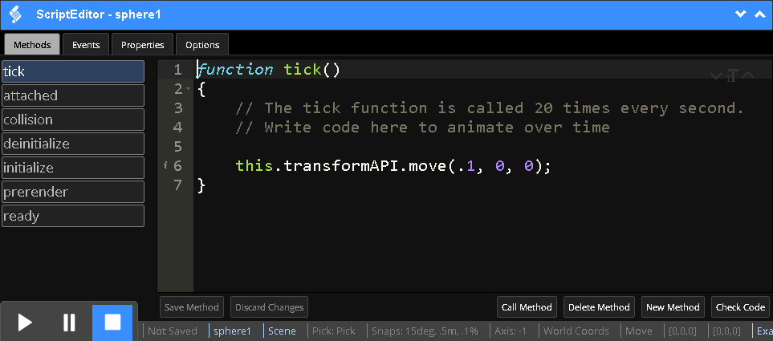

<h1>Creating Simulations</h1>

A guide to create simulations using the VW Sandbox.

[TOC]

# Learning the Interface

## Using the Editor

### Editor Overview

The VW Sandbox Editor provides a collaborative authoring experience in a web browser.  You can access the Editor by going to an instance of the VW Sandbox and clicking `Try it!`.  ADL hosts an instance of the VW Sandbox at [http://sandbox.adlnet.gov](http://sandbox.adlnet.gov).  If you want to host your own instance, see the [Basic Installation](server-installation.md#basic-installation) guide.


At the bottom left of the screen is a play-pause-stop control panel that controls the state of the simulation.  By default, simulations load in the Editor in the stopped state.

Along the top of the interface is the toolbar and toolbar icons that enable a wide range of commands to be issued.

On the left side of the screen is a `Library` tab providing access to drag and drop re-usable content objects into the scene.

The scene itself is in the center of the screen.  A grid provides perspective within the scene.

On the right side of the screen is an `Editors` tab providing access to multiple editors that provide information about objects in the scene and commands to manipulate the objects and the scene itself.

When an object is selected, the Script Editor can be loaded at the bottom of the screen from the toolbar menu (`Windows` > `Script Editor`) or from the toolbar icons () located three icons in from the right.

### Navigation, Selecting, and Moving Objects

By default, simulations are launched for editing in the Editor Camera.  The Editor Camera allows you to see and navigate the whole scene.  To navigate and manipulate objects using the Editor Camera, please review the keyboard and mouse commands below.

* Hold the **right mouse** button and move your mouse to look around the scene.  
* Scroll the mouse wheel forward to zoom in and backward to zoom out.
* Hold the mouse wheel down to pan the view around.
* Use the `Focus` toolbar button () to focus the camera on the selected object.

!!! note

	To learn more about navigating using using different modes of the Editor Camera, take a look at [Camera Modes](graphics.md#camera-modes).

Click the left mouse button to select an object.  Go ahead and create an object to try it out.  Expand the `Library` tab on the left side of the screen.  Open the `Demo Entities` tab and drag the T90 Tank into the scene.  Select the tank by moving the cursor over the tank and clicking your left mouse button.  The tank should highlight in blue.


Click the left mouse button again on a specific part of an already selected object to select that part.  To continue the example, with the tank already selected, click the mouse button over the turret of the tank.  The turret should highlight in green.


To learn more about selecting objects in more advanced ways, check out the [Selecting Objects](tutorials/selecting-objects.md) tutorial.

#### Moving Objects

To move an object in the Editor, select the object, and a gizmo will appear (see image below).  The default mode for the gizmo tool is the move mode.  The red arrow points in the X direction, the green arrow points in the Y direction, and the blue arrow points in the Z direction.  

Simply click on the arrow for the direction you want to move and drag in that direction.



The gizmo will also show three colored squares when in the move mode.  Click and drag the yellow square to move in the X and Y directions at the same time, holding Z constant.  Click and drag the purple square to move in the X and Z directions at the same time, holding Y constant.  Finally, click and drag the blue square to move in the Y and Z directions at the same time, holding X constant.

You can select multiple objects by holding the `CTRL` button and clicking a second object.  You can then move multiple objects at the same time.

!!! note: 
	By default, when moving objects they are **snapped** to fixed incremental positions.  However, if you want to move objects very precisely (smaller increments than the fixed snap increments), you can turn snaps off by using the `Edit` > `Transform` > `Snaps` > `Off` menu item.

#### Toolbar and Hotkeys

 &nbsp;&nbsp;&nbsp;  **Logout** 

Leave the current simulation. Also available from the `File` > `Logout` menu item.

 &nbsp;&nbsp;&nbsp; **Move** 

Activate the move tool. This will place a gizmo over the selected object. Click and drag on the colored lines to move the object in the direction of that line. Hold your mouse between lines to select the plane made from those two lines. Clicking and dragging while a plane handle is selected will move the object along the selected plane.  Also available from the `Edit` > `Transform` > `Move` menu item.

!!! note:

	The blue background highlight indicates the move tool is currently active.

 &nbsp;&nbsp;&nbsp; **Rotate** 

Activate the rotate tool. Also available from the `Edit` > `Transform` > `Rotate` menu item. This will place a gizmo over the selected object. Click the gizmo axis you want to rotate on and drag in a straight horizontal line in one direction to rotate one way and then in a straight horizontal line in the other direction to rotate away.


Try selecting the turret of the tank as show in the selection section and use the rotate tool to move the turret around.

 &nbsp;&nbsp;&nbsp; **Scale** 

Activate the Scale tool. This will place a gizmo over the selected object. Click and drag the center box to scale uniformly on all axis. Click and drag on one of the colored boxes to scale only in the direction of the selected box. Also available from the `Edit` > `Transform` > `Scale` menu item.

!!! note:

	You can use keyboard shortcuts to quickly change between move (w), rotate (e), and scale (r) modes.

 &nbsp;&nbsp;&nbsp; **World Coordinates** 

Align the selected tool's gizmo with the world coordinate system. Thus, the X handle of the move gizmo will point toward the absolute X of the world, and Z will always be 'up', toward the sky. Also available from the `Edit` > `Transform` > `World Coords` menu item.

!!! note:

	The blue background highlight indicates the editor is actively using world coordinates.

 &nbsp;&nbsp;&nbsp; **Local Coordinates** 

Align the selected tool's gizmo with the selected object. Use this if you want to move an object toward its own 'front', even if that 'front' does not point straight along a world axis line because the object has been rotated. Also available from the `Edit` > `Transform` > `Local Coords` menu item.

 &nbsp;&nbsp;&nbsp; **Select by Clicking** 

When this mode is activated, clicking on an object will select it for editing. The object selection is used by all tools and windows to display properties. This button will light up blue when in `Select` mode. Also available from the `Edit` > `Select` > `Pick` menu item.

 &nbsp;&nbsp;&nbsp; **Select None**

Unselect the selected object, and exit select mode. Note that clicking the button will change the select mode to none, and you will have to click the 'Select By Clicking' button to enter selection mode again. Also available from the `Edit` > `Select` > `Select None` menu item.

 &nbsp;&nbsp;&nbsp; **Select Parent**

When an object is selected, clicking this button will select the object's parent, if the object has one. Also available from the `Hierarchy` > `Select Parent` menu item.

 &nbsp;&nbsp;&nbsp; **Focus**

Move the camera such that it frames the selected object in the view. This will also reset the camera mode to orbit mode if it is not already in orbit mode.  Also available from the `Camera` > `Focus Selected` menu item.

!!! note:
	The focus to camera toolbar button is very helpful for navigating.  Simply select the object you want to focus on (either through the hierarchy or by clicking the object directly) and then click the Focus Camera button ().

 &nbsp;&nbsp;&nbsp; **Copy**

Copy the selected object to be pasted later. You must have an object selected for this operation. When copying, the entire hierarchy of the selected object will be copied as well. If the bounding box that marks the selection is red, you have selected an object that controls a part of a model that was loaded by an asset file (most likely from the 3D Repository). These objects cannot be copied. Also available from the `Edit` > `Copy` menu item.

 &nbsp;&nbsp;&nbsp; **Paste** 

Paste the copied object into the scene. This will make a new object with all the properties of the copied object. You will be assigned as the new object's owner. This new object will be placed at the center of your view, at z=0. Note that when looking at the world at very shallow angles, this may place the object farther away then you expect. Also available from the `Edit` > `Paste` menu item.

 &nbsp;&nbsp;&nbsp; **Duplicate**

A shortcut for copy, then paste. Also available from the `Edit` > `Duplicate` menu item.

!!! note:
	The new (duplicated) object will be placed *exactly* on top of the original.

 &nbsp;&nbsp;&nbsp; **Delete**

Deletes the currently selected object. Also available from the `Edit` > `Delete` menu item.

 &nbsp;&nbsp;&nbsp; **Link**

This tool allows you to make one object a child of another. You must be the owner of both objects to complete this operation. You must first select an object before clicking this tool. When activated, the cursor will change to a cross hair, and allow you to pick a second object. When you choose the second object, the selected object will be added as a child of the object you pick. Also available from the `Hierarchy` > `Link` menu item.

 &nbsp;&nbsp;&nbsp; **Unlink**

This button will unlink the selected object from its parent. The selected object must be a child of another object in the scene. Also available from the `Hierarchy` > `Unlink` menu item.

 &nbsp;&nbsp;&nbsp; **Orbit Camera**

Activate the editor camera's orbit mode. See the [Camera Modes](graphics.md#camera-modes) section for details on how the camera controls work. Also available from the `Camera` > `Default Cameras` > `Orbit` menu item.

!!! note:

	The blue background highlight indicates the editor is actively using the `Orbit` camera mode, which is the default camera mode for the editor.

 &nbsp;&nbsp;&nbsp; **First Person Camera**

Activate the editor camera's first person mode. See the [Camera Modes](graphics.md#camera-modes) section for details on how the camera controls work. Also available from the `Camera` > `Default Cameras` > `Avatar View` menu item.

 &nbsp;&nbsp;&nbsp; **Navigate Camera**

Activate the editor camera's navigate mode. See the [Camera Modes](graphics.md#camera-modes) section for details on how the camera controls work. Also available from the `Camera` > `Default Cameras` > `Navigate` menu item.

 &nbsp;&nbsp;&nbsp; **Free Camera**

Activate the editor camera's free camera mode. See the [Camera Modes](graphics.md#camera-modes) section for details on how the camera controls work. Also available from the `Camera` > `Default Cameras` > `Fly` menu item.

 &nbsp;&nbsp;&nbsp; **Create Sphere**

Create a new sphere object at the center of the view. See the [Primitives](graphics.md#primitives) section for information on the object settings. Also available from the `Create` > `Primitives` > `Sphere` menu item.

 &nbsp;&nbsp;&nbsp; **Create Box**

Create a new box object at the center of the view. See the [Primitives](graphics.md#primitives) section for information on the object settings. Also available from the `Create` > `Primitives` > `Box` menu item.

 &nbsp;&nbsp;&nbsp; **Create Cylinder**

Create a new Cylinder object at the center of the view. See the [Primitives](graphics.md#primitives) section for information on the object settings. Also available from the `Create` > `Primitives` > `Cylinder` menu item.

 &nbsp;&nbsp;&nbsp; **Create Cone**

Create a new cone object at the center of the view. See the [Primitives](graphics.md#primitives) section for information on the object settings. Also available from the `Create` > `Primitives` > `Cone` menu item.

 &nbsp;&nbsp;&nbsp; **Create Plane**

Create a new plane object at the center of the view. See the [Primitives](graphics.md#primitives) section for information on the object settings. Also available from the `Create` > `Primitives` > `Plane` menu item.

 &nbsp;&nbsp;&nbsp; **Script Editor Window**

Show the ScriptEditor window. You should have an object selected when opening this window. Also available from the `Windows` > `Script Editor` menu item.

 &nbsp;&nbsp;&nbsp; **Chat Window**

Show the Chat window. Also available from the `Windows` > `Chat` menu item.

 &nbsp;&nbsp;&nbsp; **Asset Library Window**

Show the Asset Library window. Also available from the `Windows` > `Models` menu item.

**Hotkeys**

These are some hotkeys that are helpful to remember when using the VW Sandbox Editor.  While in the editing mode the following hotkeys are available:

* `q` - select object
* `w` - move
* `e` - rotate
* `r` - scale
* `[shift] d` - duplicate
* `[delete]` - delete

### Organizing, Accessing, and Relating Objects

The hierarchy editor is a great way to organize access, and relate objects together.



In the hierarchy above, two spheres are in the scene.  Objects can be organized by grouping them together.  With multiple objects selected, click on the `Hierachy` > `Grouping` > `Group` menu item.  Grouping is a helpful way to move multiple objects at the same time.  The hierachy editor will update to reflect the new grouping.



Another way to relate objects together is to **link** them together in a parent > child relationship.  The big difference between a group and a link relationship is the role of the parent.  In the group, two children have a common parent -- the group object, which is an empty object.  In the parent > child relationship one object becomes the parent of the other object.   To create the parent > child relationship:

1. Select the object you want to become the child
1. Click the `Link` toolbar icon ()
1. Click the object you want to become the parent

!!! note:
	You can select the parent object by either clicking on the object directly or by clicking on the object in the hiearchy editor.



You can use the Select Parent toolbar icon () to select the parent of an object.  The Scene is the root level object and has no parent. 

## Editing and Playing

You'll typically go through these steps to create and share a simulation.

1. Create the simulation
1. Edit the simulation
1. Test the simulation
1. Publish the simulation

### Edit

When you're in **edit** mode, you see and can use the Editor tools and interact with the world. The edit mode is the default mode for a world -- when you create a new simulation, you'll be in the edit mode.

!!! note:

	When you are in edit mode, the server will keep backups of the world every few minutes.

### Play, Pause, and Stop

You can **play** the simulation by clicking the play button in the lower left side of the Editor.  When the Editor is in play mode, the Editor tools are disabled.  You can a**pause** the simulation, which is sometimes helpful to activate the tools to for example change camera angles or inspect items without stopping the simulation.  When you click **stop** the simulation will reset and you will again be able to use the Editor tools.

### View Performance

Performance of a simulation is usually based on the interaction of CPU and GPU resources and simulation complexity.  As you work on your simulation, you can check the Frames Per Second (FPS) of the user experience on the current machine by navigating to the `Rendering` > `Toggle Stats` menu item, which will toggle an overlay window in the top left corner showing the Frames per Second (FPS) of the simulation on and off.



Toggling the Stats on will result in an overlay window in the upper left hand corner of the simulation that shows the current FPS, the range of observed FPS values, and a graph showing the observed FPS values over time.



### Publish

**Publishing** a simulation involves changing the `Settings` on the simulated world's landing page.  Settings such as whether the Editor tools should be shown or what camera users should be in upon login are commonly set to "publish" a world.  See the [Change Simulation Settings](#change-simulation-settings) section for other options that can be set when the owner of a world is ready to make it ready for other users.

### Test

Typically, **testing** is done in the simulated world using the play, pause, and stop controls.  However, it can sometimes be difficult to iteratively change the settings of a world for publish, determining that something needs to be changed, and then changing the settings again to edit, and returning to edit.  

To mitigate this difficulty, a **Test Publish** mode is available.  While in **edit** mode, you should see an option under the `File` menu called `World Settings`.  In `World Settings`, you have the same options as are available on the world settings page. Fill these out as you would when publishing the world. You can use the "Test Publish" mode to get a real time view of exactly how the published world will behave. This feature will create a clone of your world on the server, set the publish settings, and launch it in a child window. The main window will be disabled. When the child window closes, the temporary world is delete off the server, and the main window is re-enabled.

Again, usually the play/pause feature of the editor should be enough to test, but you can use the above workflow to test aspects of your scene that play/pause cannot simulate -- for instance, you might want to test code that responds to a users log in action.

### Management

You can manage a simulated world you create by going to the landing page for the world.  The landing page contains the Launch button.


In addition to the Launch button, are other world management buttons.  World management options include restoring past versions, deleting the world, duplicating it, and embedding it as an IFrame on other websites.

### Change Simulation Settings

The Settings page provides options to control the configuration of the simulated world to allow it to serve as a virtual world that persists state changes or a game that resets when closed.



!!! note "Note:"
    World Settings are only provided to owners of simulated worlds.

If you would like the world to function as a virtual world, select options to persist world state on close and create an avatar for each user.

If you would like the world to function as a simulation or game, deselect options to persist world state and avatar creation.  You may also want to select the option to limit the simulation to single player if you want to limit multiplayer behavior.

Independent of the kind of simulation, choices for who can access the simulation and what users will see when they login are provided.  Anonymous users can be allowed or not allowed to join.  Owners can make simulations into more published forms by not showing the editor tools and choosing a specific camera for users (e.g., a chase camera).

!!! note "Note:"
    If you want to choose a camera other than the default Editor Camera for users to use, you must create the camera.  See the  [Creating Cameras](graphics.md#creating-cameras) section for more information.

## Importing 3D Models and Textures

You can import 3D models and textures using the asset server, which is accessible via the `Assets` menu item.  

Uploading your 3D models as COLLADA is the easiest approach. If you have the COLLADA model hosted remotely, you can simply go to `Asset` > `Load Mesh by URL` and choose `Collada`. 

!!! note:

	The server that hosts the file must implement CORS and have no authentication requirements.

 Alternatively, you can upload the COLLADA model to the asset server and then load it into the Editor.  Assuming you are logged in, below are the steps:

1.  `Asset` > `Create New Asset` > `From File`
1.  Give the asset a name
1.  Click `Create Asset` to upload the .dae
1.  Click `Upload`
1.  Drag and drop the model from the `Content Libraries` > `My Models`

!!! note:

	We also support uploading glTF models, but while this is a better performance route, it is also more complicated.  For more information on using glTF models, see [Using glTF 3D Models](graphics.md#using-gltf-3d-models) in the Graphics section.

You can add a **texture** to an object by selecting the object and viewing the Material Editor.  Expand the Texture Layer and click on the image to choose a new image.

See [Audio](audio.md) for information about uploading audio assets.

## Simulation Authoring

All objects in the world can be assigned a friendly name. These names appear in the GUI for all action, but need not be unique -- they are just for your convenience. To name an object, select the object and open the Properties window. Under the `Flags` heading, find the `Name` field and type the name. 



When you copy, duplicate, or paste an object, the name will be incremented automatically if it ends with a number.

The name is stored in the `DisplayName` property of an object. From script, all objects are indexed by name under `this.children_by_name`.

### Script Editor

The ScriptEditor is used to write scripts for simulation logic.  All scripts are written in JavaScript.



Code you write with the ScriptEditor is immediately injected into the multiplayer engine as new properties, methods, and events for the selected object.  You can see which selected object the ScriptEditor is focused on in the blue title window at the top and in the status bar at the bottom.  In the screenshot, the ScriptEditor is focused on `sphere1`.

The ScriptEditor has three tabs across the top: `Methods`, `Events`, and `Properties`.  Depending on which tab is selected, the list of items will be displayed vertically on the left and the code for the given selected item is in the main content window on the right.  In the screen shot above, the `Methods` tab is selected and the `tick` method is selected.

!!! note:

	The editor uses js_beautify on all input code before displaying it. On some systems, the JavaScript engine may insert "use strict."  This is normal and not a problem. 

The two up and down arrow buttons in the upper right hand corner of the script editor expand the ScriptEditor window (up) and minimize/hide the ScriptEditor window (down).


### The Tick Heartbeat

The `tick()` method is called by the engine 20 times every second.  It is the heartbeat of the multiplayer simulation.  Each simulation object can define the `tick` method and this is typically where simulation logic originates.

### Finding Objects through Script

When finding objects through scripts, it is helpful to remember the hierarchy view of objects.  The hierarchy root is the `Scene` object.  You can access the `Scene` by simply calling `this.Scene` on any object.  Thinking about the hierarchy and knowing how to access the Scene, we can use different methods to find and access objects through scripts:

1. [children_by_name](#children_by_name)
1. [findNode](#findnode)
1. [children](#children)
1. [findNodeByID](#findnodebyid)
1. [parent](#parent)

The first two methods find objects based on the object's `DisplayName` property, which can be set through the Property editor.  The second two methods finds all children anonymously or by ID.

!!! note:
	In the examples below, we'll be writing code to find and access objects in the `tick()` method of objects.

#### children_by_name

The easiest and most intuitive way to find and access an object is to use the `children_by_name` object based on the `Scene`.  Assume `sphere1` is a child of the `Scene`:

```
var sphere = this.Scene.children_by_name["sphere1"];
```

If `sphere2` is a child of `sphere1`, then we could find and access `sphere2` continuing this method:

```
var sphere2 = this.Scene.children_by_name["sphere1"].children_by_name["sphere2"];
```

You don't have to go through the `Scene` to access objects.  You can refer directly to the children of the selected object.  Assuming we are selected on `sphere1` (the parent of `sphere2`), we could do the following:

```
var sphere2 = this.children_by_name["sphere2"];
```

#### findNode

The `Scene` provides a `findNode` method we can use to find any object in the `Scene`.  This allows us to find `sphere2` from *any* object without knowing the hierarchy.

```
var sphere2 = this.Scene.findNode("sphere2");
```
#### children

If you want to iterate through all children of an object, you'll want to use the `children` JavaScript object.

```
for (i = 0; i < this.children.length; i++)
{
    console.log(this.children[i].DisplayName);
}
```

!!! note:
	The JavaScript `console.log()` method is a powerful way to display data by writing it to the browser console.  Knowing how to use the browser's debug tools and specifically the browser console are key simulation development skills.  See [w3schools JavaScript Debugging](http://www.w3schools.com/js/js_debugging.asp) page for more information.

#### findNodeByID

Objects ar runtime are given an ID that uniquely identifies them across the multiplayer network.  If you know this ID, the `Scene` provides the `findNodeByID` method that we can use to access the object.

```
var sphere2 = this.Scene.findNodeByID("sphere2-vwf-Nec9b207d");
```

!!! note:
	You can find the ID of any object by selecting the object and using the `Tools` > `Show ID` menu item.

#### parent


### Moving Objects using Transforms

Every simulation object has a Scripting API accessible to it via the `this` object.  To move an object, you can add logic to the `tick` method to change the current position or rotation of an object.  Every 1/20th of a second, the engine will call the tick() method.  Let's add the following line to the tick method of an object to move it .1 units along its X axis:

```
this.tranformAPI.move(.1, 0, 0);
```



By default, the `move` method uses the Global coordinate system.  If the object we had selected had been rotated, we could have the object move along the X axis of its Local coordinate system, by specifying the coordinate system for the movement.

```
function tick()
{
	this.transformAPI.move(.1, 0, 0, this.transformAPI.COORDINATES.LOCAL);
}
```

### Responding to User Input

To allow a player to control an object using traditional WASD keyboard controls, we'll want to use the `keyDown` and `keyUp` events the engine fires when keys are pressed and released, respectively.  We'll want to register these events with local handlers in the `ready()` method, which the engine calls on every object that defines it when the Scene is completely loaded.  The `ready()` method is also called each time a new client joins a multiplayer simulation. 

This ready code is boilerplate code for binding and unbinding handler methods for keyUp and keyDown events.  It uses intermediate functions _ku and _kd to ensure multiple handlers are not bound redundantly.

```
function ready()
{
	this.Scene.unbind("keyDown", this._kd);
    this.Scene.unbind("keyUp", this._ku);

    var self = this;
    
    this._kd = function(e, d)
    {
        self._keyDown(e, d)
    };
    
    this._ku = function(e, d)
    {
        self._keyUp(e, d)
    };

    this.Scene.bind("keyDown", this._kd);
    this.Scene.bind("keyUp", this._ku);
}
```

The ready method first unbinds the intermediate functions if they are defined to ensure they are reset appropriately.  It then binds the `keyUp` and `keyDown` events to the intermediate functions, which bind the actual event handler code `_keyDown` and `_keyUp`.  Therefore, with this ready function in place, we need to define _keyDown and `_keyUp` methods.  Click `New Method` to define the _keyDown and _keyUp methods.

The `_keyDown` method is where we can write code to process the keys being pressed.  Note that an array is defined as a local property because multiple keys can be down at the same time.  So, switch tabs to the Properties tab and define a new property to serve as the array called `_keysDown` with value `[]` (the empty array).  

```
function _keyDown(e, d)
{
	// if the key being pressed is not in the array

    if (this._keysDown.indexOf(e.key.char) == -1)
    {
    	// add the key to the array

        this._keysDown.push(e.key.char); 
    }
}
```

The `_keyUp` method is where we can write code to process the keys being released.

```
function _keyUp(e, d)
{
	// if the key being released is in the array

    if (this._keysDown.indexOf(e.key.char) !== -1)
    {
    	// then remove (splice) the key being released from the array

        this._keysDown.splice(this._keysDown.indexOf(e.key.char), 1);
    }
}
```

Now that the key handlers are bound and defined, we can write logic based on the keys the user is pressing.


### Lights, Camera, Action!

To create a new light, go to `Create` > `Lights` and choose the desired type of light (Point, Spot, or Directional).  See [Lighting](graphics.md#lighting) for more information or the tutorial on [Lights and Materials](tutorials/lights-and-materials.md).

To create a new camera, go to `Create` > `Camara` > `Perspective`.  See [Creating Cameras](graphics.md#creating-cameras).

### Smart Objects

You can make one of your objects 
Editor Data exposing properties

###  Manage and Organize Smart Objects

Asset Server discussion

Other ways you can store and manage things

Manual creation of a content library (see creating a new content library)

### Searching for Objects

### Asset Server Filtering

### Working with a Team

Asset Server refreshing assets
Continues base class

Alternatively, you can manage the files on disc: yml, json.  Version controlling.


