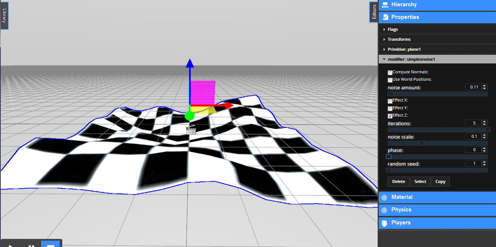

<h1>Graphics</h1>

[TOC]

# Lighting

# Cameras

## Creating Cameras

There are two major things to understand about cameras in the VWF. First, the camera you are looking through by default in the Editor is a special camera that is not shared with other users. Each user has his or her own viewpoint when editing that is not shared between users. There is a function for temporarily broadcasting the position of your camera to other users; see the [Camera Modes](camera-modes.md "Camera Modes") section for more information. 

Second, you can also create camera objects within the scene. These cameras are full VWF entities, and can be scripted, copied, or deleted. They can even have behaviors applied, just as any other object. 

To create a camera, use the drop down menu. Choose `Create` > `Camera` > `Perspective`. The camera will be created at the center of your view. If you move your viewpoint within about 10 meters of the camera, and you are in a selection mode, you will see an icon appear to show you the location of the new camera object. If you do not see this icon, you may be too far away. That's OK, you can select the camera by name on the Hierarchy panel. 

When you have a camera selected in the editor, you will see a preview of the selected camera's view. This view will update in real time as you use the editor tools to move around the camera. You will also see in the main view a helper graphic to show you where the camera is pointing. This helper may show a camera viewpoint that is slightly behind the camera's position. This is normal. We actually use the near clip plane of the camera as the cameras 'position'. 

If you see the camera icon, you can double click it to activate the selected camera as the main camera. You can also activate different cameras by choosing `Camera` > `Activate Camera` from the drop down menu. Note: All the existing camera modes, such as 'Fly', or 'Orbit', apply only to the default Editor Camera. Selecting one of these modes will active the default camera.

When a camera is selected, you may edit some of it's properties in the Properties panel.

`Field of View` - The width of the camera view. A good default is 60, but you can simulate a telescopic view with a much smaller number.

`Near` - the near clip plane. Objects nearer than this will not be shown. Clip planes are used primarily to focus the depth buffer resolution around the area of interest in a scene. A full discussion of this topic is out of scope for this article. Just please note that you may see some visual artifacts if the near is set too low, or the far too high.

`Far` - the far clip plane. Objects farther than this will not be shown.

# Primitives

Primitives come in various shapes and are a good starting place for many things.  The primitives in the VW Sandbox are Sphere, Box, Plane, Cylinder, Cone, Text, and Torus (a hula hoop or doughnut looking thing). You can add a primitive to you world from the drop-down menu bar (`Create` > `Primitives` > choose the one you want), from the toolbar menu (sphere, box, cylinder, cone and plane only), or from the content library on the left of the screen under "Primitives."

## Common Properties

### Flags
By default all primitives have the same flags of Name, Owners, with checkboxes of visible, cast shadows, receive shadows, selectable, and inherit parent scale are checked, and static, dynamic, and passable unchecked.


### Transforms
Displays and controls the translation, rotation and scale of a primitive. Values refer to the x, y, and z axes.

* `Translation` ` Placement of the object. Default: 0, 0, 0.001.
* `Rotation` - Orientation of the object in position. Default: 0, 0, 0.
* `Scale` - Size of the object. Default: 1, 1, 1.


## Sphere

A ball.

* `Radius` - default 1, range 0.00 - 10.00.
* `R Segments` - default 10, range 3 - 16.
* `S Segments` - default 10, range 3 - 16.

!!! note:

	You can force the value greater than the range using the up and down arrow buttons.


## Box

A cube.

* `Length' - default 1, range 0.00 - 10.00.
* `Height` - default 1, range 0.00 - 10.00.
* `Height Segments` - default 1, range 1 - 16.
* `Length Segments` - default 1, range 1 - 16.
* `Width` - default 1, range 0.00 - 10.00.
* `Width Segments` - default 1, range 1 - 16.


## Plane

A flat square with x and y dimensions only.

* `Length` - default 1, range 0.00 - 10.00.
* `Length Segments` - default 1, range 1 - 16.
* `Width` - default 1, range 0.00 - 10.00.
* `Width Segments` - default 1, range 1 - 16.


## Cylinder

A roller. A tumbler.  

!!! note:

	Using radius segments of 3, 4, or 5 gives you a solid 3D triangle, square, pentagon respectively.

* `Height` - default 1, range 0.00 - 10.00.
* `Height Segments` - default 1, range 1 - 16.
* `Radius`- default 1, range 0.00 - 10.00.
* `Radius Segments` - default 10, range 1 - 16.


## Cone

A pyramid with a circular cross section. 

!!! note:

	Using radius segments of 4 gives you a typical pyramid shape.

* `Height` - default 1, range 0.00 - 10.00.
* `Height Segments` - default 1, range 1 - 16.
* `Radius` - default 1, range 0.00 - 10.00.
* `Radius Segments` - default 10, range 1 - 16.


## Text

Makes a 3D shape out of a string of characters. Displays as one long string and does not accept escape sequences for new lines, tabs, etc. 

* `Height` - default 1, range 0.00 - 10.00.
* `Text` - a place to enter/edit text strings, default hi, range unlimited (please use reason).
* `Text Size` - default 1, range 0.00 - 10.00.


## Torus

In geometry, a torus (plural tori) is a surface of revolution generated by revolving a circle in three-dimensional space about an axis coplanar with the circle. Looks like a ring, a hula hoop, or a doughnut shape. 

* `Arc` - default 6.28, range 0.00 - 10.00. *Note*: 6.28 closes the circle.
* `Radius` - default 1, range 0.00 - 10.00.
* `Tube Width` - default 0.1, range 1 - 16.
* `Tube Segments` - default 6, range 3 - 10.
* `Radius Segments` - default 10, range 3 - 10.


## Empty

Empty nodes/primitives are useful as a common and unseen parent of a collection of other nodes/objects/entities you wish to group and work with together. An empty node does display a glyph to aid selecting.

An empty node has different default properties than the other primitives. The default property flags of an empty node are name and owners, by default visible and inherit parent scale are checked, and static, dynamic, cast shadows, receive, passable, and selectable are unselected.  The transforms are the same as all other primitives. An empty node has no specific properties. An empty node accepts modifiers although they have no effect on the empty node and do not automatically transfer to children of the empty node.


# Materials

## Phong Material

This is the default material type for all VW Sandbox objects. It corresponds directly to a THREE.js MeshPhongMaterial. 


### Alpha
This is the transparency of the object


### SpecularLevel
The brightness of the shine on the object


### Shininess
The size of the specular hilight


### Reflect
The amount of reflection of the skybox image


### Diffuse Color
The color of the surface


### Specular Color
The color of the hilight from a light. This is mixed with the light color.


### Emission Color
An additional light, or self-illumination added to the object


## Modifiers

Modifiers alter or reshape primitives.  To use a modifier select a primitive (except an empty node) then from the drop-down menu bar choose `Create` > `Modifiers` > and choose the one you want. The modifier then shows up as a child of primitive in the Editor side panel `Heirarchy`. With the primitive selected, the modifier shows up in the Editor side panel `Properties` under the specific properties for that primitive.  This opens a small panel where you may manipulate the values of the modifier to make changes to the primitive.

Let's try out the modifiers and try to explain what they do.

### Bend

Seen easiest on a primitive with straight lines like a box. Bends the primitive.

* `Enabled` - default checked.
* `Bend Amount` - default -0.05, range -0.050 - 0.050.
* `Major Axis` - default X, choose X, Y, or Z.
* `Minor Axis` - default Y, choose X, Y, or Z.

!!! note:

	You can force the value greater than the range using the up and down arrow buttons or typing a value.


### Twist

Rotate around the stationary center of the primitive.

* `Twist Amount` - default 0, range -1.00 - 1.00.


### Taper

Reduce the thickness in one end of the primitive.

* `Taper Amount` - default 0, range -1.00 - 1.00.


### Perlin Noise

Noise refers to a computer-generated pseudo-random texture to better simulate real surfaces. 

You can think of Perlin noise a bit like a wave - a 2D or 3D wave - the noise scale is the frequency, and the different amounts are the amplitude. Instead of a smooth sine wave, it's all "noisy" because it's actually made of the interference of many sine waves in many "octaves." The 'size' of the noise is just the base wavelength, off which the octaves are based.

Perlin noise has a slightly different look than Simplex noise, but is hugely complex computationally, so Simplex noise is preferred.

* `Compute Normals` - default unchecked.
* `Use World Positions` - default unchecked.
* `Noise Amount` - default 0, range 0.00 - 5.00.
* `Effect X` - default unchecked.
* `Effect Y` - default unchecked.
* `Effect Z` - default unchecked.
* `Iterations` - default 2, range 2 - 5.
* `Noise Scale` - default 1, range 0.00 - 1.00.
* `Octaves` - default 256, range 8 - 256.
* `Phase` - default 0, range 0.000 - 1.000.
* `Random Seed` - default 1, range 1 - 512.


### Simplex Noise

Noise refers to a computer-generated pseudo-random texture to better simulate real surfaces. 

Simplex noise is a method for constructing an n-dimensional noise function comparable to Perlin noise ("classic" noise) but with fewer directional artifacts and, in higher dimensions, a lower computational overhead.

You can think of Simplex noise a bit like a wave - a 2D or 3D wave - the noise scale is the frequency, and the different amounts are the amplitude. Instead of a smooth sine wave, it's all "noisy" because it's actually made of the interference of many sine waves. The "size" of the noise is just the base wavelength.



Simplex noise has a slightly different look than Perlin noise, and is much simpler computationally, so Simplex noise is preferred.

* `Compute Normals` - default unchecked.
* `Use World Positions` - default unchecked.
* `Noise Amount` - default 0, range 0.00 - 5.00.
* `Effect X` - default unchecked.
* `Effect Y` - default unchecked.
* `Effect Z` - default unchecked.
* `Iterations` - default 2, range 2 - 5.
* `Noise Scale` - default 1, range 0.00 - 1.00.
* `Phase` - default 0, range 0.000 - 1.000.
* `Random Seed` - default 1, range 1 - 512.


### Offset

The amount or distance by which something is out of line. Distance in meters out of line with the glyph or centering pin that an object is.

* `Offset X` - default 0, range -10.00 - 10.00.
* `Offset Y` - default 0, range -10.00 - 10.00.
* `Offset Z` - default 0, range -10.00 - 10.00.


### Stretch

To make (something) wider or longer by pulling it. 

* `Offset Y` - default 0, range -10.00 - 10.00.
* `Offset X` - default 0, range -10.00 - 10.00.
* `Effect Axis` - default X, chose X, Y, or Z.


### Push

* `Active` - default checked.
* `Amount` - default 0, range -1.00 - 1.00.


### UV Map

UV mapping stands for the technique used to "wrap" a 2D image texture onto a 3D mesh. "U" and "V" are the name of the axes of a plane, since "X", "Y" and "Z" are used for the coordinates in the 3D space.

For more information see [Materials Tutorial - Textures](tutorials/lights-and-materials.md#textures "Materials - Textures (see Note)")

* `Active` - default checked.
* `Length` - default 1, range -10.00 - 10.00.
* `Height` - default 1, range -10.00 - 10.00.
* `Mode` - default Sphere, chose Plane, Box, or Sphere.
* `U Offset` - default 0, range -1.00 - 1.00.
* `V Offset` - default 0, range -1.00 - 1.00.
* `Plane Axis` - default Z, chose X, Y, or Z.
* `Rotate` - default 1, range -3.14159 - 3.13841.
* `Tile X` - default 2, range -10.00 - 10.00.
* `Tile Y` - default 2, range -10.00 - 10.00.
* `Width` - default 1, range -10.00 - 10.00.


### Extrude

Thrust or force out.

* `Amount` - default 1, range -1.00 - 1.00.
* `Axis` - default Z, chose X, Y, or Z.
* `Hide Parent Line` - default unchecked.
* `Steps` - default 1, range 1 - 20.


### Path Extrude

Thrust or force out.

* `Hide Parent Line` - default unchecked.
* `Choose Path` - a place to enter node id, default empty. You can enter the node id of a node, copy and paste a node id (i.e. from the Show ID Tool), or press the Choose Node button which turns the mouse cursor into crosshair for selecting a node in the world.
* `Text Size` - default 1, range 0.00 - 10.00.


### Lathe

To cut, shape, or otherwise treat on a machine for use in working wood, metal, etc., that holds the material and rotates it about a horizontal axis against a tool that shapes it (dictionary.com).

* `Active` - default checked.
* `Amount` - default 1, range -1.00 - 1.00.
* `Steps` - default 10, range 1 - 20.


# Particle Systems

You can create basic, spray, suspended, and atmospheric particle systems.

## Language Reference

### CreateParticleSystem(nodeID, childID, childName) class

[comment]: <> (More technical and specific description of what the particle system does.)

**Arguments:**

`nodeID` (`String`)  
Unique identifier corresponding to a particular node.

`childID` (`String`)  
Unique identifier corresponding to the child node. 

`childName` (`String`)
Name of the child node.

**Returns:**

`particleSystem` (`THREE.Vector3`)  
A system of particles...


#### Constructor

new THREE.PointCloud(particles, shaderMaterial_default)

Brief description of constructor.

**Arguments:**

`particles` (`THREE.Geometry`)  
Brief insight into argument. If the argument is optional add that in parentheses at the end.

`shaderMaterial_default` (`THREE.ShaderMaterial`)  
If there are no arguments explicitly state and italicize. In such a case there is no need for a description.


#### Properties


##### particles

Type: `THREE.Geometry`

Create the particle variables.


##### vertShader_default

Type: `Object`

Default material expects all computation done cpu side, this just renders. **Note:** since the color, size, spin, and orientation are just linear interpolations, they can be done in the shader.


##### fragShader_default

Type: `Object`

Default material expects all computation done cpu side, this just renders. **Note:** since the color, size, spin, and orientation are just linear interpolations, they can be done in the shader.


##### attributes_default

Type: `Object`

The default shader, the one used by the analytic solver, just has some simple stuff. Includes: `size`, `vertexColor`, and `random`.


##### uniforms_default

Type: `Object`

The default shader, the one used by the analytic solver, just has some simple stuff. Includes: `amplitude`, `texture`, `pCount`, `maxRate`, `useTexture`, `maxSpin`, `minSpin`, `screenSize`, `maxOrientation`, `minOrientation`, `time`, `fractime`, `sizeRange`, `textureTiles`, `colorRange`, `startColor`, `endColor`, `startSize`, `endSize`, and `alphaTest`.


##### shaderMaterial_default

Type: `THREE.ShaderMaterial`

Materials to be shaded.	Includes: `uniforms`, `attributes`, `vertexShader`, and `fragmentShader`.


##### vertShader_interpolate

Type: `Object`

The interpolate shader blends from one simulation step to the next on the shader. This allows for a complex simulation to run at a low framerate, but still have smooth motion.  This is very efficient, as it only requires sending data up to the gpu on each sim tick. reuse the frag shader from the normal material.


##### attributes_interpolate

Type: `Object`

The interpolation does need to remember that previous position. Includes: `random`, `previousPosition`, `age`, and `lifespan`.


##### shaderMaterial_interpolate

Type: `THREE.ShaderMaterial`

Enter useful inforamtion here. Includes: `uniforms`, `attributes`, `vertexShader`, and `fragmentShader`.


##### vertShader_analytic

Type: `Object`

Analytic shader does entire simulation on GPU. It cannot account for drag, gravity, nor can it generate new randomness. Each particle has it's randomness assigned and it just repeats the same motion over and over. Also, the other solvers can hold a particle until it can be reused based on the emitRate. This cannot, as the entire life of the particle must be computed from an equation given just time t. It does offsett them in time to avoid all the particles being generated at once. also, it does not account for emitter motion. The upside is it is very very efficient, no CPU intervention required.


##### fragShader_analytic

Type: `Object`

Divides into 4 or 9 "virtual" textures to be able to have different images on particles. Gets the color from the texture and blends with the vertexColor.


##### attributes_analytic

Type: `Object`

Describe attributes analytic here. Includes: `acceleration`, `velocity`, `previousPosition`, `age`, `lifespan`, `random`, `vertexColor`, and `size`.


##### shaderMaterial_analytic

Type: `THREE.ShaderMaterial`

describe shader material analytic here. Includes: `uniforms`, `attributes`, `vertexShader`, and `fragmentShader`.


#### Methods


##### createParticle(i)

Creates a new particle. Creates and stores all the values for vertex attributes in each shader.

**Arguments:**

`i` (`number`)  
The number of the new particle.

**Returns:**

`particle` (`THREE.Vector3`)  
Brief description of returned value. Or if there is no returned value:


##### generatePoint()

Generate a new point in space based on the emitter type and size.

**Arguments:**

*(None)*

**Returns:**

`point` (`THREE.Vector3`)  
A new point in space.


##### rebuildParticles()

Setup the particles with new values.

**Arguments:**

*(None)*

**Returns:**

*(Nothing)*


##### setupParticle(particle, mat, inv)

Set the particle initial values. Used when creating and reusing particles.

**Arguments:**

`particle` (`THREE.Vector3`)  
Brief description of argument. 

`mat` (`matrix`)
Array of numbers relating to the particle's placement in space.

`inv` (`number`)
I don't know.  Inventory, Inverse?

**Returns:**

*(Nothing)*


##### updateAnalyticShader(time)

When updating in `AnalyticShader` mode, the process is very simple just inform the shader of the new time.

**Arguments:**

`time` (`number`)  
Add to the old time and calculate using the combined time to update.

**Returns:**

*(Nothing)*


##### updateAnalytic(time)

In `Analytic` mode, run the equation for the position, and update each particle.

**Arguments:**

`time` (`number`)  
Add to the old time and calculate using the combined time to update.

**Returns:**

*(Nothing)*


##### updateEuler(time)

Timesliced Euler integrator which can do more complex sim.  It ticks 10 times a second, and blends tick with previous via a shader.

**Arguments:**

`time` (`number`)  
Add to the old time and calculate using the combined time to update.

**Returns:**

*(Nothing)*


##### updateParticleAnalytic(particle, mat, inv, delta_time)

Update a particle from the Analytic solver.

**Arguments:**

`particle` (`THREE.Vector3`)  
Brief description of argument. 

`mat` (`matrix`)
Array of numbers relating to the particle's placement in space.

`inv` (`number`)
I don't know.  Inventory, Inverse?

`delta_time` (`number`)  
The change in time since last update.    

**Returns:**

*(Nothing)*


##### updateParticleEuler(particle, mat, inv, step_dist)

Update a particle with the Euler solver.

**Arguments:**

`particle` (`THREE.Vector3`)  
Brief description of argument. 

`mat` (`matrix`)
Array of numbers relating to the particle's placement in space.

`inv` (`number`)
I don't know.  Inventory, Inverse?

`step_dist` (`number`)  
The amount between the previous and the current, the  step distance.

**Returns:**

*(Nothing)*


##### update(time)

Update the particle system.

**Arguments:**

`time` (`number`)  
The current time in millisecond from the system.

**Returns:**

*(Nothing)*


##### setSolverType(type)

Change the solver type for the system.

**Arguments:**

`type` (`String`)  
String indicating the type of solver to be used.

**Returns:**

*(Nothing)*


##### updateTransform(newtransform)

If you move the system, all the particles need to be recomputed to look like they stick in world space. Not that we don't do this for the `AnalyticShader`.  We could, but that solver is meant to be very high performance, so we don't.

**Arguments:**

`newtransform` (`number`)  
Get the current transform, and invert the new one.

**Returns:**

*(Nothing)*


##### setParticleCount(newcount)

Change the system count. **Note:** this must be set before the first frame renders, it cannot be changed at runtime.

**Arguments:**

`newcount` (`number`)  
The new number of particles to be a part of the system.

**Returns:**

*(Nothing)*

### particleSystem class

Description  

#### Constructor

##### new particleSystem(childID, childSource, childName)

Brief description.

**Arguments:**

`childID` (`String`)
Unique identifier representing the child.

`childSource` (`String`)
Unique identifier representing the parent.

`childName` (`String`)
The name of the child.


#### Properties

`ps` (`particleSystem`)  
Instance of a particle system.


#### Methods


##### settingProperty(propertyName, propertyValue)

Sets a property of the particle system to the given value and rebuilds the particles.

**Arguments:**

`propertyName` (`String`)  
String matching the name of a particular particle system property.

`propertyValue` (`String`)  
String of a value corresponding to the particular property.

**Returns:**

*(Nothing)*


##### initializingNode()

Starts up a node.

**Arguments:**

*(None)*

**Returns:**

*(Nothing)*


##### gettingProperty(propertyName)

Provides the value of the given property.

**Arguments:**

`propertyName` (`String`)  
String corresponding to a particle system property.

**Returns:**

`propertyValue` (`String`)  
String conveying the value of the specified property.


##### callingMethod(name, args)

Describe what this function does.

**Arguments:**

`name` (`String`)  
The name of the calling method.

`args` (`Array of Strings`)
The corresponding arguments.

**Returns:**

*(Nothing)*

##### getRoot()

Gets the root of the node.

**Arguments:**

*(None)*

**Returns:**

`rootnode` (`Node`)  
The root of the node.


# Terrain


# Optimizing Performance

Player Settings
Lightweight Art


# Custom Graphics

Most simulation development involves manipulating existing Graphic types (e.g., 3D models, primitive shapes, particle systems).  Sometimes you will need to create custom Graphic types that directly interface with [THREE.js](http://threejs.org/) (e.g., an ocean, orthographic camera, advanced particle system, custom animation, custom shader).  

At its core, writing a custom graphic type involves defining a simulation object definition in YAML and corresponding code in JavaScript.  Writing a custom graphic type is a good way to extend the VW Sandbox without requiring extensive knowledge of the [architecture](architecture.md) or making significant changes to it.  As an example of writing a custom graphic, consider making a custom sphere graphic type.

Simulation object definition:

```
extends: custom_sphere.vwf
source: custom_sphere.js

```

Where `extends: custom_sphere.vwf` is the engine's simulation object interface (not implementation) where properties and methods of the simulation object are defined.  `source: custom_sphere.js` is a JavaScript file that implements the interface.

Learn more by going through the [Custom Graphic Tutorial](tutorials/writing-custom-graphic-type.md), which walks through creating a custom sphere.