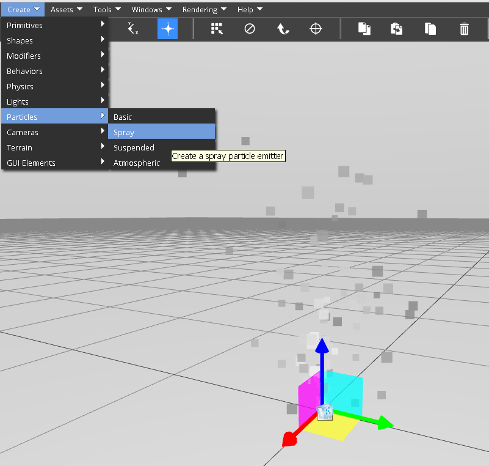
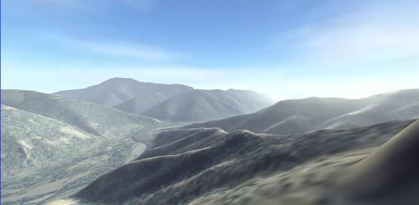
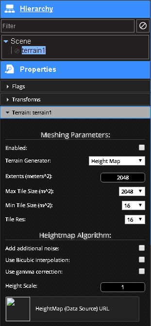
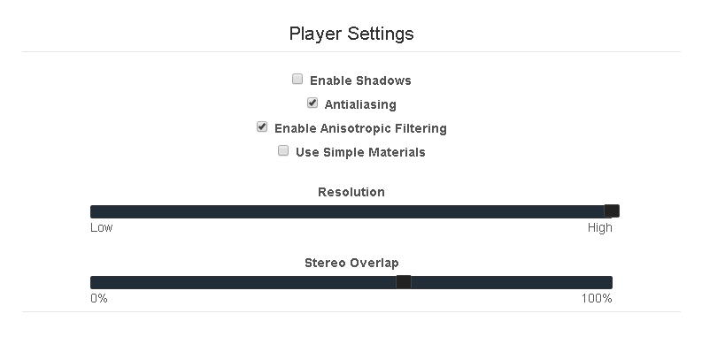

<h1>Graphics</h1>

[TOC]

# Lighting

# Cameras

## Camera Modes

This documentation refers to the various interaction modes for the Editor Camera. This information is not relevant to cameras with are entities within a scene.

!!! note "Note:"
    The current camera controls assume you have a standard three button mouse.

!!! note "Note:"
	These camera controls apply to the default Editor Camera only. Selecting one will activate the default camera.


### Orbit

This is the default mode. The camera orbits around an imaginary point in space. The camera can swing around this point while facing it, or move toward or away from the point. The point itself can be translated to different locations in the scene.

* right click and drag to orbit
* middle click and drag to pan (move the focus point)
* mouse wheel to zoom in or out
* hold shift and move the mouse to orbit
* use the arrow keys to orbit
* hold shift and use the up and down keys to zoom
* hold space and use the arrow keys to pan
* touch and drag on a touchscreen to orbit
* pinch a touchscreen to zomm
* Two-finger touch and drag to pan

### First/Third Person

This mode is only available when the scene is generating avatars for users. The camera can transition between first and third person modes by rolling the mousewheel. When this mode is active, certain mouse motions will control the avatar. 

**Third Person mode**

* right click and drag to orbit around the avatar
* roll the mouse wheel to zoom. When you are close enough, you will enter First Person mode
* use the arrow keys or WASD to move the avatar

**First Person mode**

* right click and drag to turn your viewpoint
* roll the mousewheel to exit back to Third Person mode
* use the arrow keys or WASD to contol the character

### Navigate Mode

This mode allows you to zoom to a very specifc point in space easily. It is related to Orbit mode in that it exposes the same functionality, with some additional features. 

* all the same interactivity from the Orbit mode, plus:
* middle click and drag to zoom in or out from the point of interest
* middle click to animate the center point to a location in the scene. This uses a polygon accurate mouse intersection test
* tap space to set the center point (same as middle click)

### Free Mode

This mode is a first person style controller, but not tied to the avatar. 

* right click and drag to turn the viewpoint
* roll the mouse wheel to move forward. You can move forward forever
* middle click and drag to pan
* use the arrow keys to turn the viewpoint
* use space and the arrow keys to pan
* use ctrl and the up or down button to move forward or back

### Device Orientation

This mode will attempt to use the sensors in your phone or tablet to position the viewpoint. This will have no effect on a desktop computer

* physically move your tablet around space to change the viewpoint.

### Fly

A first person control mode that is always moving forward.

* right click and drag to turn
* roll the mouse wheel to accelerate or decelerate

## Creating Cameras

There are two major things to understand about cameras in the VWF. First, the camera you are looking through by default in the Editor is a special camera that is not shared with other users. Each user has his or her own viewpoint when editing that is not shared between users. There is a function for temporarily broadcasting the position of your camera to other users; see the [Camera Modes](#camera-modes "Camera Modes") section for more information. 

Second, you can also create camera objects within the scene. These cameras are full VWF entities, and can be scripted, copied, or deleted. They can even have behaviors applied, just as any other object. 

To create a camera, use the drop down menu. Choose `Create` > `Camera` > `Perspective`. The camera will be created at the center of your view. If you move your viewpoint within about 10 meters of the camera, and you are in a selection mode, you will see an icon appear to show you the location of the new camera object. If you do not see this icon, you may be too far away. That's OK, you can select the camera by name on the Hierarchy panel. 

When you have a camera selected in the editor, you will see a preview of the selected camera's view. This view will update in real time as you use the editor tools to move around the camera. You will also see in the main view a helper graphic to show you where the camera is pointing. This helper may show a camera viewpoint that is slightly behind the camera's position. This is normal. We actually use the near clip plane of the camera as the cameras 'position'. 

If you see the camera icon, you can double click it to activate the selected camera as the main camera. You can also activate different cameras by choosing `Camera` > `Activate Camera` from the drop down menu. Note: All the existing camera modes, such as 'Fly', or 'Orbit', apply only to the default Editor Camera. Selecting one of these modes will active the default camera.

When a camera is selected, you may edit some of it's properties in the Properties panel.

`Field of View` - The width of the camera view. A good default is 60, but you can simulate a telescopic view with a much smaller number.

`Near` - the near clip plane. Objects nearer than this will not be shown. Clip planes are used primarily to focus the depth buffer resolution around the area of interest in a scene. A full discussion of this topic is out of scope for this article. Just please note that you may see some visual artifacts if the near is set too low, or the far too high.

`Far` - the far clip plane. Objects farther than this will not be shown.

## Sharing the Camera View

Sometimes, it may be useful to allow other users to see the same view that you see, even if you are in the default Editor Camera. Normally, the Editor Camera is independent, and not replicated by the system to other users. This allow each user to work in a different part of the scene. 

When you share your camera view, other users will have their Editor Camera updated to see exactly the view you see. 

To share your camera view, use the drop down menu. Choose `Cameras` > `Share Camera View`. Click OK at the prompt. Each user in the world will be asked if they would like to receive the camera view, and also must accept. 

To disable the camera sharing, click the same menu item (`Cameras` > `Share Camera View`) again. Click OK at the prompt. 

!!! note:
	Both users must activate the default camera. Other cameras are always synchronized. 


# Primitives

Primitives come in various shapes and are a good starting place for many things.  The primitives in the VW Sandbox are Sphere, Box, Plane, Cylinder, Cone, Text, and Torus (a hula hoop or doughnut looking thing). You can add a primitive to you world from the drop-down menu bar (`Create` > `Primitives` > choose the one you want), from the toolbar menu (sphere, box, cylinder, cone and plane only), or from the content library on the left of the screen under "Primitives."

## Common Properties

### Flags
By default all primitives have the same flags of Name, Owners, with checkboxes of visible, cast shadows, receive shadows, selectable, and inherit parent scale are checked, and static, dynamic, and passable unchecked.


### Transforms
Displays and controls the translation, rotation and scale of a primitive. Values refer to the x, y, and z axes.

* `Translation` ` Placement of the object. Default: 0, 0, 0.001.
* `Rotation` - Orientation of the object in position. Default: 0, 0, 0.
* `Scale` - Size of the object. Default: 1, 1, 1.


## Sphere

A ball.

* `Radius` - default 1, range 0.00 - 10.00.
* `R Segments` - default 10, range 3 - 16.
* `S Segments` - default 10, range 3 - 16.

!!! note:

	You can force the value greater than the range using the up and down arrow buttons.


## Box

A cube.

* `Length' - default 1, range 0.00 - 10.00.
* `Height` - default 1, range 0.00 - 10.00.
* `Height Segments` - default 1, range 1 - 16.
* `Length Segments` - default 1, range 1 - 16.
* `Width` - default 1, range 0.00 - 10.00.
* `Width Segments` - default 1, range 1 - 16.


## Plane

A flat square with x and y dimensions only.

* `Length` - default 1, range 0.00 - 10.00.
* `Length Segments` - default 1, range 1 - 16.
* `Width` - default 1, range 0.00 - 10.00.
* `Width Segments` - default 1, range 1 - 16.


## Cylinder

A roller. A tumbler.  

!!! note:

	Using radius segments of 3, 4, or 5 gives you a solid 3D triangle, square, pentagon respectively.

* `Height` - default 1, range 0.00 - 10.00.
* `Height Segments` - default 1, range 1 - 16.
* `Radius`- default 1, range 0.00 - 10.00.
* `Radius Segments` - default 10, range 1 - 16.


## Cone

A pyramid with a circular cross section. 

!!! note:

	Using radius segments of 4 gives you a typical pyramid shape.

* `Height` - default 1, range 0.00 - 10.00.
* `Height Segments` - default 1, range 1 - 16.
* `Radius` - default 1, range 0.00 - 10.00.
* `Radius Segments` - default 10, range 1 - 16.


## Text

Makes a 3D shape out of a string of characters. Displays as one long string and does not accept escape sequences for new lines, tabs, etc. 

* `Height` - default 1, range 0.00 - 10.00.
* `Text` - a place to enter/edit text strings, default hi, range unlimited (please use reason).
* `Text Size` - default 1, range 0.00 - 10.00.


## Torus

In geometry, a torus (plural tori) is a surface of revolution generated by revolving a circle in three-dimensional space about an axis coplanar with the circle. Looks like a ring, a hula hoop, or a doughnut shape. 

* `Arc` - default 6.28, range 0.00 - 10.00. *Note*: 6.28 closes the circle.
* `Radius` - default 1, range 0.00 - 10.00.
* `Tube Width` - default 0.1, range 1 - 16.
* `Tube Segments` - default 6, range 3 - 10.
* `Radius Segments` - default 10, range 3 - 10.


## Empty

Empty nodes/primitives are useful as a common and unseen parent of a collection of other nodes/objects/entities you wish to group and work with together. An empty node does display a glyph to aid selecting.

An empty node has different default properties than the other primitives. The default property flags of an empty node are name and owners, by default visible and inherit parent scale are checked, and static, dynamic, cast shadows, receive, passable, and selectable are unselected.  The transforms are the same as all other primitives. An empty node has no specific properties. An empty node accepts modifiers although they have no effect on the empty node and do not automatically transfer to children of the empty node.


# Materials

## Phong Material

This is the default material type for all VW Sandbox objects. It corresponds directly to a THREE.js MeshPhongMaterial. 


### Alpha
This is the transparency of the object


### SpecularLevel
The brightness of the shine on the object


### Shininess
The size of the specular hilight


### Reflect
The amount of reflection of the skybox image


### Diffuse Color
The color of the surface


### Specular Color
The color of the hilight from a light. This is mixed with the light color.


### Emission Color
An additional light, or self-illumination added to the object


## Modifiers

Modifiers alter or reshape primitives.  To use a modifier select a primitive (except an empty node) then from the drop-down menu bar choose `Create` > `Modifiers` > and choose the one you want. The modifier then shows up as a child of primitive in the Editor side panel `Heirarchy`. With the primitive selected, the modifier shows up in the Editor side panel `Properties` under the specific properties for that primitive.  This opens a small panel where you may manipulate the values of the modifier to make changes to the primitive.

Let's try out the modifiers and try to explain what they do.

### Bend

Seen easiest on a primitive with straight lines like a box. Bends the primitive.

* `Enabled` - default checked.
* `Bend Amount` - default -0.05, range -0.050 - 0.050.
* `Major Axis` - default X, choose X, Y, or Z.
* `Minor Axis` - default Y, choose X, Y, or Z.

!!! note:

	You can force the value greater than the range using the up and down arrow buttons or typing a value.


### Twist

Rotate around the stationary center of the primitive.

* `Twist Amount` - default 0, range -1.00 - 1.00.


### Taper

Reduce the thickness in one end of the primitive.

* `Taper Amount` - default 0, range -1.00 - 1.00.


### Perlin Noise

Noise refers to a computer-generated pseudo-random texture to better simulate real surfaces. 

You can think of Perlin noise a bit like a wave - a 2D or 3D wave - the noise scale is the frequency, and the different amounts are the amplitude. Instead of a smooth sine wave, it's all "noisy" because it's actually made of the interference of many sine waves in many "octaves." The 'size' of the noise is just the base wavelength, off which the octaves are based.

Perlin noise has a slightly different look than Simplex noise, but is hugely complex computationally, so Simplex noise is preferred.

* `Compute Normals` - default unchecked.
* `Use World Positions` - default unchecked.
* `Noise Amount` - default 0, range 0.00 - 5.00.
* `Effect X` - default unchecked.
* `Effect Y` - default unchecked.
* `Effect Z` - default unchecked.
* `Iterations` - default 2, range 2 - 5.
* `Noise Scale` - default 1, range 0.00 - 1.00.
* `Octaves` - default 256, range 8 - 256.
* `Phase` - default 0, range 0.000 - 1.000.
* `Random Seed` - default 1, range 1 - 512.


### Simplex Noise

Noise refers to a computer-generated pseudo-random texture to better simulate real surfaces. 

Simplex noise is a method for constructing an n-dimensional noise function comparable to Perlin noise ("classic" noise) but with fewer directional artifacts and, in higher dimensions, a lower computational overhead.

You can think of Simplex noise a bit like a wave - a 2D or 3D wave - the noise scale is the frequency, and the different amounts are the amplitude. Instead of a smooth sine wave, it's all "noisy" because it's actually made of the interference of many sine waves. The "size" of the noise is just the base wavelength.


Simplex noise has a slightly different look than Perlin noise, and is much simpler computationally, so Simplex noise is preferred.

* `Compute Normals` - default unchecked.
* `Use World Positions` - default unchecked.
* `Noise Amount` - default 0, range 0.00 - 5.00.
* `Effect X` - default unchecked.
* `Effect Y` - default unchecked.
* `Effect Z` - default unchecked.
* `Iterations` - default 2, range 2 - 5.
* `Noise Scale` - default 1, range 0.00 - 1.00.
* `Phase` - default 0, range 0.000 - 1.000.
* `Random Seed` - default 1, range 1 - 512.


### Offset

The amount or distance by which something is out of line. Distance in meters out of line with the glyph or centering pin that an object is.

* `Offset X` - default 0, range -10.00 - 10.00.
* `Offset Y` - default 0, range -10.00 - 10.00.
* `Offset Z` - default 0, range -10.00 - 10.00.


### Stretch

To make (something) wider or longer by pulling it. 

* `Offset Y` - default 0, range -10.00 - 10.00.
* `Offset X` - default 0, range -10.00 - 10.00.
* `Effect Axis` - default X, chose X, Y, or Z.


### Push

* `Active` - default checked.
* `Amount` - default 0, range -1.00 - 1.00.


### UV Map

UV mapping stands for the technique used to "wrap" a 2D image texture onto a 3D mesh. "U" and "V" are the name of the axes of a plane, since "X", "Y" and "Z" are used for the coordinates in the 3D space.

For more information see [Materials Tutorial - Textures](tutorials/lights-and-materials.md#textures "Materials - Textures (see Note)")

* `Active` - default checked.
* `Length` - default 1, range -10.00 - 10.00.
* `Height` - default 1, range -10.00 - 10.00.
* `Mode` - default Sphere, chose Plane, Box, or Sphere.
* `U Offset` - default 0, range -1.00 - 1.00.
* `V Offset` - default 0, range -1.00 - 1.00.
* `Plane Axis` - default Z, chose X, Y, or Z.
* `Rotate` - default 1, range -3.14159 - 3.13841.
* `Tile X` - default 2, range -10.00 - 10.00.
* `Tile Y` - default 2, range -10.00 - 10.00.
* `Width` - default 1, range -10.00 - 10.00.


### Extrude

Thrust or force out.

* `Amount` - default 1, range -1.00 - 1.00.
* `Axis` - default Z, chose X, Y, or Z.
* `Hide Parent Line` - default unchecked.
* `Steps` - default 1, range 1 - 20.


### Path Extrude

Thrust or force out.

* `Hide Parent Line` - default unchecked.
* `Choose Path` - a place to enter node id, default empty. You can enter the node id of a node, copy and paste a node id (i.e. from the Show ID Tool), or press the Choose Node button which turns the mouse cursor into crosshair for selecting a node in the world.
* `Text Size` - default 1, range 0.00 - 10.00.


### Lathe

To cut, shape, or otherwise treat on a machine for use in working wood, metal, etc., that holds the material and rotates it about a horizontal axis against a tool that shapes it (dictionary.com).

* `Active` - default checked.
* `Amount` - default 1, range -1.00 - 1.00.
* `Steps` - default 10, range 1 - 20.


# Particle Systems

You can create basic, spray, suspended, and atmospheric particle systems.  To create a particle system, use the `Create` > `Particles` and choose the desired particle system.



The properties for the particle system can be modified using the property editor.  

# Terrain



The VW Sandbox provides a powerful terrain system in a web browser.  The system is described in detail in the [Working with Terrain](tutorials/working-with-terrain.md) tutorial.  You can create terrain using the `Create` > `Terrain` > `Terrain` menu items.  A random set of hills is produced by default.  You can change the terrain settings using the property editor.

Typicallly, you will want to use a height map to shape the terrain.  With the terrain object selected, expand the `Terrain: terrain1` properties.  Change the `Terrain Generator` to `Height Map` and choose a HeightMap data source.



# Optimizing Performance

## View Performance

Performance of a simulation is usually based on the interaction of CPU and GPU resources and simulation complexity.  As you work on your simulation, you can check the Frames Per Second (FPS) of the user experience on the current machine by navigating to the `Rendering` > `Toggle Stats` menu item, which will toggle an overlay window in the top left corner showing the Frames per Second (FPS) of the simulation on and off.


Toggling the Stats on will result in an overlay window in the upper left hand corner of the simulation that shows the current FPS, the range of observed FPS values, and a graph showing the observed FPS values over time.


## Using glTF 3D Models

While COLLADA 3D models are the easiest to import, glTF 3D models provide the best performance, but have a more complicated set of import steps.  Recall that glTF is a two-file format. There is a JSON file and a binary file. Below are the steps to import glTF 3D models into the VW Sandbox:

1. Upload the binary blob as a new asset, and note its ID.
1. Open the JSON file in a text editor, and make the following edit:
	1. Under `buffers`, find the buffer that corresponds to the binary file. It's usually the only buffer. Under that, change the `path` field to the asset ID string of the binary blob.
1. Save the JSON file
1. Upload the JSON file as a new asset. During uploading, in the mime type dropdown, select `model/vnd.gltf+json` as the type.
Add the model to your scene by using either the content library, or by loading the model by URL and giving it the URL to the JSON asset.

## Simplifying Player Settings

You can change the settings the VW Sandbox uses to play a simulation.  These settings can be used to simplify the simulation by disabling shadows or using simple materials.  These settings then apply to all simulations viewed through that web browser.  To access the player settings:

1. Go to the VW Sandbox home page
1. Click on `Worlds`
1. Click on `Tools` (upper-right corner)
1. Click on `Player Settings`

The player settings should appear:



## Lightweight Art

Given the VW Sandbox is a web application and all simulation content is web content, a good way to increase performance and enhance user experience is to create lightweight artwork.  Using less polygons, better textures, and small file sizes all contribute to fast downloads and fast computation.

# Custom Graphics

Most simulation development involves manipulating existing Graphic types (e.g., 3D models, primitive shapes, particle systems).  Sometimes you will need to create custom Graphic types that directly interface with [THREE.js](http://threejs.org/) (e.g., an ocean, orthographic camera, advanced particle system, custom animation, custom shader).  

At its core, writing a custom graphic type involves defining a simulation object definition in YAML and corresponding code in JavaScript.  Writing a custom graphic type is a good way to extend the VW Sandbox without requiring extensive knowledge of the [architecture](architecture.md) or making significant changes to it.  As an example of writing a custom graphic, consider making a custom sphere graphic type.

Simulation object definition:

```
extends: custom_sphere.vwf
source: custom_sphere.js

```

Where `extends: custom_sphere.vwf` is the engine's simulation object interface (not implementation) where properties and methods of the simulation object are defined.  `source: custom_sphere.js` is a JavaScript file that implements the interface.

Learn more by going through the [Custom Graphic Tutorial](tutorials/custom-graphic-tutorial.md), which walks through creating a custom sphere.