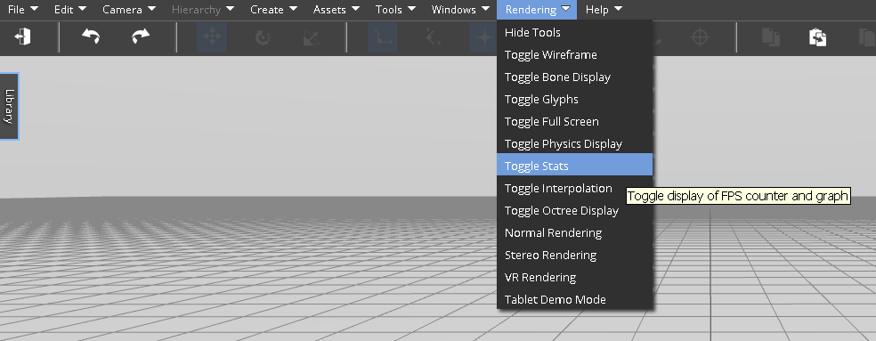

<h1>Optimizing Performance</h1>

# Fast Server Performance

Use the -compile configuration option to build a single `load.js` that is concatenated and minified version of required libraries.

# View Performance

Performance of a simulation is usually based on the interaction of CPU and GPU resources and simulation complexity.  As you work on your simulation, you can check the Frames Per Second (FPS) of the user experience on the current machine by navigating to the `Rendering` > `Toggle Stats` menu item, which will toggle an overlay window in the top left corner showing the Frames per Second (FPS) of the simulation on and off.

Toggling the Stats on will result in an overlay window in the upper left hand corner of the simulation that shows the current FPS, the range of observed FPS values, and a graph showing the observed FPS values over time.

# Using glTF 3D Models

While COLLADA 3D models are the easiest to import, glTF 3D models provide the best performance, but have a more complicated set of import steps.  Recall that glTF is a two-file format. There is a JSON file and a binary file. Below are the steps to import glTF 3D models into the VW Sandbox:

1. Upload the binary blob as a new asset, and note its ID.
1. Open the JSON file in a text editor, and make the following edit:
	1. Under `buffers`, find the buffer that corresponds to the binary file. It's usually the only buffer. Under that, change the `path` field to the asset ID string of the binary blob.
1. Save the JSON file
1. Upload the JSON file as a new asset. During uploading, in the mime type dropdown, select `model/vnd.gltf+json` as the type.
Add the model to your scene by using either the content library, or by loading the model by URL and giving it the URL to the JSON asset.

## Simplifying Player Settings

You can change the settings the VW Sandbox uses to play a simulation.  These settings can be used to simplify the simulation by disabling shadows or using simple materials.  These settings then apply to all simulations viewed through that web browser.  To access the player settings:

1. Go to the VW Sandbox home page
1. Click on `Worlds`
1. Click on `Tools` (upper-right corner)
1. Click on `Player Settings`

The player settings should appear:

# Lightweight Art

Given the VW Sandbox is a web application and all simulation content is web content, a good way to increase performance and enhance user experience is to create lightweight artwork.  Using less polygons, better textures, and small file sizes all contribute to fast downloads and fast computation.
