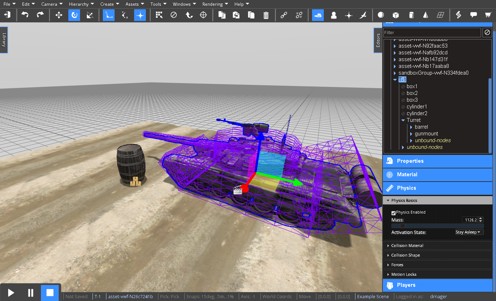
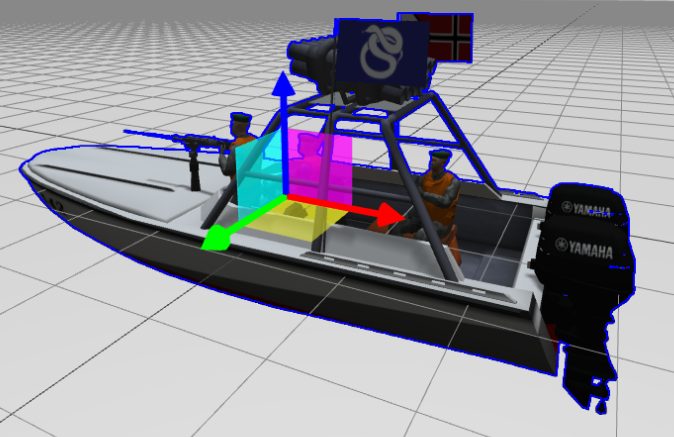

<h1>Physics</h1>

The VW Sandbox engine provides physics based on ammo.js -- a port of the Bullet physics library.


<h2>Contents</h2>
[TOC]

# Creating Physics through the Editor

The VW Sandbox provides physics that simulation objects can use to provide physics effects like collisions, gravity, torque, and forces.  These effects can be accessed through the editor and through the [Scripting API](reference-guide/scripting-api.md#physicsapi-reference).

The editor provides a Physics Editor that can be used to inspect or set the physics attributes of any simulation object.



When the Physics Editor is selected, any physics settings are shown in purple highlighting on the simulation object.  In the image above, the tank has a compound collision shape (made up of cylinders and boxes) you can see in purple highlighting.  When physics are enabled using the `Physics Enabled` checkbox, collisions and gravity apply to the simulation object.

## Collisions

Collisions between objects requires the objects to have physics enabled and have a collision shape either defined directly on the object through one of the support collision types or indirectly through child objects (that are typically invisible as in the tank example above).  The supported collision types an object can directly define are:

* None
* Box
* Sphere
* Cylinder
* Cone
* Plane
* Mesh

### Collisions Based on Primitive Object Shapes

For the primitive object types, the engine already understands the appropriate collision shape. So, you won't see a collision type selector for a `Sphere` -- the engine assumes the collision type is also `Sphere`.

If you want the collision shape to be compound (made up of  multiple primitive shapes), you will want to create child objects that have the `Collision Enabled` checkbox under the Physics Editor checked as shown in the tank example above.


### Collisions Based on 3D Model Meshes

Simulation objects that are 3D models can also use the `Mesh` collision type.  However, using the mesh shape for collisions is more expensive computationally than collisions based on primitive shapes, so primitive shapes are recommended for collisions unless a mesh shape is required.

!!! note:
	The current embedded simulation below loads the mesh example in the Edit mode, so the Editor tools are shown.  The Editor Camera is located at 0, 0, 0 in the Scene.  To play the simulation:  

	1. Click the image to Play
	2. Select the furniture item (the object on the left)
	3. Click on the Focus toolbar button () to focus the Editor Camera on the furniture.  
	4. Click the Select None toolbar button ()
	5. Click the Play button to start the simulation.

<iframe class="preview" width="705" height="430" frameBorder="0" src="" url="http://sandbox.adlnet.gov/adl/sandbox/example_physicsmeshcollision/" img="../images/physics-mesh.png">This embedded simulation requires your Web browser support iframes.  It appears it is unable to do so.</iframe>

[comment]:<>(http://localhost:3000/adl/sandbox/example_physicsmeshcollision/)

&nbsp;

In the simulation above, we can see that the spheres fall around the furniture fitting the mesh very precisely.  When this precise behavior is required, mesh shapes are helpful.  Just remember the computational cost of this precision.


## Forces

Forces and torques are usually applied by your scripts to control the object in space. While you can set the initial values for linear and angular velocity from the editor, this is not usually necessary. Setting the velocities from the editor will cause the objects to begin the simulation with a given velocity or rotation. See [Scripting](#scripting) for information on how to control forces and torques while the simulation is running.

### Gravity

Gravity is defined on the `Scene`.  Select the `Scene` from the Hierarchy and expand the Physics Editor.  There you will see `Gravity` is defined as a force equal to -9.8 m/s/s along the Z axis (the acceleration of gravity).  A checkbox to `Enable Physics` is defined on the `Scene` is by default checked.

### Mass

Each simulation object can define a mass used for physics calculations under the Physics Basics heading.  The mass will influence many calculations the depend on it.

### Torque

Torque is the tendancy of a force to rotate an object about an axis, fulcrum, or pivot.  You can apply constant torque on the X, Y, or Z axis to apply a constant torque force rotating an object.  To do so, select the object, open the Physics Editor and expand the `Forces` tab.  You will see `Constant Torque`.

### Force

Forces can be applied through the Editor as a constant force to change the motion of an object along a given axis.  If the mass of an object is 1, and it has a `Constant Force` set to 9.8 along the Z axis, it will hover.  Any force unopposed by another force will move an object in the direction of the force.

### Constant Torque and Constant Force

These forces (as described above) are applied to your object at every simulation tick. This is a bit like attaching a motor to the object, which is always pushing in a given direction. 

## Constraints

The VW Sandbox provides different kinds of constraints you can make between objects in the Editor.  These can be classified into joints you can create and motion and rotation locks you can enforce on one or more axes.

### Joints

You can make point constaints and hinge constraints to create joints between two objects.  Use the `Create` > `Physics` > and choose the desired constraint type.  The VW Sandbox provides four types of joints:

1. Point Constraints
2. Hinge Constraints
3. Slider Constraints
4. Fixed Constraints

!!! note:
	The VW Sandbox constraints implement the Bullet Physics constraints.  You can learn more about these constraints from the [Bullet Physics wiki](http://bulletphysics.org/mediawiki-1.5.8/index.php/Main_Page).

When you create a constraint, you will see an entry in the Hierarchy and an icon for the constraint in the Editor based on the type of constraint.  For each constraint, you will need to choose the two objects on which the constraint operates (A and B).  Simply click `Choose Node` and click on each object either in the Scene or in the Hierarchy.  

!!! note:
	Both Object A and Object B must have `Physics Enabled` checked.

#### Point Constraints

The Point Constraint works like a ball and socket to allow two objects to rotate along multiple axes.  It functions similar to a hinge if there is no force pushing an object in one dimension.  It has a pink selector icon that must be moved and/or rotated to allow the two objects to move in the desired manner.

#### Hinge Constraints

The Hinge Constraint works like a hinge allowing two objects to rotate on an axis.  With the Hinge Constraint selected and the Physics Editor expanded, you will need to rotate and/or move the pink highlight selector using the gizmo tool so that the hinge operates along the desired axis.

#### Slider Constraints

The Slider Constraint allows two objects to move along and rotated around a shared piston.

#### Fixed Constraints

A fixed constraint works similar to linking two objects into a parent child relationship.  However, it is different from the linking relationship because it is much easier to break the relationship when needed.

### Motion and Rotation Locks

You can create motion and rotation locks using the Physics Editor.  Motion and rotation is by default enabled in the X, Y, and Z directions.  You can disable or lock motion or rotation in one or more directions by unchecking the appropriate directions.  Motion and rotation locks are useful when creating a 2D side scrolling platform game.

# Scripting

Scripts will typically apply torque and forces to influence object behavior.  For example, to guide the motion of a boat based on WASD user input, the script might apply a torque to turn and force to move forward.

```javascript
function tick()
{
	if (this._keysDown.indexOf("W") !== -1)
	{
	    var force = this.transformAPI.localToGlobal(-10 * mass, 0, 0);
	    this.physicsAPI.addForceAtCenter(force[0], force[1], force[2]);
	}

	var vel = this.physicsAPI.getLinearVelocity();
	vel = this.transformAPI.globalToLocalRotation(vel);
	var speedTorqueFactor = (Math.abs(vel[0]));

	if (this._keysDown.indexOf("A") !== -1)
	{
	    this.physicsAPI.addTorque(0, 0, speedTorqueFactor * mass);
	    var force = this.transformAPI.localToGlobal(speedTorqueFactor * mass, 0, 0);
	    this.physicsAPI.addTorque(force);
	}
```

Lines 3 and 13 are the conditional statements for the W and A keys.  Other keys would be done simliarly.  See [Responding to User Input](creating-simulations.md#responding-to-user-input) in Creating Simulations guide for more information on handling user key presses.

The physicsAPI defaults methods to world coordinates.  Line 5, 10, and 16 translate coordinates between different coordinate systems.  Specifically, it translates local coordinates of the boat object to the world coordinate system.  See [Transforms](scripting.md#transforms) in the Scripting guide for more information on translating coordinates.

Finally, lines 6, 9, 11, 15, and 17 use the physicsAPI to change the motion of the boat.  Line 6 applies a force to the center of the object to move it forward.  In this case, the force is equal to -10 times the object's mass in its X direction (the red arrow of the gizmo tool).  The boat 3D model was modeled with its forward direction being -X, so a negative force moves it forward.



Line 9 gets the current linear velocity of the boat and line 11 divides the velocity by 3 to create a `speedTorqueFactor` -- so the turning torque will torque more when the boat is going faster.  Line 15 and 17 make the boat turn using torque forces.  Line 15 turns the boat left by applying the torque in the Z direction -- like a compass rotating around the blue arrow of the gizmo tool.  Line 17 makes the boat carve or dip into the turn by applying the torque to its X direction -- rotating around the red arrow of the gizmo tool.

See the [Scripting](scripting.md) article for more discussion about scripting simulations and see the [PhysicsAPI Reference](reference-guide/scripting-api.md#physicsapi-reference) for a detailed list of methods you can use.  

<script type = "text/javascript" > function setupFrames(){for (var i in $("iframe.preview")) {var imageurl = $($("iframe.preview")[i]).attr('img'); var previewsrc = $($("iframe.preview")[i]).attr('url'); (function(i, imageurl, previewsrc) {var frame = $("iframe.preview")[i]; frame.src = "about:blank"; frame.onload = function() {var doc = $("iframe.preview")[i].contentDocument; if (doc) {$(doc.body).css('overflow', "hidden"); var imgstr = '</img>'; var ClickToPlay = '<div style="font-family:sans-serif;font-size:100px;text-align:center;line-height:' + $(doc).height() + 'px;background:white;opacity: 0;position: absolute;width: 100%;height: 100%;z-index: 10;top: 0%;left: 0%;">Click To Play</div>'; var ClickToPlayDiv = $(ClickToPlay).appendTo(doc.body); var img = $(doc.body).append(imgstr); $(ClickToPlayDiv).mouseover(function() {$(ClickToPlayDiv).css('opacity', '0.75'); }); $(ClickToPlayDiv).mouseout(function() {$(ClickToPlayDiv).css('opacity', '0.0'); }); $(ClickToPlayDiv).click(function() {setupFrames(); frame.src = previewsrc; }); } } })(i, imageurl, previewsrc); } } setupFrames(); </script>