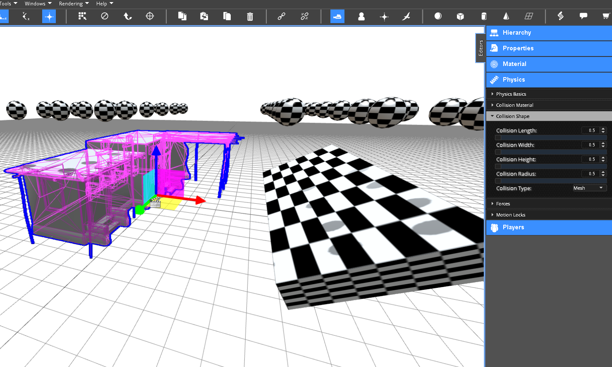

<h1>Physics</h1>

The VW Sandbox engine provides physics based on the ammo.js physics library.

<h2>Contents</h2>
[TOC]

# Creating Physics through the Editor

The VW Sandbox provides physics that simulation objects can use to provide physics effects like collisions, gravity, torque, and forces.  These effects can be accessed through the Editor and through the [Scripting API](reference-guide/scripting-api.md#physicsapi-reference).

The Editor provides a Physics Editor that can be used to inspect or set the physics attributes of any simulation object.

When the Physics Editor is selected, any physics settings are shown in purple highlighting on the simulation object.  In the image above, the tank has multiple physics collision shapes (e.g., cylinders and boxes) you can see in purple highlighting.  When physics are enabled using the `Physics Enabled` checkbox, collisions and gravity apply to the simulation object.

## Collisions

Collisions between objects requires the objects to have physics enabled and have a collision shape either defined directly on the object through one of the support collision types or indirectly through child objects (that are typically invisible as in the tank example above).  The supported collision types an object can directly define are:

* None
* Box
* Sphere
* Cylinder
* Cone
* Plane
* Mesh

### Collisions based on Primitive Object Shapes

If one of the primitive object types are used (i.e., Box, Sphere, Cylinder, Cone, or Plane), then that primitive object used for collisions can also have a length, width, height, or radius as appropriate.

If you want the collision shape to be a composition of multiple primitive shapes, you will want to create child objects that have the `Collision Enabled` checkbox under the Physics Editor checked as shown in the tank example above.

### Collisions based on 3D Model Meshes

Simulation objects that are 3D models can also use the Mesh collision type.  However, using the mesh shape for collisions is more expensive computationally than collisions based on primitive shapes, so primitive shapes are recommended for collisions.  In the example below, a 3D model rock, which is a mesh, is selected in the Scene.

In the image above, we can see that the rock is selected and the `Collision Type` is `None`.  Setting the `Collision Type` to `Mesh` results in the purple highlighting showing the collision shape based on the mesh geometry.

## Forces

### Gravity

Gravity is defined on the `Scene`.  Select the `Scene` from the Hierarchy and expand the Physics Editor.  There you will see `Gravity` is defined as a force equal to -9.8 m/s/s along the Z axis (the acceleration of gravity).  A checkbox to `Enable Physics` is defined on the `Scene` is by default checked.

### Mass

Each simulation object can define a mass used for physics calculations under the Physics Basics heading.  The mass will influence many calculations the depend on it.

### Torque

Torque is the tendancy of a force to rotate an object about an axis, fulcrum, or pivot.  You can apply constant torque on the X, Y, or Z axis to apply a constant torque force rotating an object.  To do so, select the object, open the Physics Editor and expand the `Forces` tab.  You will see `Constant Torque`.

### Force

Forces can be applied through the Editor as a constant force to change the motion of an object along a given axis.  If the mass of an object is 1, and it has a `Constant Force` set to 9.8 along the Z axis, it will hover.  Any force unopposed by another force will move an object in the direction of the force.

## Constraints

### Joints

### Motion-lock constraints for 2D side scrolling games.

# Scripting