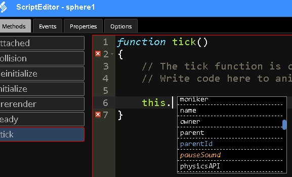

<h1>Reference Guide</h1>

The VW Sandbox provides multiple APIs that are accessible through the Script Editor to define and manipulate simulation logic.  The [Node API](#node-api "Node API") provides properties and methods to manipulate a simulation object, which is a node in the replicated computation model.  The [Transform API](TransformAPI.md "Transform API") provides methods to manipulate the properties of nodes such as their position and rotation.  It also includes methods to convert between different coordinate systems. The [Physics API](PhysicsAPI.md "Physics API") provides methods to apply forces and velocities to objects.  The [Audio API](AudioAPI.md "Audio API") provides properties and methods to control sound logic.

<h2>Contents</h2>
[TOC]

# Node API

The Node API provides properties and methods to manipulate a simulation object, which is a node in the replicated computation model.  The Node API is the primary API for manipulating simulation objects and is accessible through the Script Editor by selecting an object and typing `this.`, which will result in an autocomplete list of available properties and methods.  

The autocomplete list should include any properties and methods the object defines as well as access to the Transform, Physics, and Audio APIs.

## Properties

Any property that the node has defined will be availble.  In addition, some standard properties are provided.

### DisplayName

The name of the object that appears in the Properties panel in the Editor.

## Methods

Any method that the node has defined will be available.  In addition, some standard methods are provided.

### AudioAPI

Returns the node's [AudioAPI](AudioAPI "Audio API") endpoint.

**Arguments:**

*(None)*

**Returns:**

`audioAPI` (`AudioAPI`)

The [AudioAPI](AudioAPI "Audio API") endpoint.

### PhysicsAPI

Returns the node's [PhysicsAPI](PhysicsAPI "Physics API") endpoint.

**Arguments:**

*(None)*

**Returns:**

`physicsAPI` (`PhysicsAPI`)

The [PhysicsAPI](PhysicsAPI "Physics API") endpoint.

### TransformAPI

Returns the node's [TransformAPI](TransformAPI "Transform API") endpoint.

**Arguments:**

*(None)*

**Returns:**

`transformAPI` (`TransformAPI`)

The [TransformAPI](TransformAPI "Transform API") endpoint.

### Random

Return, preserving replicated computation, a random number between 0 (inclusive) and 1 (exclusive).  Similar to JavaScript's `Math.random()`, but is safe for replicated computation.

**Arguments:**

*(None)*

**Returns:**

`randomNumber` (`Number`)

The generated random number between 0 and 1.

# Transform API

Facilitates manipulation of nodes by allowing manipulation of their properties such as position, and  rotation.

Facilitates movement, rotation, and more of nodes.

## Methods

### move(x, y, z, coordinateSystem)

Moves a node

**Arguments:**

`x` (`number`)  
Movement along the x-axis in meters.

`y` (`number`)  
Movement along the y-axis in meters.

`z` (`number`)  
Movement along the z-axis in meters.

`coordinateSystem` (`String`)  
Specify either 'global' or 'local' coordinate system.

**Returns:**

*(Nothing)*

### getPosition()

Return a node's local position?

**Arguments:**

*(None)*

**Returns:**

`localPosition` (`Array of numbers`)  
Array containing local x, y, and z coordinates.

### getWorldPosition()

Return a node's global position.

**Arguments:**

*(None)*

**Returns:**

`globalPosition` (`Array of numbers`)  
Array containing global x, y, and z coordinates.

### localToGlobal(x, y, z)

Exchanges local x, y, and z coordinates for global x, y, and z coordinates.

**Arguments:**

`x` (`number`)  
Movement along the x-axis in meters.

`y` (`number`)  
Movement along the y-axis in meters.

`z` (`number`)  
Movement along the z-axis in meters.

**Returns:**

`vector` (`Array of numbers`)  
Array containing global x, y, and z coordinates.

### localToGlobalRotation(x, y, z)

Converts local values of rotation to global values of rotation.

**Arguments:**

`x` (`number`)  
Movement around the x-axis in meters.

`y` (`number`)  
Movement around the y-axis in meters.

`z` (`number`)  
Movement around the z-axis in meters.

**Returns:**

`vector` (`Array of numbers`)  
Array containing global x, y and z values of rotation.

### globalToLocal(x, y, z)

Exchanges global x, y, and z coordinates for local x, y, and z coordinates.

**Arguments:**

`x` (`number`)  
Position along the x-axis.

`y` (`number`)  
Position along the y-axis.

`z` (`number`)  
Position along the z-axis.

**Returns:**

`vector` (`Array[x coordinate, y coordinate, z coordinate]`)  
Array containing local x, y, and z coordinates.

### globalToLocalRotation(x, y, z)

Converts local values of rotation to global values of rotation.

**Arguments:**

`x` (`number`)  
Movement around the x-axis in meters.

`y` (`number`)  
Movement around the y-axis in meters.

`z` (`number`)  
Movement around the z-axis in meters.

**Returns:**

`vector` (`Array[x coordinate, y coordinate, z coordinate]`)  
Array containing global x, y and z values of rotation.

### globalRotationToLocalRotation(x, y, z)

Converts global rotation values to local rotation values.

`x` (`number`)  
Movement around the x-axis in meters.

`y` (`number`)  
Movement around the y-axis in meters.

`z` (`number`)  
Movement around the z-axis in meters.

**Returns:**

`vector` (`Array[x coordinate, y coordinate, z coordinate]`)  
Array containing local x, y and z values of rotation.

### setPosition(x, y, z)

Accepts X, Y, and Z coordinates to establish a new position.

**Arguments:**

`x` (`number`)  
Position along the x-axis.

`y` (`number`)  
Position along the y-axis.

`z` (`number`)  
Position along the z-axis.

**Returns:**

*(Nothing)*

### rotate(x, y, z, coordinateSystem)

Accepts X, Y, Z and Coordinate System and rotates.

**Arguments:**

`x` (`number`)  
Angle of movement around the x-axis.

`y` (`number`)  
Angle of movement around the y-axis.

`z` (`number`)  
Angle of movement around the z-axis.

**Returns:**

*(Nothing)*

### rotateX(angle, coordinateSystem)

Rotates the node around the x-axis.

**Arguments:**

`angle` (`number`)  
Angle of movement around the x-axis.

`coordinateSystem` (`String`)
Designates whether local, global, or parent coordinates are given.

**Returns:**

*(Nothing)*

### rotateY(angle, coordinateSystem)

Rotates the node around the y-axis.

**Arguments:**

`angle` (`number`)  
Angle of movement around the y-axis.

`coordinateSystem` (`String`)
Designates whether local, global, or parent coordinates are given.

**Returns:**

*(Nothing)*

### rotateZ(angle, coordinateSystem)

Rotates the node around the z-axis.

**Arguments:**

`angle` (`number`)  
Angle of movement around the z-axis.

`coordinateSystem` (`String`)
Designates whether local, global, or parent coordinates are given.

**Returns:**

*(Nothing)*

Coordinates:
	Local
	Global
	Parent

### rotateAroundAxis(angle, axis, coordinateSystem)

Accepts Angle, Axis, and Coordinate System and rotates node around given axis.

**Arguments:**

`angle` (`number`)  
The angle for rotation.

`axis` (`Array of numbers`)
Designates which axis for rotation.

`coordinateSystem` (`String`)
Designates which coordinate system is given (Local, global, or parent).

**Returns:**

*(Nothing)*

### getRotation()

By some form of magic, returns a number representing the rotation

**Arguments:**

*(None)*

**Returns:**

`euler` (`Array of numbers`)  
Angles of rotation around x, y and z axes.

### setRotation(x, y, z)

Sets the rotation of a node given specified angles.

**Arguments:**

`x` (`number`)  
Angle of rotation around the x-axis.

`y` (`number`)  
Angle of rotation around the y-axis.

`z` (`number`)  
Angle of rotation around the z-axis.

**Returns:**

*(Nothing)*

### getScale()

Returns the magnitude of the node.

**Arguments:**

*(None)*

**Returns:**

`vector` (`Array of numbers`)  
Array of x, y, and z vectors.

### setScale(x, y, z)

Accepts X, Y, and Z to set the scale of a node.

**Arguments:**

`x` (`number`)  
Scale of the x-axis.

`y` (`number`)  
Scale of the y-axis.

`z` (`number`)  
Scale of the z-axis.

**Returns:**

*(Nothing)*

### scaleMatrix(x, y, z, mat)

Accepts X, Y, Z, and Matrix.

**Arguments:**

`x` (`number`)  
Scale of the x-axis.

`y` (`number`)  
Scale of the y-axis.

`z` (`number`)  
Scale of the z-axis.

`mat` (`Array of numbers`)  
Current matrix of the node.

**Returns:**

`matrix` (`Array of numbers`)  
Updated matrix of the node being scaled.

### lookAt(t, clamp, axis, up, fromOffset)

Facilitates examination of a node.

**Arguments:**

`t` (`String`)  
Identification string of the target being looked at.

`clamp` (`String`)  
Axis held steady while examining the node.

`axis` (`String`)  
Designates the axis. More needed. Default value is 'Y'.

`up` (`String`)  
I'm really not sure.

`fromOffset` (`number`)  
Value of the offset of the node.

**Returns:**

*(Nothing)*

# Physics API

The Physics API provides methods to apply forces and velocities to objects.

## Methods

### addForceAtCenter(x, y, z, coords)

Applies force at center of node. Accepts X, Y, Z, and Coordinates.

**Arguments:**

`x` (`number`)  
Force applied along x-axis.

`y` (`number`)  
Force applied along y-axis.

`z` (`number`)  
Force applied along z-axis.

`coords` (`number`) (optional)  
Coordinates where force is to be applied.

**Returns:**

*(Nothing)*

### addForceImpulse(x, y, z, coords)

Accepts X, Y, Z, and Coordinates.

**Arguments:**

`x` (`number`)  
Force applied along x-axis.

`y` (`number`)  
Force applied along y-axis.

`z` (`number`)  
Force applied along z-axis.

`coords` (`number`) (optional)  
Coordinates where force is to be applied.

**Returns:**

*(Nothing)*

### addTorqueImpulse(x, y, z, coords)

Accepts X, Y, Z, and Coordinates.

**Arguments:**

`x` (`number`)  
Torque applied along x-axis.

`y` (`number`)  
Torque applied along y-axis.

`z` (`number`)  
Torque applied along z-axis.

`coords` (`number`) (optional)  
Coordinates where torque is to be applied.

**Returns:**

*(Nothing)*

### addTorque(x, y, z, coords)

Accepts X, Y, Z, and Coordinates.

**Arguments:**

`x` (`number`)  
Torque applied along x-axis.

`y` (`number`)  
Torque applied along y-axis.

`z` (`number`)  
Torque applied along z-axis.

`coords` (`number`) (optional)  
Coordinates where torque is to be applied.

**Returns:**

*(Nothing)*

### addForceOffset(x, y, z, x1, y1, z1, coords)

Accepts X, Y, Z, X1, Y1, Z1 and Coordinates.

**Arguments:**

`x` (`number`)  
Force applied along x-axis.

`y` (`number`)  
Force applied along y-axis.

`z` (`number`)  
Force applied along z-axis.

`x1` (`number`)  
Force applied along second x-axis.

`y1` (`number`)  
Force applied along second y-axis.

`z1` (`number`)  
Force applied along second z-axis.

`coords` (`number`) (optional)  
Coordinates where force is to be applied.

**Returns:**

*(Nothing)*

### setLinearVelocity(x, y, z, coords)

Sets the linear velocity. Accepts X, Y, Z, and Coordinates.

**Arguments:**

`x` (`number`)  
Velocity applied along x-axis.

`y` (`number`)  
Velocity applied along y-axis.

`z` (`number`)  
Velocity applied along z-axis.

`coords` (`number`) (optional)  
Origin coordinates of linear velocity.

**Returns:**

*(Nothing)*

### setAngularVelocity(x, y, z, coords)

Sets the angular velocity. Accepts X, Y, Z, and Coordinates.

**Arguments:**

`x` (`number`)  
Velocity applied along x-axis.

`y` (`number`)  
Velocity applied along y-axis.

`z` (`number`)  
Velocity applied along z-axis.

`coords` (`number`) (optional)  
Coordinates where angular velocity is to be applied.

**Returns:**

*(Nothing)*

### getLinearVelocity()

Returns the current internal Linear Velocity value.

**Arguments:**

*(None)*

**Returns:**

`linearVelocity` (`number`)  
Current internal linear velocity value.

### getAngularVelocity()

Returns the current internal Angular Velocity value.

**Arguments:**

*(None)*  

**Returns:**

`angularVelocity` (`number`)  
Current internal angular velocity value.

#Audio API

The Audio API provides properties and methods to control sound logic.

##Properties

### id
Type: `String`  
The name to identify the sound

### sound
Type: `String` `filename`  
The file of the sound

### position
Type: `number`  
Where the sound can be found

### volume
Type: `number`  
How loud

###end range
Type: `number`  
some number for the end

###start range
Type: `number`  
some number for the start

###looping
Type: `boolean`  
Indicates whether or not the sound is to loop/repeat

###playing
Type: `boolean`  
Indicates whether or not the sound is currently in use  

##Methods

###play()

Plays sound.

**Arguments:**

*(None)*

**Returns:**

*(Nothing)*

###pause()

Halts playback of sound, holding position along track to resume where left off.

**Arguments:**

*(None)*

**Returns:**

*(Nothing)*

###stop()

Ends playback of sound, resets position.

**Arguments:**

*(None)*

**Returns:**

*(Nothing)*

###loop()

Sets the `boolean` looping variable.

**Arguments:**

*(None)*

**Returns:**

*(Nothing)*

###unloop()

Sets the `boolean` looping variable.

**Arguments:**

*(None)*

**Returns:**

*(Nothing)*

###updateSourcePosition

Get the position of the source object. **Note:** The 3D driver keeps track of the position.

**Arguments:**

*(None)*

**Returns:**

*(Nothing)*

###updateVolume(camerapos)

HTML can't actually play it louder, however we can make it 'carry' farther by using the inverse and adjusting the range parameters of the falloff curve.

**Arguments**

`camerapos` (`number`)  
Location of camera.

**Returns**

*(Nothing)*

###Initialize()

start it up

**Arguments:**

*(None)*

**Returns:**

*(Nothing)*

###playSound(url, volume)

Lets GUI elements play sounds.

**Arguments:**

`url` (`String`)  
String specifying the URL.

`volume` (`number`)  
How loud.

**Returns:**

*(Nothing)*

###calledMethod(id, name, params)

This is a good place to explain.

**Arguments:**

`id` (`String`)  
The identification String.

`name` (`String`)  
The name of the command:/

* `playSound`

	If the scene played the sound, it has no position and just plays at full volume. Nodes that are not the scene use their position to adjust the volume.

* `pauseSound`

* `stopSound`

* `deleteSound`

	**Note:** only delete sound if you are sure the sound will not play again any time soon

`params` (`Array`)  
Array of additional parameters

**Returns**

*(Nothing)*

###ticked()

Update the sound volume based on the position of the camera and the position of the object

**Arguments:**

*(None)*

**Returns:**

*(Nothing)*

###deletedNode(id)

Deletes the specified sound source node.

**Arguments:**

`id` (`String`)  
The String identifier of the node deleted.

**Returns:**

*(Nothing)*
