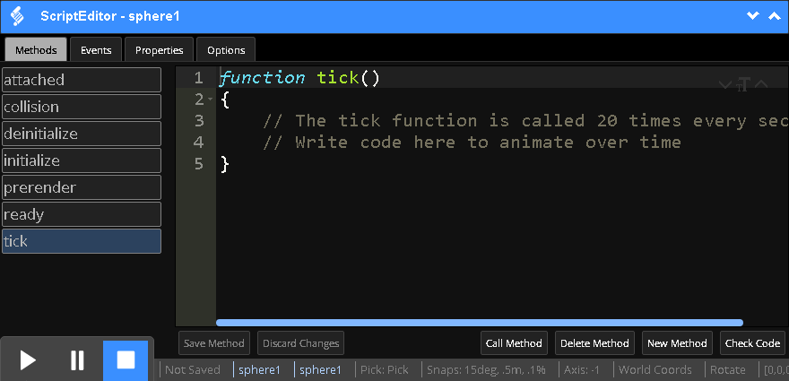

<h1>Scripting</h1>

The Scripting guide will explain how to use the ScriptEditor for writing simulation logic.

[TOC]

# ScriptEditor



Code you write with the ScriptEditor is immediately injected into the multiplayer engine as new properties, methods, and events for the selected object.  You can see which selected object the ScriptEditor is focused on in the blue title window at the top and in the status bar at the bottom.  In the screenshot, the ScriptEditor is focused on `sphere1`.

The ScriptEditor has three tabs across the top: `Methods`, `Events`, and `Properties`.  Depending on which tab is selected, the list of items will be displayed vertically on the left and the code for the given selected item is in the main content window on the right.  In the screen shot above, the `Methods` tab is selected and the `tick` method is selected.

!!! note:

	The editor uses js_beautify on all input code before displaying it. On some systems, the JavaScript engine may insert "use strict."  This is normal and not a problem. 

The two up and down arrow buttons in the upper right hand corner of the script editor expand the ScriptEditor window (up) and minimize/hide the ScriptEditor window (down).


# Simulation Object

Each simulation object in a Scene can be scripted using the ScriptEditor to add simulation logic.  To do so, select the object (either directly or through the Hierarchy) and click on the ScriptEditor (toolbar  or through the `Windows` > `Script Editor` menu item).

## The Tick Function

Simulations play in a synchronized manner where the engine moves each simulation client forward by 1/20th of a second, which is known as a "tick."  The engine will call the tick() method of each object every 1/20th of a second.  This length of time is equal to 50 milliseconds or .05 seconds.  The tick is the heartbeat of the simulation.  Each simulation object can define the `tick` method and this is typically where simulation logic originates.

When the Script Editor loads, it will be focused on the selected object.  Scripting simulation logic usually starts with creating a tick() function.  In the image below, we've moved the selected tank object (named T-1) forward by .01 meters every tick (.05 seconds), which is a rate of .2 meters / second.


Each simulation object provides access to properties and methods that you define on the simulation object and as well as engine provided properties and methods through the `this` keyword.  If you create a new property to keep track of fuel consumption, you can reference that property in your script.  The Scripting API provides access, and APIs for physics, transforms, audio, and communications.  For example, in the image above, `this.transformAPI` provides access to methods that transform simulation objects.  

See the [Simulation Object Reference](reference-guide/scripting-api.md#simulation-object-reference) for a detailed list of properties and methods.  Below is a discussion of scripting simulation objects using these properties and methods.

## Events

You can write your own event handlers for events that the engine fires.  Events the engine fires include:

* `pointerClick` - When mouse buttons are pressed and released.
* `pointerDown` - When mouse buttons are pressed.
* `pointerMove` - Each movement of a mouse over an object.
* `pointerOut` - When mouse moves off of an object.
* `pointerOver` - When mouse moves over an object.
* `pointerUp` - When mouse buttons are released.
* `pointerWheel` - When the mouse wheel is turned.

## Properties and Methods

You can write your own properties and methods.  These properties and methods will be able to be called by simulation objects.

## The Scene

The engine provides access to the Scene object by calling `this.Scene`.  Common methods the Scene provides include finding and accessing other objects.  See [Finding Objects through Script](creating-simulations.md#finding-objects-through-script) for more information.

## Transforms

The engine provides the TransformAPI to get and set the position, rotation, and scale of simulation objects.  The TransformAPI also provides methods to convert between local and global coordinate systems.

See the [TransformAPI Reference](reference-guide/scripting-api.md#transformapi-reference) for more information.    

## Physics

The Engine provides the PhysicsAPI to add, get, and set forces, velocities, and torques for simulation objects.

Scripts will typically apply torque and forces to influence object behavior.  For example, to guide the motion of a boat based on WASD user input, the script might apply a torque to turn and a force to move forward.

```javascript
function tick()
{
	if (this._keysDown.indexOf("W") !== -1)
	{
	    var force = this.transformAPI.localToGlobal(-10 * mass, 0, 0);
	    this.physicsAPI.addForceAtCenter(force[0], force[1], force[2]);
	}

	var vel = this.physicsAPI.getLinearVelocity();
	vel = this.transformAPI.globalToLocalRotation(vel);
	var speedTorqueFactor = (Math.abs(vel[0]));

	if (this._keysDown.indexOf("A") !== -1)
	{
	    this.physicsAPI.addTorque(0, 0, speedTorqueFactor * mass);
	    var force = this.transformAPI.localToGlobal(speedTorqueFactor * mass, 0, 0);
	    this.physicsAPI.addTorque(force);
	}
```

Lines 3 and 13 are the conditional statements for the W and A keys.  Other keys would be done simliarly.  See [Responding to User Input](creating-simulations.md#responding-to-user-input) in Creating Simulations guide for more information on handling user key presses.

The physicsAPI defaults methods to world coordinates.  Line 5, 10, and 16 translate coordinates between different coordinate systems.  Specifically, it translates local coordinates of the boat object to the world coordinate system.  See [Transforms](#transforms) for more information on translating coordinates.

Finally, lines 6, 9, 11, 15, and 17 use the physicsAPI to change the motion of the boat.  Line 6 applies a force to the center of the object to move it forward.  In this case, the force is equal to -10 times the object's mass in its X direction (the red arrow of the gizmo tool).  The boat 3D model was modeled with its forward direction being -X, so a negative force moves it forward.


Line 9 gets the current linear velocity of the boat and line 11 divides the velocity by 3 to create a `speedTorqueFactor` -- so the turning torque will torque more when the boat is going faster.  Line 15 and 17 make the boat turn using torque forces.  Line 15 turns the boat left by applying the torque in the Z direction -- like a compass rotating around the blue arrow of the gizmo tool.  Line 17 makes the boat carve or dip into the turn by applying the torque to its X direction -- rotating around the red arrow of the gizmo tool.

See the [Scripting](scripting.md) article for more discussion about scripting simulations and see the [PhysicsAPI Reference](reference-guide/scripting-api.md#physicsapi-reference) for a detailed list of classes, properties, and methods you can use.  

See the [PhysicsAPI Reference](reference-guide/scripting-api.md#physicsapi-reference) for a detailed list of methods you can use.

## Audio

The engine provides the AudioAPI to play, pause, stop, and delete audio files.

As an example, consider the scenario where we want a boat to play a motor running sound clip when the user drives the boat.

```javascript

function tick()
{
    if (this._keysDown.indexOf("W") !== -1)
    {
    	var sound = Engine.callMethod(this.id, "getSound", ["/sas/assets/c253157d"]);

	    if (sound == null || !sound.isPlaying())
	    {
	        this.audioAPI.playSound("/sas/assets/c253157d", false, 100);
	    }
	}	
}
```

In line 3, we check to see if the user is pressing down the W key.  If the user is pressing the W key, then we get a reference to the sound file by its asset server identifier (`/sas/assets/c253157d`).  In line 7, we check to see if the sound is not yet defined or playing.  In line 9, we call the AudioAPI's `playSound` method passing the asset server identifer, a boolean value indicating if we want the audio file to loop (false in this case), and  


See the [AudioAPI Reference](reference-guide/scripting-api.md#audioapi-reference) for more information.

## Broadcasting Messages to Other Objects

You will sometimes find the need to send information from one object to other objects based on proximity using a publisher subscriber model.  The engine provides the broadcast method where a publisher object can broadcast data (an array) to other subscriber objects that are within a given range.

As an example, consider the scenario where we want a user to drive a boat and have other boats within a certain range to navigate to a point in front of the user-driven boat.  In the user-driven boat, you could add a broadcast method.

```javascript
var leader_projection = this.transformAPI.localToGlobal(-150, 0, 0);

this.broadcast("facLeaderInput", [leader_projection], 500);
```

In the broadcast above, Line 1 uses the TransformAPI to get a position, in world coordinates, that is 150 meters in front of the user driven boat and it stores this position as `leader_projection`.  Line 3 then uses the broadcast method to send the leader_projection data as the only value in the data array to any subscriber objects within 500 meters that define the `facLeaderInput` method.

Then, in a subscriber object, we could define the `facLeaderInput` method to store the position as a candidate position to guide the subscriber object's movement.

```javascript
function facLeaderInput(args)
{
    this.facLeaderMovementCandidate = args;
}
```

See the [broadcast() method](reference-guide/scripting-api.md#broadcastsignal-data-range) in the Reference Guide for more information.

## Raycasting to find Simulation Object Intersections

There are many situations where you will want to cast an invisible ray from an origin in a given direction of a Scene to find the nearest intersecting simulation object.  The [rayCast()](reference-guide\scripting-api.md#raycastorigin-direction-options) method of the [traceAPI](reference-guide\scripting-api.md#traceapi-reference) provides the means to do this.  See the example below where raycast is used to see if a shot fired from a gun's barrel hits another simulation object in the Scene.

```javascript
var origin = this.children_by_name["Barrel"].transformAPI.getWorldPosition();

var dir = this.children_by_name["Barrel"].transformAPI.localToGlobalRotation([0, 0, 1]);

var hit = this.Scene.traceAPI.rayCast(origin, dir,
{
    ignore: [findviewnode(this.id)]
});

if (hit)
{
    if (hit.node && hit.node.hit)
    {
        hit.node.hit([hit.point, 5]);
    }
}
```

On line 1, the origin for the raycast is defined by getting the global position of the gun's barrel.  The raycast parameters are all in the world space of the Scene, so we need to use the TransformAPI to get the position of the object in world space.

On line 3, the direction for the raycast is defined by getting the direction out of the gun barrel, which is the Z axis of the gun object in local coordinates [0, 0, 1].  The transform API is again used to convert this direction from local coordinates to global world coordinates.

Line 5 calls the raycast, which you can see is a part of the traceAPI that the Scene provides.  It takes the origin and direction of the ray as the first two parameters, respectively.  It then passes as a third parameter an options object, which has just one option, `ignore`, defined on line 7.  This ignore option specifies which objects (using an Array) the raycast should ignore when searching for the nearest intersection.  We don't want the raycast from the gun intersecting with the gun, so we get the gun's ID `findviewnode(this.id)` and specify this ID as the only item in the ignore options Array.

Line 10 then tests to see if an intersection was found.  If an intersection was found, represented by the hit variable, then we want to do something about the hit.  Line 12 checks to ensure we can find the object that was hit (hit.node) and if that object has a `hit` method defined.  If the object that was hit exists and has a `hit` method, then line 14 calls that object's hit method passing as a parameter an Array containing the intersection point in world space and the number 5 which is used by the object's hit method.

See the [traceAPI](reference-guide/scripting-api.md#traceapi-reference) for more information.

## Vector Functions

The engine provides common vector functions that are necessary to calculate distances or directions.  The `MATH` library attached to each simulation object provides helpful vector functions.

# Reference Guide

See the [Scripting API](reference-guide/scripting-api.md) for complete reference information.
