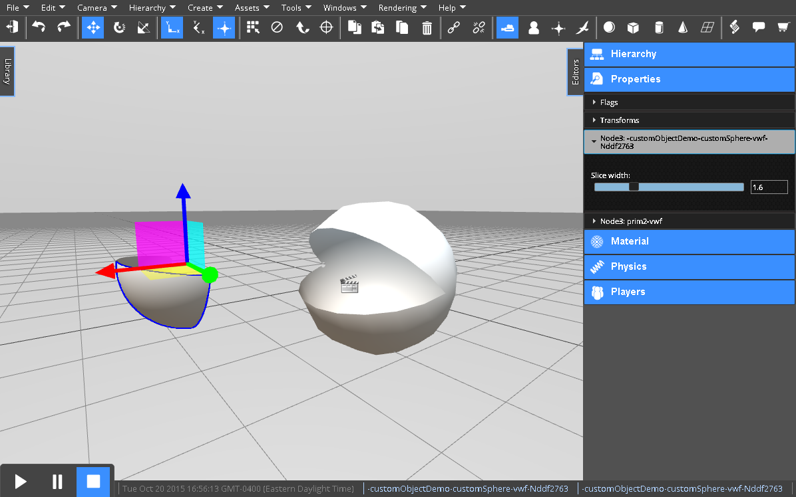
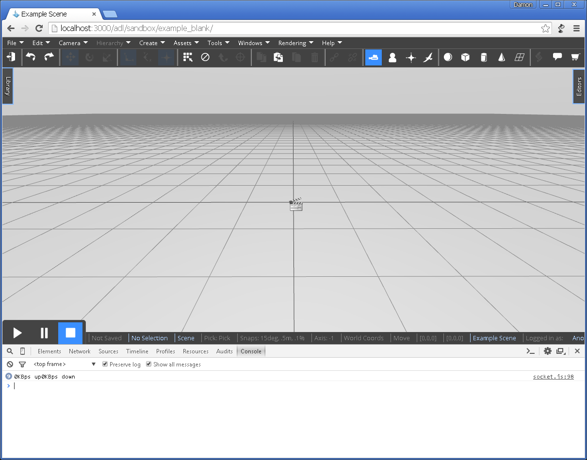
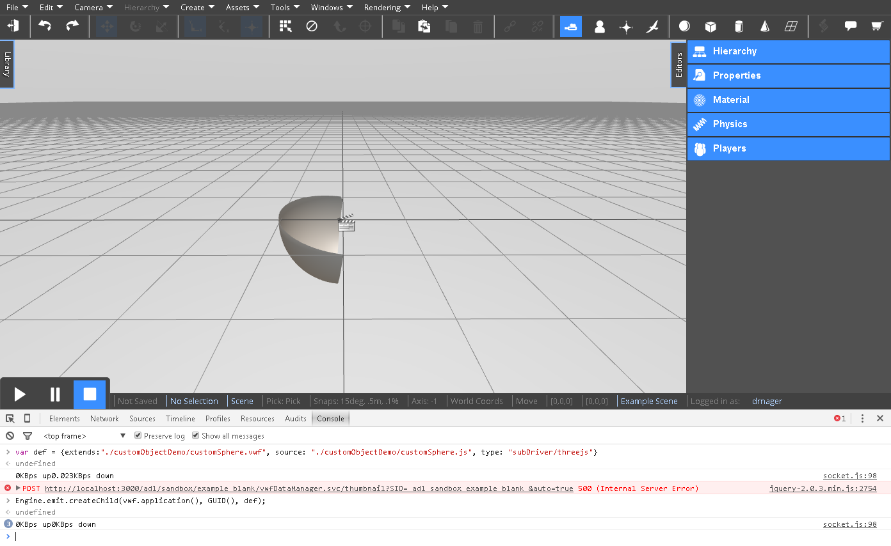
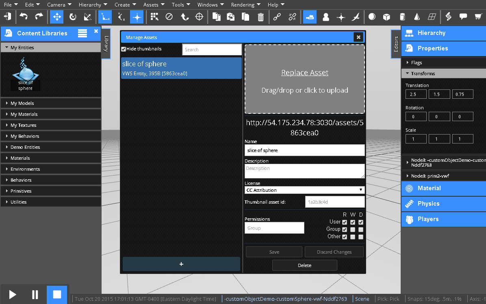
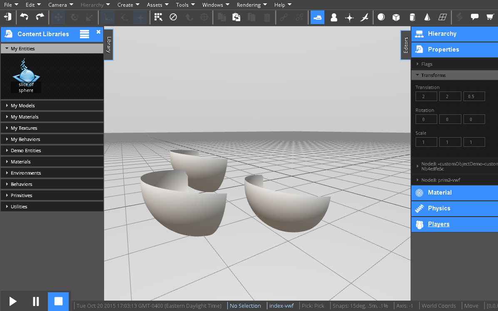
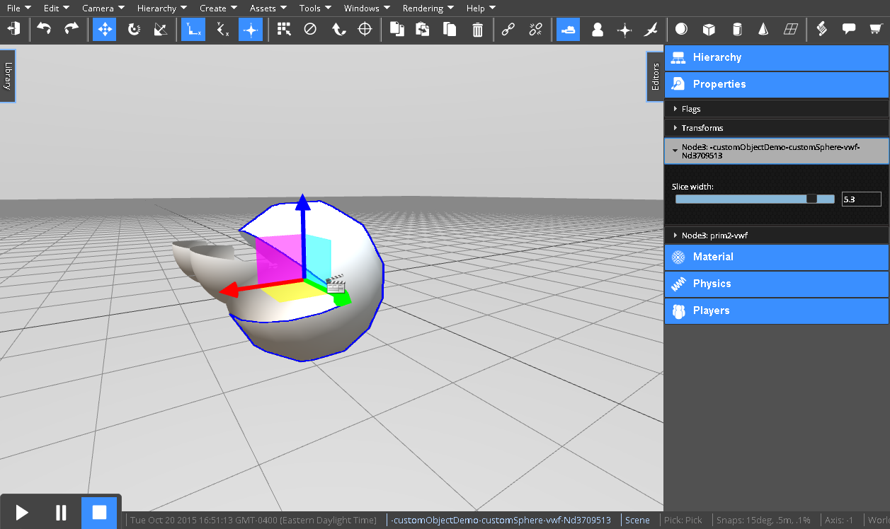

<h1>Custom Graphic Tutorial</h1>



<h2>Contents</h2>
[TOC]

# Overview
One powerful way to extend the VW Sandbox without knowing too much about or changing the VW Sandbox architecture is to write custom graphics.  Most simulation development involves manipulating existing Graphic types (e.g., 3D models, primitive shapes, particle systems).  Sometimes you will want to create custom Graphic types that directly interface with THREE.js -- the JavaScript 3D library used by the Graphics driver.  For example, custom graphics you might want to create include:

* ocean
* orthographic camera
* advanced particle system
* custom animation
* custom shader

At its core, writing a custom graphic type involves defining a simulation object definition.  Let's create a custom sphere to illustrate the process of writing a custom graphic type.  You'll want to have a local server installation for this tutorial.

!!! note:
    See the [Server Installation](../server-installation.md) guide to setup your local server.

# Part 1: Simulation Object Definition

The first step is to create a new object definition, which has two parts: 1) an interface written in YAML and 2) an implementation written in JavaScript.

```
extends: customSphere.vwf
source: customSphere.js

```

Where `extends: customSphere.vwf` is the engine's object interface (not implementation) defining its properties and methods and `source: custom_sphere.js` is a JavaScript file that implements the interface.

For this demo, we'll keep the two files in a directory in `Sandbox` > `public` > `adl` > `sandbox`.  We'll call the directory `customObjectDemo`.  Placing the files here will make them easy for us to reference later.

!!! note:
    Here are links to download the complete files for your reference: [customSphere.vwf.yaml](customSphere.vwf.yaml) and [customSphere.js](customSphere.js)

Create a new text file called `customSphere.vwf.yaml` in the `customObjectDemo` directory.  Put the following in the file:

```
extends: prim2.vwf
```

Now create another file called `customSphere.js` in the `customObjectDemo` directory.

# Part 2: Boilerplate Files

Put the following boilerplate code in the JavaScript `customSphere.js` file:

```
"use strict";
(function()    // this is the factory function that will return our new object type
{	
	
    // constructor for our new object
    function customSphere(childID, childSource, childName, childType, assetSource, asyncCallback)
    {
    	this.root = new THREE.Object3D(); // the root of our custom graphics

    	this.getRoot = function() //boilerplate for giving our node to the system
    	{
    		return this.root;
    	}    	

		this.inherits = ['vwf/model/threejs/visible.js', 'vwf/model/threejs/transformable.js'];
    	this.initialize = function()
    	{

    	}    	

    }
    //default factory code
    return function(childID, childSource, childName, childType, assetSource, asyncCallback)
    {
        //name of the node constructor
        var s = new customSphere(childID, childSource, childName, childType, assetSource, asyncCallback);
        return s;
    }
})();
```

# Part 3: Creating the Custom Graphic

Our custom graphic will be a slice of a standard sphere.  In the `this.initialize()` function of `customObject.js`, let's create a new  [THREE.js sphere](http://threejs.org/docs/#Reference/Extras.Geometries/SphereGeometry).

```
    	this.initialize = function()
    	{
			this.sphere = new THREE.SphereGeometry(1,10,10,3,1.6,0,3.1);
			this.material = new THREE.MeshPhongMaterial("#FFFFFF");
            this.material.side = 2;
			this.mesh = new THREE.Mesh(this.sphere,this.material);	
			this.getRoot().add(this.mesh);
    	}   
```

The Engine will call the constructor, initialize the new object type, and return the new object type in the Engine.  To make the Engine create the object type, create a new simulation.  Make sure the new simulation settings have the `Persist world state on close` setting checked.  We can also uncheck `Create Avatar for Each User`.  Then open and clear the console.  You should see something like the following:



In the console, let's define the object.  Type:

```
var def = {extends:"./customObjectDemo/customSphere.vwf", source: "./customObjectDemo/customSphere.js", type: "subDriver/threejs"}
```

Next, let's send a command to the engine to create an instance of the object:

```
Engine.emit.createChild(vwf.application(), GUID(), def);
```

You should see a slice of a sphere appear in your editor.



# Part 4: Making the Custom Graphic Reusable

Now that we have a custom graphic defined that the Engine is capable of creating, let's store it in the asset server, so it can be created on demand.

Select the custom graphic and click `Assets` > `Create New Asset` > `From Sel. Entity`.  Give the the asset a name and click `Upload` to save it.



You will notice that the new asset appears in the `My Entities` Content Library.  You should also notice the asset is given an ID.  You can now drag multiple instances of the custom graphic into the Editor from the Content Library.



# Part 5: Making a Custom Property

Let's now make a custom property `phi`, which is the horizontal length of the slice.

First add the property to the object definition in `customObject.vwf.yaml`.  Also add the EditorData so the property can be modified through the Editor using a slider control:

```
---
extends: prim2.vwf
properties:
  phi: 1.6
  materialDef:
  EditorData:
    customProp:
      displayname: "Slice width"
      type: "slider"
      min: 0
      max: 6.2
      step: 0.1
      property: "phi"  
```

Then add the `phi` property to customObject.js:

```
this.phi = 1.6;
```

Add a method to the `customSphere` object so the Engine can get this property:

```
this.gettingProperty = function(name,val)
{
    if(name == 'phi')
    {
        return this.phi;
    }   
} 
```

And add a method so the Engine can set this property:

```
this.settingProperty = function(name,val)
{
    if(name == 'phi')
    {
        this.phi = val;
        this.root.remove(this.mesh)
        this.sphere = new THREE.SphereGeometry(1,10,10,3,val,0,3.1);
        this.mesh = new THREE.Mesh(this.sphere,this.material);
        this.getRoot().add(this.mesh);
    }
}
```

Refresh your browser.  You should then be able to select one of the custom objects and view its Properties.  You should see a new property for `Slice width` that you can set to make something like a Pac Man.



# Conclusion

This tutorial showed you how to make a custom graphic using the underlying three.js graphic library.  Using the steps above, the custom graphic can be used in a multiplayer simulations.  By using the EditorData, we are able to allow the Editor to set custom properties of the custom graphic.


