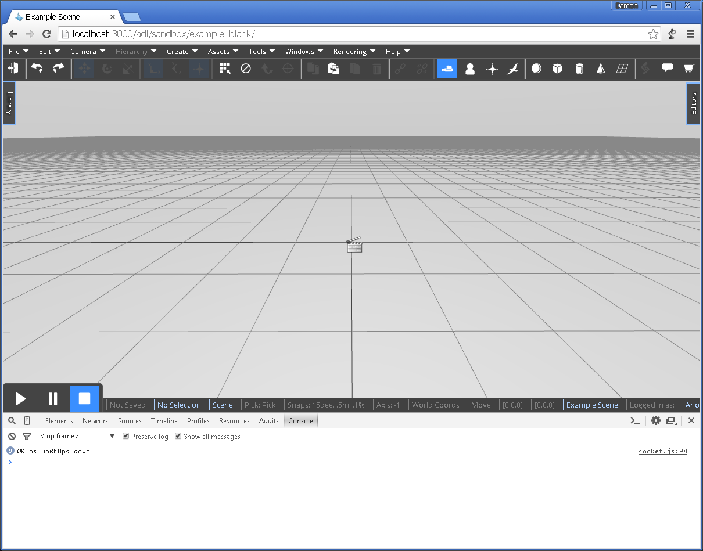

<h1>Writing a Custom Graphic Type</h1>

<h2>Contents</h2>
[TOC]

# Overview
One powerful way to extend the VW Sandbox without knowing too much about or changing the VW Sandbox architecture is to write custom graphics.  Most simulation development involves manipulating existing Graphic types (e.g., 3D models, primitive shapes, particle systems).  Sometimes you will want to create custom Graphic types that directly interface with THREE.js -- the JavaScript 3D library used by the Graphics driver.  For example, custom graphics you might want to create include an ocean, orthographic camera, advanced particle system, custom animation, or custom shader.  

At its core, writing a custom graphic type involves defining a node definition.  Let's create a custom sphere to illustrate the process of writing a custom graphic type.  You'll want to have a local server installation for this tutorial.

# Part 1: Node definition

The first step is to create a new node definition, which has two parts: 1) an interface written in YAML and 2) an implementation written in JavaScript.

```
extends: customSphere.vwf
source: customSphere.js

```

Where `extends: customSphere.vwf` is the engine's node interface (not implementation) defining its properties and methods and `source: custom_sphere.js` is a JavaScript file that implements the interface.

For this demo, we'll keep the two files in a directory in `Sandbox` > `public` > `adl` > `sandbox`.  We'll call the directory `customObjectDemo`.  Placing the files here will make them easy for us to reference later.

Create a new text file called `customSphere.vwf.yaml` in the `customObjectDemo` directory.  Put the following in the file:

```
extends: prim2.vwf
```

Now create another file called `customSphere.js` in the `customObjectDemo` directory.

# Part 2: Boilerplate Files

  Put the following boilerplate code in the file:

```
"use strict";
(function()    // this is the factory function that will return our new object type
{	
	
    // constructor for our new object
    function customSphere(childID, childSource, childName, childType, assetSource, asyncCallback)
    {
    	this.root = new THREE.Object3D(); // the root of our custom graphics

    	this.getRoot = function() //boilerplate for giving our node to the system
    	{
    		return this.root;
    	}    	

		this.inherits = ['vwf/model/threejs/visible.js', 'vwf/model/threejs/transformable.js'];
    	this.initialize = function()
    	{

    	}    	

    }
    //default factory code
    return function(childID, childSource, childName, childType, assetSource, asyncCallback)
    {
        //name of the node constructor
        var s = new customSphere(childID, childSource, childName, childType, assetSource, asyncCallback);
        return s;
    }
})();
```

In the `this.initialize()` function, let's create a new [THREE.js sphere](http://threejs.org/docs/#Reference/Extras.Geometries/SphereGeometry).

```
    	this.initialize = function()
    	{
			this.sphere = new THREE.SphereGeometry(1,10,10,3,1.6,0,3.1);
			this.material = new THREE.MeshPhongMaterial("#FFFFFF");
			this.mesh = new THREE.Mesh(this.sphere,this.material);	
			this.getRoot().add(this.mesh);
    	}   
```

The Engine will call the constructor, initialize the new object type, and return the new object type in the Engine.  To make get the Engine to create the object type, open an example blank world and open the console.  Clear the console.  You should see something like the following:



In the console, let's define the node definition.  Type:

```
var def = {extends:"./damonsCustomObject/customSphere.vwf", source: "./damonsCustomObject/customSphere.js", type: "subDriver/three.js"}