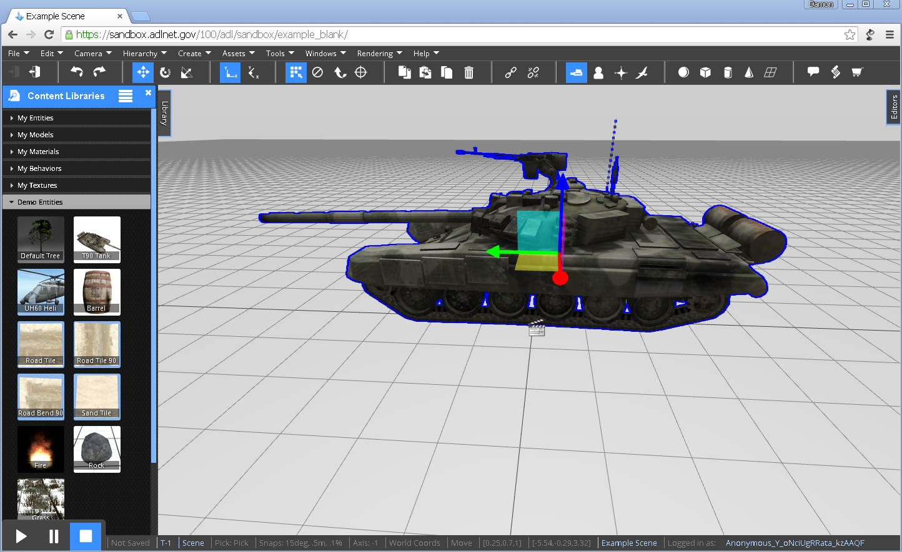
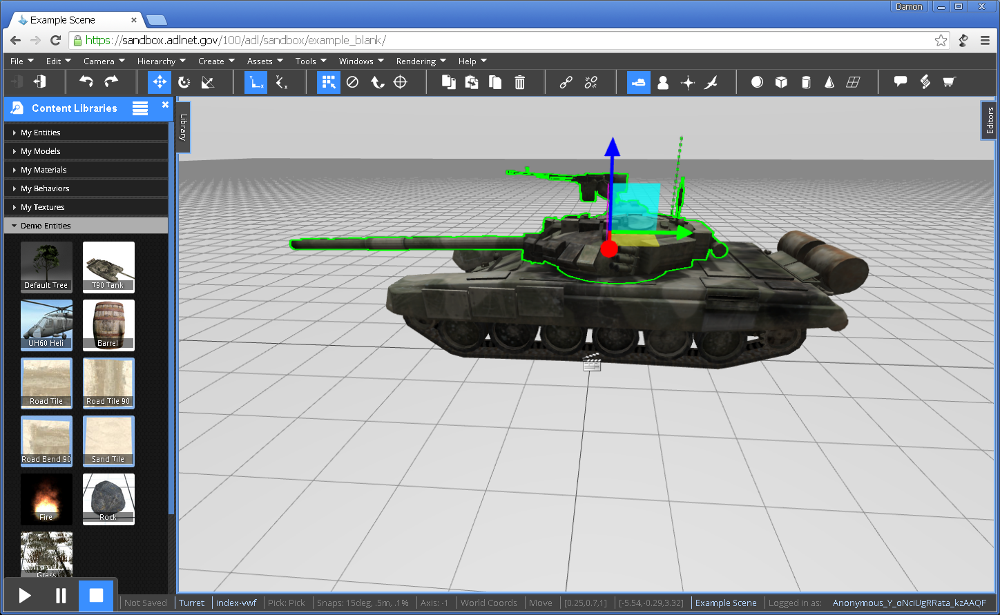
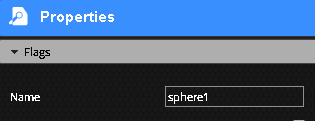

<h1>User Guide</h1>

<h2>Contents</h2>
[TOC]

# Overview

There are two primary ways to use the VW Sandbox.  The first is as an editor to collaboratively author simulations.  The second is as a player to participate in multiplayer simulations.  This user guide focuses on using the editor as each simulation will provide its own way for players to use the simulation.

To use the VW Sandbox editor, simply go to a hosted website instance of it.  A hosted instance is available at [http://sandbox.adlnet.gov](http://sandbox.adlnet.gov).  It can also be downloaded and run locally, where it is usally accessed at `http://localhost:3000/`.  

The front page of the VW Sandbox provides a link to "Try it!"  After choosing to sign in or proceed as a guest, the editor will load in the example blank world.

To begin using the VW Sandbox editor, you will want to ensure you are comfortable using the [Editor Camera](cameras/editor-camera.md) and the [Editor Interface](editor/overview.md).

After learning the basics of the editor, consider going through one of our tutorials:

- [Build a game.](/build%20a%20game/ "Build a Game")
- [Working with terrain.](http://sandboxdocs.readthedocs.org/en/latest/User%20Guide/Working%20with%20Terrain/ "Working with Terrain")
- [Selecting objects.](Selecting-Objects/ "Selecting Objects")
- [Working with groups.](Working%20with%20Groups/ "Working with Groups")
- [Lights and materials.](Lights%20and%20Materials/ "Lights and Materials")

# Editor Camera

By default, simulations are launched for editing in the Editor Camera.  The Editor Camera allows you to see and navigate the whole scene.  To navigate and manipulate objects using the Editor Camera, please review the keyboard and mouse commands below.

**Navigation**

* Hold the right mouse button and move your mouse to look around the scene.  
* Scroll the mouse wheel forward to zoom in and backward to zoom out.
* Hold the mouse wheel down to pan the view around.

!!! note

	To learn more about navigating using using different modes of the Editor Camera, take a look at [Camera Modes](camera-modes.md).

**Selection**

Click the left mouse button to select an object.  Go ahead and create an object to try it out.  Expand the `Library` tab on the left side of the screen.  Open the `Demo Entities` tab and drag the T90 Tank into the scene.  Select the tank by moving the cursor over the tank and clicking your left mouse button.  The tank should highlight in blue.

Click the left mouse button again on a specific part of an already selected object to select that part.  To continue the example, with the tank already selected, click the mouse button over the turret of the tank.  The turret should highlight in green.

To learn more about selecting objects in more advanced ways, check out the [Selecting Objects](../tutorials/Selecting-Objects.md) tutorial.

## Camera Modes

This documentation refers to the various interaction modes for the Editor Camera. This information is not relevant to cameras with are entities within a scene.

!!! note "Note:"
    The current camera controls assume you have a standard three button mouse.

!!! note "Note:"
	These camera controls apply to the default Editor Camera only. Selecting one will activate the default camera.

### Orbit

This is the default mode. The camera orbits around an imaginary point in space. The camera can swing around this point while facing it, or move toward or away from the point. The point itself can be translated to different locations in the scene.

* right click and drag to orbit
* middle click and drag to pan (move the focus point)
* mouse wheel to zoom in or out
* hold shift and move the mouse to orbit
* use the arrow keys to orbit
* hold shift and use the up and down keys to zoom
* hold space and use the arrow keys to pan
* touch and drag on a touchscreen to orbit
* pinch a touchscreen to zomm
* Two-finger touch and drag to pan

### First/Third Person

This mode is only available when the scene is generating avatars for users. The camera can transition between first and third person modes by rolling the mousewheel. When this mode is active, certain mouse motions will control the avatar. 

**Third Person mode**
* right click and drag to orbit around the avatar
* roll the mouse wheel to zoom. When you are close enough, you will enter First Person mode
* use the arrow keys or WASD to move the avatar

**First Person mode**

* right click and drag to turn your viewpoint
* roll the mousewheel to exit back to Third Person mode
* use the arrow keys or WASD to contol the character

### Navigate Mode

This mode allows you to zoom to a very specifc point in space easily. It is related to Orbit mode in that it exposes the same functionality, with some additional features. 

* all the same interactivity from the Orbit mode, plus:
* middle click and drag to zoom in or out from the point of interest
* middle click to animate the center point to a location in the scene. This uses a polygon accurate mouse intersection test
* tap space to set the center point (same as middle click)

### Free Mode

This mode is a first person style controller, but not tied to the avatar. 

* right click and drag to turn the viewpoint
* roll the mouse wheel to move forward. You can move forward forever
* middle click and drag to pan
* use the arrow keys to turn the viewpoint
* use space and the arrow keys to pan
* use ctrl and the up or down button to move forward or back

### Device Orientation

This mode will attempt to use the sensors in your phone or tablet to position the viewpoint. This will have no effect on a desktop computer

* physically move your tablet around space to change the viewpoint.

### Fly

A first person control mode that is always moving forward.

* right click and drag to turn

## Sharing the Camera View

Sometimes, it may be useful to allow other users to see the same view that you see, even if you are in the default Editor Camera. Normally, the Editor Camera is independent, and not replicated by the system to other users. This allow each user to work in a different part of the scene. 

When you share your camera view, other users will have their Editor Camera updated to see exactly the view you see. 

To share your camera view, use the drop down menu. Choose `Cameras` > `Share Camera View`. Click OK at the prompt. Each user in the world will be asked if they would like to receive the camera view, and also must accept. 

To disable the camera sharing, click the same menu item (`Cameras` > `Share Camera View`) again. Click OK at the prompt. 

!!! note:
	Both users must activate the default camera. Other cameras are always synchronized. 

## Creating Cameras

There are two major things to understand about cameras in the VWF. First, the camera you are looking through by default in the Editor is a special camera that is not shared with other users. Each user has his or her own viewpoint when editing that is not shared between users. There is a function for temporarily broadcasting the position of your camera to other users; see the [Camera Modes](camera-modes.md "Camera Modes") section for more information. 

Second, you can also create camera objects within the scene. These cameras are full VWF entities, and can be scripted, copied, or deleted. They can even have behaviors applied, just as any other object. 

To create a camera, use the drop down menu. Choose `Create` > `Camera` > `Perspective`. The camera will be created at the center of your view. If you move your viewpoint within about 10 meters of the camera, and you are in a selection mode, you will see an icon appear to show you the location of the new camera object. If you do not see this icon, you may be too far away. That's OK, you can select the camera by name on the Hierarchy panel. 

When you have a camera selected in the editor, you will see a preview of the selected camera's view. This view will update in real time as you use the editor tools to move around the camera. You will also see in the main view a helper graphic to show you where the camera is pointing. This helper may show a camera viewpoint that is slightly behind the camera's position. This is normal. We actually use the near clip plane of the camera as the cameras 'position'. 

If you see the camera icon, you can double click it to activate the selected camera as the main camera. You can also activate different cameras by choosing `Camera` > `Activate Camera` from the drop down menu. Note: All the existing camera modes, such as 'Fly', or 'Orbit', apply only to the default Editor Camera. Selecting one of these modes will active the default camera.

When a camera is selected, you may edit some of it's properties in the Properties panel.

`Field of View` - The width of the camera view. A good default is 60, but you can simulate a telescopic view with a much smaller number.

`Near` - the near clip plane. Objects nearer than this will not be shown. Clip planes are used primarily to focus the depth buffer resolution around the area of interest in a scene. A full discussion of this topic is out of scope for this article. Just please note that you may see some visual artifacts if the near is set too low, or the far too high.

`Far` - the far clip plane. Objects farther than this will not be shown.

# Editor Interface

The VW Sandbox Editor provides a collaborative authoring experience in a web browser.  

At the bottom left of the screen is a play-pause-stop control panel that controls the state of the simulation.  By default, simulations load in the Editor in the stopped state.

Along the top of the interface is the toolbar and toolbar icons that enable a wide range of commands to be issued.

On the left side of the screen is a `Library` tab providing access to drag and drop re-usable content objects into the scene.

The scene itself is in the center of the screen.  A grid provides perspective within the scene.

On the right side of the screen is an `Editors` tab providing access to multiple editors that provide information about objects in the scene and commands to manipulate the objects and the scene itself.

When an object is selected, the Script Editor can be loaded at the bottom of the screen from the toolbar menu (Windows > Script Editor) or from the toolbar icons () located three icons in from the right.

## Naming Objects

All objects in the world can be assigned a friendly name. These names appear in the GUI for all action, but need not be unique - they are just for your convenience. To name an object, select the object and open the Object Properties window. Under the 'Flags' heading, find the 'name' field. Type the name here. 

When you copy, duplicate, or paste an object, the name will be incremented automatically if it ends with a number.

The name is stored in the `DisplayName` property of an object. From script, all objects are indexed by name under `this.children_by_name`.

## Hotkeys

There are some hotkeys that are helpful to remember when using the VW Sandbox Editor.  While in the editing mode the following hotkeys are available:

* `q` - select object
* `w` - move
* `e` - rotate
* `r` - scale
* `[shift] d` - duplicate
* `[delete]` - delete

## Assets

### Upload a 3D Model
With the Sandbox, you can upload 3D asset file from your own computer into a world. This article explains how.

Supported Formats:

1. 3DS
1. OBJ
1. FBX
1. DAE
1. OSG

Asset files that are uploaded to the Sandbox are not actually stored on the Sandbox server. Instead, they are indexed and tracked by the [ADL 3D Repository](https://3dr.adlnet.gov). This service converts and hosts the model and texture files. 

First, you'll need to create a .Zip file with the 3D model and all its texture. Make sure that you include all the textures that the model requires.

Choose `Create` > `Upload a 3D model` from the main menu. You should see something like this:

Either drag and drop your file, or click 'Browse'. Once you've selected a file, the upload button will enable. Be sure to give the object a title.

Click upload, and wait. If the upload is successful and conversion works, the model should appear in the scene.

### Import a 3D model from a URL
Common mesh importation is done form the ADL 3D Repository however, the online site Dropbox is also an excellent place to store and retrieve COLLADA models and textures.

!!! note:
	there are a few ways to import meshes. The 3DR integration service is the easiest and best way to import models, but it is also possible to supply a URL to a COLLADA file. The server that hosts the file must implement CORS, and have no authentication requirements. 

!!! note:
	Also, when directly adding a file URL, you are at the mercy of the importers and exporters - our system is completely bypassed.

### Animation
The ADL 3D Repository strips out animation on COLLADA files.  Dropbox will retain the animation with your .dae file.

When an object is imported via a direct URL, if the model contains an animation sequence, you will find a tab in the [Primitive Editor](http://sandboxdocs.readthedocs.org/en/latest/Developer%20Guide/editors/PrimitiveEditor/ "Primitive Editor") that controls that animation frame. 

