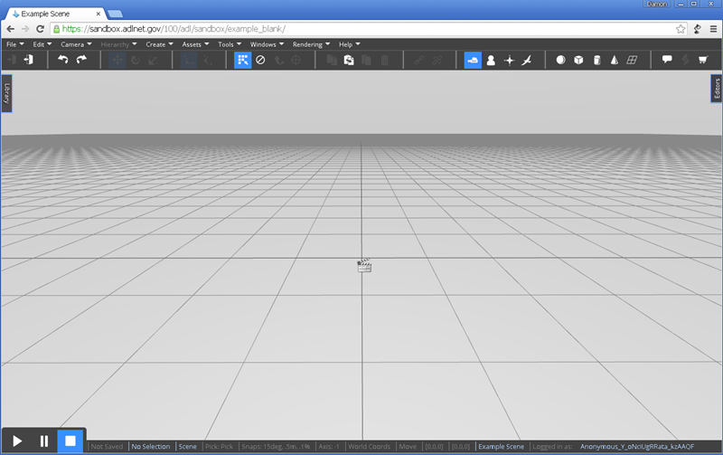

# Overview

There are two primary ways to use the VW Sandbox.  The first is as an editor to collaboratively author simulations.  The second is as a player to participate in multiplayer simulations.  This user guide focuses on using the editor as each simulation will provide its own way for players to use the simulation.

To use the VW Sandbox editor, simply go to a hosted website instance of it.  A hosted instance is available at [http://sandbox.adlnet.gov](http://sandbox.adlnet.gov).  It can also be downloaded and run locally, where it is usally accessed at `http://localhost:3000/`.  

The front page of the VW Sandbox provides a link to "Try it!"  After choosing to sign in or proceed as a guest, the editor will load in the example blank world.

To begin using the VW Sandbox editor, you will want to ensure you are comfortable using the [Editor Camera](cameras/editor-camera.md) and the [Editor Interface](editor/overview.md).

After learning the basics of the editor, consider going through one of our tutorials:

- [Build a game.](/build%20a%20game/ "Build a Game")
- [Working with terrain.](http://sandboxdocs.readthedocs.org/en/latest/User%20Guide/Working%20with%20Terrain/ "Working with Terrain")
- [Selecting objects.](Selecting-Objects/ "Selecting Objects")
- [Working with groups.](Working%20with%20Groups/ "Working with Groups")
- [Lights and materials.](Lights%20and%20Materials/ "Lights and Materials")
