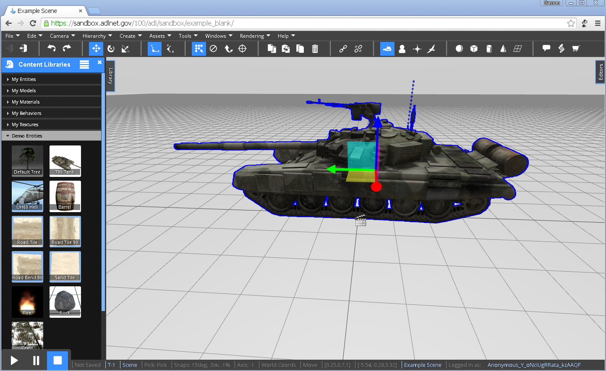
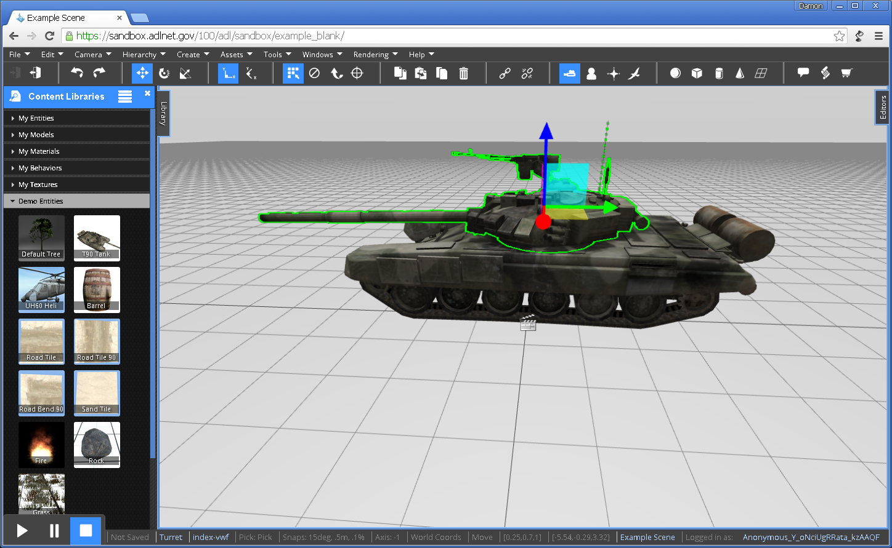

# Editor Camera

By default, simulations are launched for editing in the Editor Camera.  The Editor Camera allows you to see and navigate the whole scene.  To navigate and manipulate objects using the Editor Camera, please review the keyboard and mouse commands below.

## Navigation

Hold the right mouse button and move your mouse to look around the scene.  

Scroll the mouse wheel forward to zoom in and backward to zoom out.

Hold the mouse wheel down to pan the view around.

To learn more about navigating using using different modes of the Editor Camera, take a look at [Camera Modes](camera-modes.md).

## Selection

Click the left mouse button to select an object.  Go ahead and create an object to try it out.  Expand the `Library` tab on the left side of the screen.  Open the `Demo Entities` tab and drag the T90 Tank into the scene.  Select the tank by moving the cursor over the tank and clicking your left mouse button.  The tank should highlight in blue.

Click the left mouse button again on a specific part of an already selected object to select that part.  To continue the example, with the tank already selected, click the mouse button over the turret of the tank.  The turret should highlight in green.

To learn more about selecting objects in more advanced ways, check out the [Selecting Objects](../tutorials/Selecting-Objects.md) tutorial.

