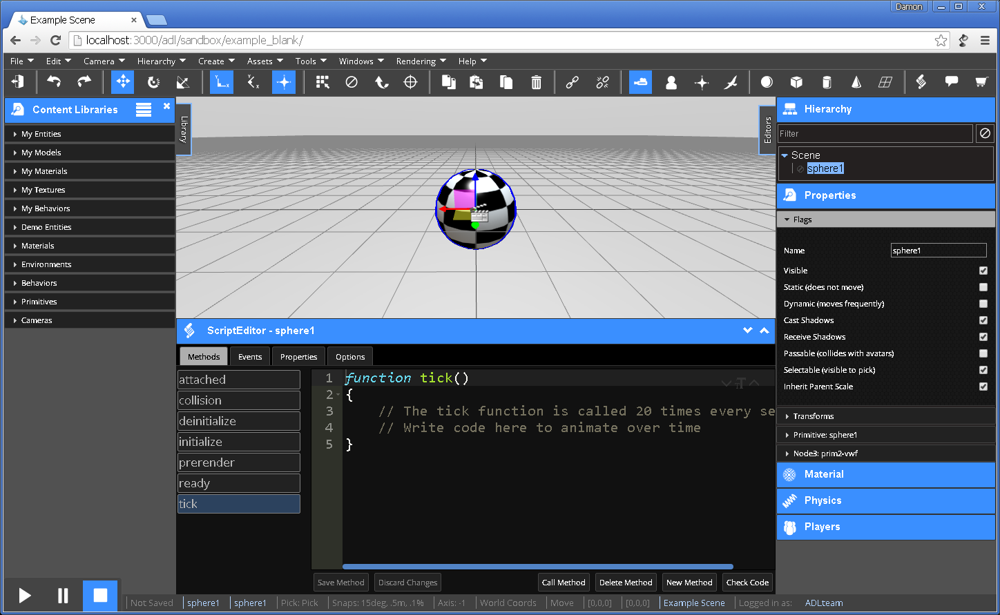

# Overview

The VW Sandbox Editor provides a collaborative authoring experience in a Web browser.  

At the bottom left of the screen is a play-pause-stop control panel that controls the state of the simulation.  By default, simulations load in the Editor in the stopped state.

Along the top of the interface is the toolbar and toolbar icons that enable a wide range of commands to be issued.

On the left side of the screen is a `Library` tab providing access to drag and drop re-usable content objects into the scene.

The scene itself is in the center of the screen.  A grid provides perspective within the scene.

On the right side of the screen is an `Editors` tab providing access to multiple editors that provide information about objects in the scene and commands to manipulate the objects and the scene itself.

When an object is selected, the Script Editor can be loaded at the bottom of the screen from the toolbar menu (Windows > Script Editor) or from the toolbar icons () located three icons in from the right.

## Hotkeys
When in the editing mode:

* q - select object
* w - move
* e - rotate
* r - scale
* [shift] d - duplicate
* [delete] - delete