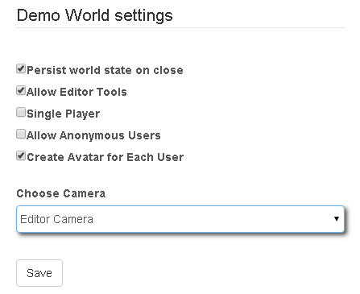

# World Settings

The Settings page provides options to control the configuration of the simulated world to allow it to serve as a virtual world that persists state changes or a game that resets when closed.

!!! note "Note:"
    World Settings are only provided to owners of simulated worlds.

If you would like the world to function as a virtual world, select options to persist world state on close and create an avatar for each user.

If you would like the world to function as a simulation or game, deselect options to persist world state and avatar creation.  You may also want to select the option to limit the simulation to single player if you want to limit multiplayer behavior.

Independent of the kind of simulation, choices for who can access the simulation and what users will see when they login are provided.  Anonymous users can be allowed or not allowed to join.  Owners can make simulations into more published forms by not showing the editor tools and choosing a specific camera for users (e.g., a chase camera).

!!! note "Note:"
    If you want to choose a camera other than the default Editor Camera for users to use, you must create the camera.  See the  [Creating Cameras](../cameras/creating-cameras.md) section for more information.

