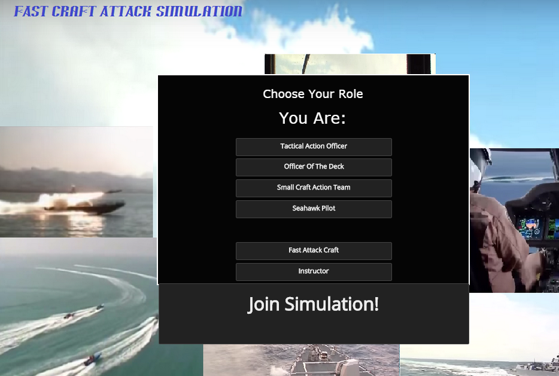
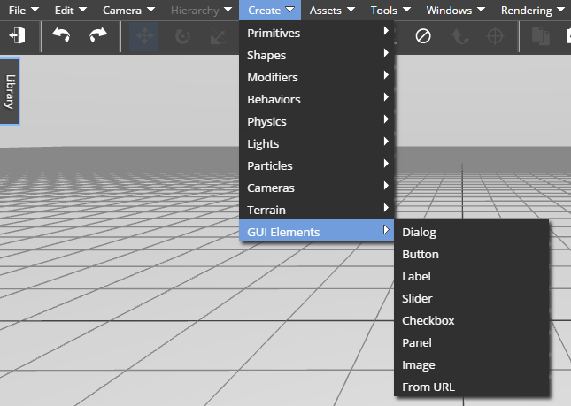
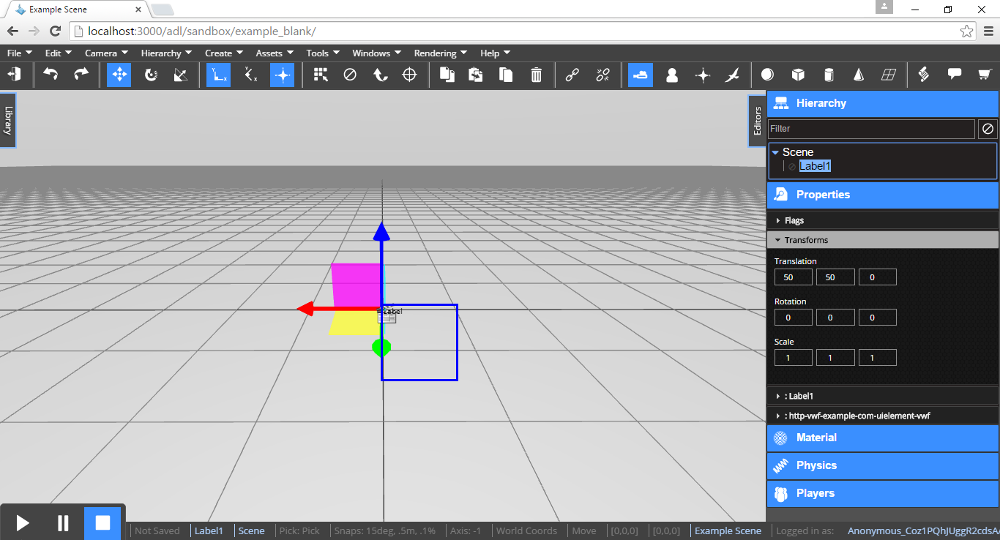

<h1>User Interfaces</h1>
 
A guide to create Graphical User Interfaces (GUIs) to provide users with start screens, preference selections, interacting dialogs, and more.



<h2>Contents</h2>

[TOC]

# Creating Graphical User Interfaces

## Creating and Selecting GUI Elements

The VW Sandbox contains a set of entities that can be used to add graphical user interfaces (GUIs) to a simulation. These GUIs are actual simulation objects, and as such can have scripts, can have properties, be persisted to the database, be saved to the inventory, and be treated exactly as a 3D asset. The GUI elements that are currently supported are; dialogs, buttons, labels, sliders, checkboxes, panels, and images.

You can create a GUI Element by clicking the Element from the top level `Create` > `GUI Elements` menu item.

!!! note:

	Creating a GUI Element this way does not select the element automatically.

 

When in edit mode, while the simulation is stopped, you can select a GUI Element by clicking on it. You should see a dark blue border around it.  In the screenshoot below, a Label was created from `Create` > `GUI Elements` > `Label`, and then clicked on it to select it.

!!! note:

	Another way to select a GUI Element is by clicking it on the Hierarchy tree shown in the Editors panel.




## Positioning, Styling and Organizing GUI Elements

### Positioning GUI Elements

To position a GUI Element you need to double click the Element you want to move, this will allow you to drag and place it anywhere you want.  Then with a single click you stop dragging and set the GUI element in that position.
Another way to position GUI Elements is by using the transform property, just like 3D nodes.  However, this value is interpreted differently.  Only the translation portion of the transform matrix is used. The X and Y components are used as percent offsets from the Element's parent div (either the root of the page or the parent GUI Element). Scale and rotation are ignored. Most GUI Elements have a length and width property and these are represented as absolute pixel sizes.

### Styling GUI Elements

You can apply styles to any GUI Element by creating a property called "style" in the Properties tab of the Script Editor.  This property can contain any legal CSS code as a value.  The CSS code has to be formatted as a JSON object where the keys are CSS attributes and the JSON object values are the corresponding CSS values.  The engine will apply that style to the GUI Element selected.

!!! note:

	If you are cutting and pasting from an existing CSS file into the ScriptEditor, you need to remove the semicolons that appear at the end of the CSS statements.

The following is an example of using a style property to modify the border and background of a GUI Element.

```
{
    "background": "linear-gradient(to bottom, #b4e391 0%,#61c419 50%,#b4e391 100%)",
    "border": "outset grey 3px",
    "border-style": "outset"
}
  
```

### Restricting User Interfaces to Specific Cameras

You can restrict a UI by ID.  You can also say if the UI object is a child of a camera.

Then go to the UI object and select:
"Restrict to Ancestor Camera"

!!! note: 
	Don't restrict a bunch of UI objects to a specific camera.  Instead, put all the UI objects into a UI panel object, that is restricted once to the specific camera.


[comment]: <> (add information about ### How to Make a Video UI Object)

### GUI Elements Hierarchical Organization

When a GUI Element is created, it becomes a child of the currently selected simulation object, more likely the Scene Object.  However, GUI Elements can have children GUI Elements too.  So, when a GUI Element is created, it becomes a child of the currently selected GUI Element.

!!! note:

	A GUI Elements Hierarchy will work just as nested HTML Document Object Model (DOM) elements do and allow you to create rich user interaces.

A GUI Element that is a child of another GUI Element will react to property changes of the parent element.  If the parent's visible property is set to invisible, for example, the child element becomes also invisible.
However, if the parent of the GUI Element is the 3D scene, properties like the parent transform or visible will not effect the child GUI Element.  The GUI Element will not react to changes of the 3D Scene properties.  If the visible property of the parent 3D Scene is set to invisible and the visible property of the child GUI Element is currently visible, the child element will remain visible.
 
!!! note:

	GUI Elements only respond to property changes of their parents if the parents are also GUI Elements.  Otherwise, parents' properties like transform and visible will not effect children GUI Elements.

## Responding to User Input

Some GUI Elements like a button can respond to a User input.  When the User clicks it, an action is normally initiated.  The mechanism to implement this actions or to trigger them is through the GUI Element's Events.

!!! note:

	Events can be enabled and implemented by selecting a GUI Element and then opening the ScriptEditor.

The code below shows the implementation of a button mouse click event.  The code broadcasts that "MyCommand" function is to be executed. 

```

function pointerClick(eventData, nodeData)
{
    this.broadcast("MyCommand", ["My Command Text"], 0);    
}
  
``` 

# GUI Elements Reference

## Dialog

A dialog with a close button. Note that closing the dialog sets its `visible` property to false - the object still exists in the scene. The dialog can be re-sized or moved at run-time. The properties will be updated accordingly.

Properties

* `title` - the title of the dialog
* `visible` - whether or not the dialog is closed
* `height` - the height in real pixels of the inner content
* `width` - the width in real pixels of the inner content

Events

* none

## Button

A button. Importantly, this node fires the `pointerClick` event when the user clicks it.

Properties

* `text` - the text on the button
* `height` - the height in real pixels of the inner content
* `width` - the width in real pixels of the inner content

Events

* `pointerClick` - fired when the user clicks on the button

## Slider

A slider. The user can set a value by dragging a handle along a track. The slider exposes a `change` event, and a `value` property.

Properties

* `value` - the currently selected value of the slider
* `height` - the height in real pixels of the inner content
* `width` - the width in real pixels of the inner content
* `max` - the value at the maximum extent
* `min` - the value at the minimum extent
* `step` - the size of each movement of the handle

Events

* `change` - fired when the value has been changed. Value will change before the event fires.

## Label

A simple text label. Can have several font properties set. The text will wrap at the end of the width, and will overflow if it cannot wrap.

Properties

* `text` - the text of the label
* `height` - the height in real pixels of the inner content
* `width` - the width in real pixels of the inner content
* `fontColor` - the color of the font
* `fontSize` - the size in pixels of the font
* `textAlign` - center, left or right align the text

Events

* none

## Checkbox

A simple checkbox. The box will extend to fill the size of the node specified by `height` and `width`.

Properties

* `height` - the height in real pixels of the inner content
* `width` - the width in real pixels of the inner content
* `isChecked` - whether or not the box is checked

Events

* `checked` - fired when `isChecked` transitioned from false to true
* `unChecked` - fired when `isChecked` transitioned from true to false

## Image

A simple image element. Can be set with the texture chooser, or by URL. 

Properties

* `src` - the url of the image to load
* `height` - the height in real pixels of the inner content
* `width` - the width in real pixels of the inner content

Events

* none

## Panel

The panel is intended to function as a group or container for other GUI Elements. It can have a background color and a border. It fires no events.

Properties

* `height` - the height in real pixels of the inner content
* `width` - the width in real pixels of the inner content
* `backgroundColor` - the color of the background
* `backgroundVisible` - whether or not the background is drawn
* `borderColor` - the color of the border
* `borderRadius` - the rounding of the panel edges
* `borderWidth` - the width in pixels of the border

Events

* none